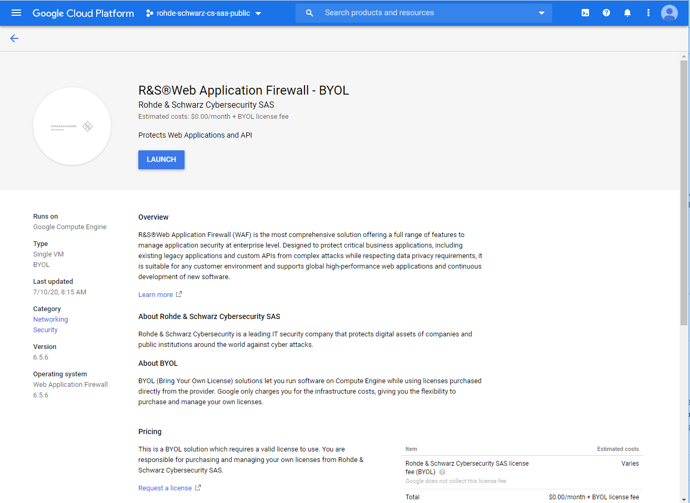
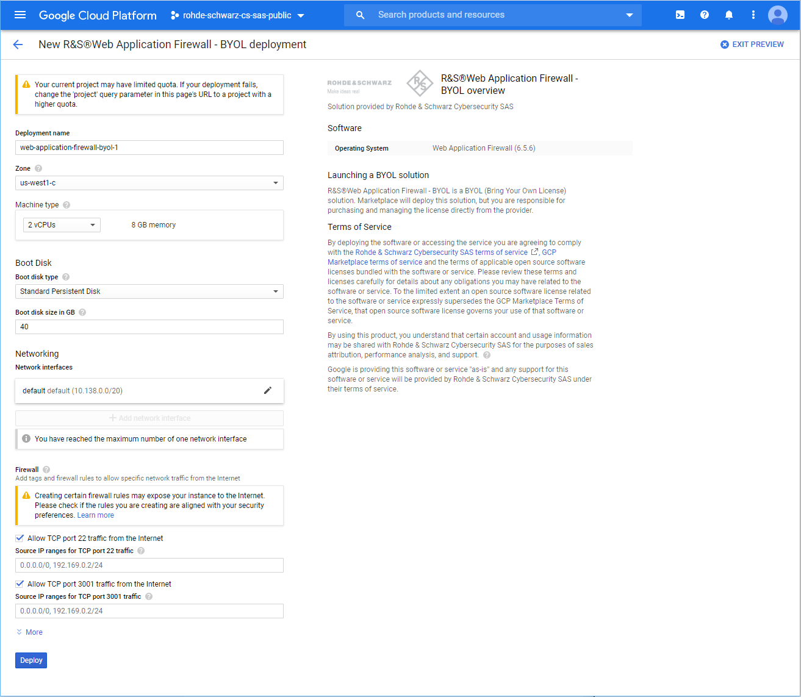
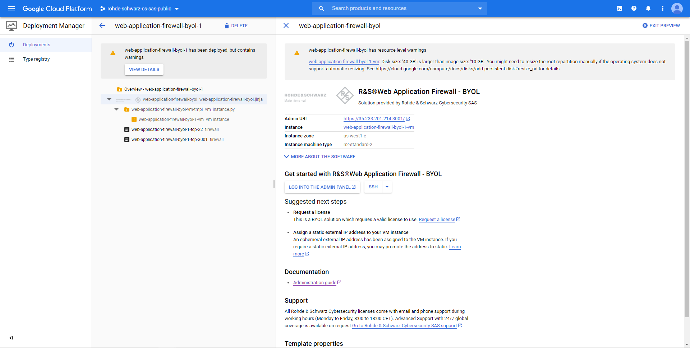

# R&S®Web Application Firewall on Google Cloud Platform
R&S®Web Application Firewall is compatible with Google Cloud Platform.

The linking procedure between a Managed instance and a Manager instance is proper to this environment and is described below.

By default, an instance created on Google Cloud Platform is automatically configured as Manager.

So, there are further operations to perform in order to configure an instance as Managed.

## Setting up a Management instance
The Google Cloud Platform console must be used to follow this procedure:
1. Connect to the [Google Cloud Platform console](https://console.cloud.google.com/) and select your project,

2. In the top left corner, click on the "Navigation menu" and then "Marketplace",

3. Search for "R&S®Web Application Firewall" and select the image you want,

4. Click "Launch on Compute Engine",

5. Complete the fields,

6. Launch,

7. Connect via SSH on port 22 with an user of an SSH key defined in (Compute Engine -> Metadata -> SSH Keys).

## Connection modes and credentials
### Text-based User Interface (TUI)
Google Cloud Platform does not allow a connection to the physical console of the instances. So, the only way to connect to a console is via SSH.
Therefore, the SSH mode is automatically enabled on the instance installed on Google Cloud Platform.
To launch the TUI, switch to dashell user
```
> su dashell
```
| Login | Password |
| ----- |:-------- |
| dashell | admin  |

You will asked to reset the password at the first connection.

For the TUI-relative documentation, please refer to [Text-based User Interface](https://documentation.appsec.rohde-schwarz.com/display/WAF656EN/TUI+-+Text-based+User+Interface).

### Administration Console (GUI)
The Java Administration Console is downloadable on the Rohde & Schwarz website: https://my.appsec.rohde-schwarz.com/.

| Login | Password |
| ----- |:-------- |
| admin | The password is generated automatically and saved to `/root/rswaf_admin_password.txt`. To retrieve it, you have to connect via SSH and display the file contents.  |
For the administration interface relative documentation, please refer to [Administration interface](https://documentation.appsec.rohde-schwarz.com/display/WAF656EN/Administration+interface).

### Administration API
| API Key |
|:-------- |
| The api key is generated automatically and saved to `/root/rswaf_admin_apikey.txt`. To retrieve it, you have to connect via SSH and display the file contents.  |
For more information about the Administration API, please refer to [Web Application Firewall API (EN)](https://documentation.appsec.rohde-schwarz.com/display/WAFAPIEN).
