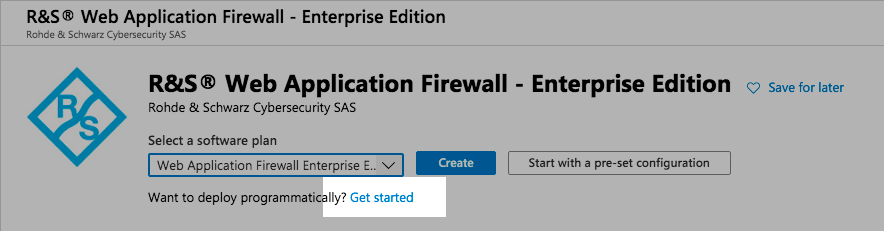
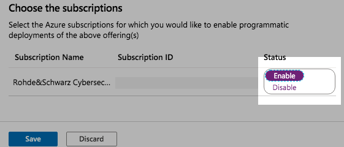

# Microsoft Azure

* 1 [Microsoft Azure recommendations and specific behaviours](#microsoft-azure-recommendations-and-specific-behaviours)
* 2 [Authentication in Azure](#authentication-in-azure)
* 3 [Usage](#usage)
* 4 [Enable programmatic deployments of our products](#enable-programmatic-deployments-of-our-products)

## Microsoft Azure recommendations and specific behaviours

| :warning: Please read this carefully before running our service in production on Microsoft Azure.|
|:-------------------------------------------------------------------------------------------------|

We recommend using a network (level 4) load balancer to allow direct TCP connections to the WAF instances.

Azure health checks (**azurerm_lb_probe**) cannot provide a **Host** HTTP header, reverse proxies must not block unknown hosts.

## Authentication in Azure

Setup an authentication strategy like explained here: https://www.terraform.io/docs/providers/azurerm/index.html.

## Usage

Terraform modules for Microsoft Azure and some examples are provided on [github.com/ubikasec/ubika-waap-extra](https://github.com/ubikasec/ubika-waap-extra/tree/master/terraform)

Modules are located in:

* **modules/azure/autoscaled**: Module to deploy an autoscaled UBIKA WAAP cluster.
* **modules/azure/basic**: Module to deploy a basic UBIKA WAAP cluster.
* **modules/azure/lb**: Basic implementation of Azure Loadbalancer for an UBIKA WAAP cluster (basic or autoscaled).
* **modules/azure/policy**: Basic implementation of autoscaling policies for an autoscaled UBIKA WAAP cluster.

Examples for Azure can be found in:

* **examples/azure_basic**: shows how we deploy a basic UBIKA WAAP cluster with an Azure loadbalancer.
* **examples/azure_autoscaled**: shows how we deploy an autoscaled UBIKA WAAP cluster with an Azure loadbalancer and some autoscaling capabilities.

In the main configuration file, **main.tf**, you can edit variables like Azure region and prefix of your future instances. You can also find every configuration needed to deploy your instances.

| :warning: Don't forget to edit the template to match your configuration before using it.|
|:----------------------------------------------------------------------------------------|

You will need at least to:
* specify the `product_version` you want to use. Available versions can be listed using [How to get the list of UBIKA images](#ubika-images).
* specify the `ssh_key_data`. It will be use to access the instance via SSH once created.
* specify a `name_prefix` for resources that will be created.
* specify a random `autoreg_admin_apiuid` to access to the product API once the instance created.
* accept the marketplace legal terms, see: [Azure marketplace agreements](#azure-marketplace-agreements)

Then, test your configuration:
```
terraform plan
```

At last, deploy your infrastructure with:
```
terraform apply
```

## Enable programmatic deployments of our products

In Microsoft Azure Portal, go to the Marketplace and search **UBIKA WAAP - Enterprise Edition**.

Select the software plan **Web Application Firewall Enterprise Edition (BYOL)**, and click on **Want to deploy programmatically? Get started**.



Then, select **enable** for your subscription, and **Save**.



Do the same operations with the software plan **Web Application Firewall Enterprise Edition (PAYG)**.

## Azure

### UBIKA images

Execute to following command to list the available images of UBIKA:
```
az vm image list --publisher UBIKA --all --output table
```

### Azure marketplace agreements

If you have an error like the following while applying a `.tf` script to deploy on Azure:

```
│ Error: A resource with the ID "/subscriptions/<subscription_id>/providers/Microsoft.MarketplaceOrdering/agreements/ubika/offers/<offer>/plans/<plan>" already exists - to be managed via Terraform this resource needs to be imported into the State. Please see the resource documentation for "azurerm_marketplace_agreement" for more information.
│   with module.ubikawaap.module.image.azurerm_marketplace_agreement.waf_byol,
│   on ../../modules/azure/_/image/main.tf line 21, in resource "azurerm_marketplace_agreement" "waf_byol":
│   21: resource "azurerm_marketplace_agreement" "waf_byol" {

│ Error: A resource with the ID "/subscriptions/<subscription_id>/providers/Microsoft.MarketplaceOrdering/agreements/ubika/offers/<offer>/plans/<plan>" already exists - to be managed via Terraform this resource needs to be imported into the State. Please see the resource documentation for "azurerm_marketplace_agreement" for more information.
│   with module.ubikawaap.module.image.azurerm_marketplace_agreement.waf_payg,
|   on ../../modules/azure/_/image/main.tf line 26, in resource "azurerm_marketplace_agreement" "waf_payg":
│   26: resource "azurerm_marketplace_agreement" "waf_payg" {
```

It means the marketplace agreement for that offer/plan was already accepted (e.g. from a previous deployment, or manually in the Portal), but Terraform doesn't know about it yet: you need to import it into the state instead of trying to recreate it.

| :warning: The `offer` and `plan` names depend on the `product_version` you deploy (they change over time, e.g. `ubika-waap-cloud-6-16-2025`/`ubika-byol` vs. the older `ubika-waap-cloud`/`6-lts-byol`). Always copy the exact resource ID from **your own error message** rather than reusing an example from this README.|
|:----------------------------------------------------------------------------------------------------------------------------------------------------------------------------------------------------------------------------------------------------------------------------------------------------------------------------------------------------------------------------------------------------------|

To fix it, run `terraform import` for both resources, using the exact module address and ID given in your error message:

```
terraform import module.ubikawaap.module.image.azurerm_marketplace_agreement.waf_byol "<id from the error message above>"
terraform import module.ubikawaap.module.image.azurerm_marketplace_agreement.waf_payg "<id from the error message above>"
```

For example, with the first error above:

```
terraform import module.ubikawaap.module.image.azurerm_marketplace_agreement.waf_byol "/subscriptions/<subscription_id>/providers/Microsoft.MarketplaceOrdering/agreements/ubika/offers/<offer>/plans/<plan>"
```

Then make sure the legal terms are accepted for the images you'll deploy (use the `offer`, `plan` and `image_version` from your module, or list them with `az vm image list --publisher UBIKA --all --output table`):

```
az vm image terms accept --urn ubika:<offer>:<plan>:<image_version>
```

You can now run `terraform plan`/`terraform apply` again.

For more details, see the Azure documentation:
* https://learn.microsoft.com/en-us/marketplace/programmatic-deploy-of-marketplace-products#deploy-vm-from-azure-marketplace-using-terraform
* https://learn.microsoft.com/en-us/cli/azure/vm/image?view=azure-cli-latest#az-vm-image-accept-terms
