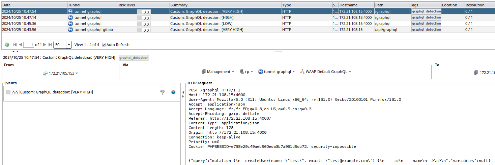

# GraphQL Detectors

* 1 [Presentation](#presentation)
* 2 [How to use the SWF GraphQL Detector](#how-to-use-the-swf-graphql-detector)
* 3 [How to interpreat the reported GraphQL Detector logs](#how-to-interpreat-the-reported-graphql-detector-logs)
* 4 [How to use the SWF GraphQL Detector Once](#how-to-use-the-swf-graphql-detector-once)
* 5 [Backups](#backups)

# Presentation
Sometimes, you may protect applications or APIs without knowing all the technologies behind them, and applications that use GraphQL are no exception.

In this use case we propose two subworkflows: `SWF - GraphQL Detector` and `SWF - GraphQL Detector Once`. These workflows help determine whether the application relies on GraphQL technology.

# How to use the SWF GraphQL Detector
The SWF neither require nor provides any attributes. Its main role is to inform the administrator about the presence of GraphQL via `Custom Log Alert`.

There are no particular restrictions on the placement of the SWF. However we recommend putting it immediately after the `START` node to test the original stream received, before any processing.

The following screenshot shows an example of the `SWF - GraphQL Detector` set in a copy of the `WAAP Default` workflow:

>💡**Tip:** 
> You may just neet to set up the SWF for a certain period, allowing enough traffic to pass through it. Then, once the operation is complete, you can take it off.

# How to interpreat the reported GraphQL Detector logs
To avoid false positives, we made a system that assigns a score indicating the likehood of GraphQL presence. 
The score ranges from `LOW` to `VERY HIGH`. Herein an explantion of the criteria on which this evaluation is based: 

* **VERY HIGH**: we get this score when the detector identifies a known GraphQL endpoint, along with the syntaxe of a GraphQL Query request, Mutation request, or Subscription request. Also, it checks the HTTP method of the query, if the query is post it checks if the mime of content-type field is used by the GraphQL systems (eg. `Content-Type: application/json`).

* **HIGH**: We can get this score using a similar process as in the previous case, but without including the HTTP method.
Otherwise, when the SWF identifies the syntaxe of an introspection or default GraphQL query, while detecting a known GraphQL endpoint and handling HTTP method.

* **MEDIUM**: When we only identifies the syntaxe of a Query/Mutation/Subscription without any additional GraphQL contexte.

* **LOW**: When we identify only a known GraphQL endpoint, or solely the syntaxe of an introspection or default GraphQL query without any additional GraphQL contexte.

# How to use the SWF GraphQL Detector Once
The `SWF - GraphQL Detector` can generate frequent logs, potentially cluttering the administrator's view. To address this, the `SWF - GraphQL Detector Once` was created to report only the highest detected score. For example, it logs `LOW` (or any initial detected score) but only updates if a higher score, such as `MEDIUM` or `HIGH` appears. Once a score is reported, no additional logs are generated unless a higher score is detected. When a `VERY HIGH` score is reached, it logs this score and remains silent until the detection expires as there is no score higher than `VERY HIGH`.
The detection expires when the value of `detection expiration time` parameter is consumed. At that point, the process resets and resumes the same detection flow.

The `SWF - GraphQL Detector Once` requires no attributes but includes the `detection expiration time` parameter, specifying the duration (in seconds) for retaining the highest detected score. The screenshot below shows `SWF - GraphQL Detector Once` with the `detection expiration time` parameter set to 3600 seconds:

If the parameter is set to 0, this means that the information will never expire.

## Examples of the GraphQL detection
The following screenshot shows the logs generated by `SWF - GraphQL Detector Once` applied for a GitLab that uses the tunnel `tunnel-graphql-gitlab`, then by tests made on a graphql API reported by tunnel `tunnel-graphql` :

# Backups

A backup of the use case of `SWF - GraphQL Detector` can be downloaded here: [ `SWF - GraphQL Detector use case`](./backup/SWF%20-%20GraphQL%20Detector.backup).

And a backup of the use case of `SWF - GraphQL Detector Once` can be downloaded here: [ `SWF - GraphQL Detector Once use case`](./backup/SWF%20-%20GraphQL%20Detector%20Once.backup).
