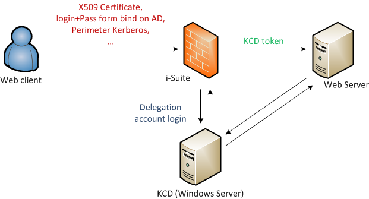
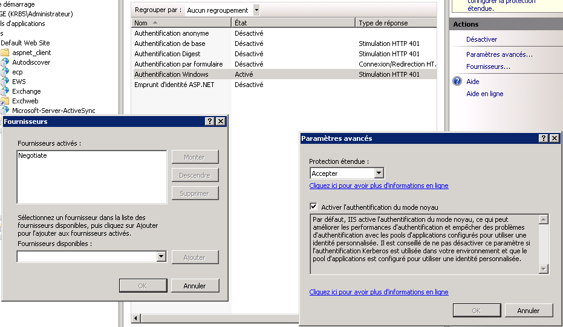
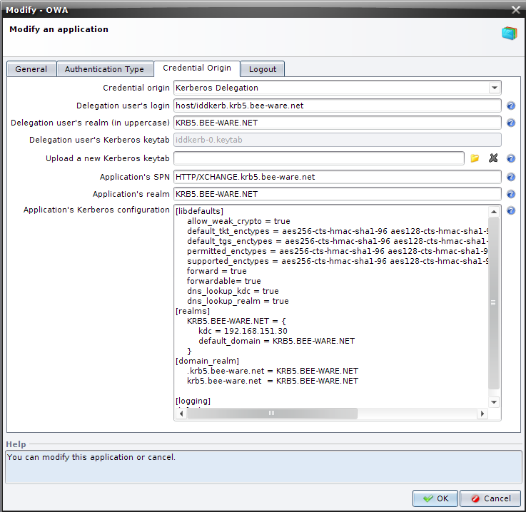

# Kerberos Delegation and the WAF

1. [Description](#description)
2. [Configuring the Microsoft Server](#configuring-the-microsoft-server)
3. [WAF Configuration](#waf-configuration)
4. [Notes](#notes)

## Description 

UBIKA WAAP Gateway & Cloud offers the **"Kerberos Delegation"** functionality based on the Microsoft Service-for-User (S4U) extensions. The user will be able to access an IIS application protected by Kerberos without necessarily being in the domain.

We can create a **"Kerberos Delegation"** application configuration on the WAF by specifying:
* the information on the delegation account which will be authenticated in the user’s place (login, realm, and keytab);
* information on the application (Service Principal Name, Realm);
* the information needed for Kerberos authentication (encryption, dns, domain, etc.).


_Typical Kerberos architecture, possible with UBIKA solutions_

The **"Kerberos Delegation"** functionality is compatible with Windows Server 2008 and upper. The server has to have been configured beforehand with the delegation (delegation user created, keytab generated, application configured).

**Additional specification:**

Cache management on Kerberos requests: authentication of the delegation user is done one single time; creating a new token for the user does not require connection to the server.


The next steps will show how to configure the Microsoft Server and the WAF. We will use the following setup:
* **REALM**: KRB5.BEE-WARE.NET
* **Domain**: krb5.denyall.com
* **Delegation account**: iddkerb
* **Delegated IIS server**: XCHANGE
* **Domain Controller**: ADKDC

## Configuring the Microsoft Server

Prerequisites: an application with Kerberos authentication enabled

On the site or directory, we’ll implement a 401 authentication and base that authentication on Kerberos. In the authentication configuration (screen below):

1. Enable "Windows authentication".
2. Then enable the Provider "Negotiate".
3. Set "Extended Protection" to "Required", and enable Kernel mode.
4. Disable Anonymous authentication


_Configuring rights for Kerberos 401 Authentication_


The SPN of the application will be **HTTP/XCHANGE.kbr5.denyall.com**.

Add the application’s SPN to the Domain Controller:
```
setspn -A HTTP/XCHANGE.krb5.denyall.com ADKDC
```

1. Create a "user" account. For example, iddkerb
2. Add an SPN to the account; the **"Delegation"** tab is now enabled for this account.
3. In the **"Delegation"** tab:
    * Enable Option 3 ("Trust this computer for delegation to specified services only").
    * Enable use of all protocols (**"Use any authentication protocol"**).
    * Then add the SPN via a search for the service at the level of the Domain Controller. Export the keytab for the account.

To add the SPN to the account:
```
setspn -A host/iddkerb.krb5.denyall.com iddkerb
```

To export the keytab for the account:
```
C:\> ktpass -princ host/iddkerb.krb5.denyall.com@KRB5.BEE-WARE.NET -mapuser iddkerb -crypto ALL -pass password -out iddkerb-0.keytab -kvno 0
```

>N.B.: The REALM of the application must be in upper case.

>N.B.: A delegation account is needed for each application.

## WAF Configuration

Prerequisites: WAF appliance(s) must be time-synchronized with the Windows Server.

1. In the "WAM Application" configuration, "Authentication type" tab, select "Kerberos Authentication Delegation - token".
2. In the "Credential origin" tab, choose "Kerberos Delegation", then fill in the fields:

Information on the delegation account:
* **"Delegation user’s login"**: host/iddkerb.krb5.beeware.net
* **"Delegation user’s realm"**: **KRB5.BEE-WARE.NET**
* **"Delegation user’s Kerberos keytab"**: iddkerb-0.keytab (file extracted from the KDC with the **ktpass** command).

Information on the application:
*   **"Application’s SPN"**: HTTP/XCHANGE.krb5.denyall.com
*   **"Application’s realm"**: KRB5.BEE-WARE.NET
*   **"Application’s Kerberos configuration"**: [MIT Kerberos Documentation](https://web-cert.mit.edu/kerberos/krb5-1.19/doc/admin/conf_files/kdc_conf.html?highlight=krb5%20conf) 

Kerberos configuration example:
```     
[libdefaults]
    allow_weak_crypto = true
    default_tkt_enctypes = aes256-cts-hmac-sha1-96 aes128-cts-hmac-sha1-96 des3-cbc-sha1 rc4-hmac des-cbc-md5 des-cbc-crc
    default_tgs_enctypes = aes256-cts-hmac-sha1-96 aes128-cts-hmac-sha1-96 des3-cbc-sha1 rc4-hmac des-cbc-md5 des-cbc-crc
    permitted_enctypes = aes256-cts-hmac-sha1-96 aes128-cts-hmac-sha1-96 des3-cbc-sha1 rc4-hmac des-cbc-md5 des-cbc-crc
    supported_enctypes = aes256-cts-hmac-sha1-96 aes128-cts-hmac-sha1-96 des3-cbc-sha1 rc4-hmac des-cbc-md5 des-cbc-crc
   forward = true
   forwardable= true
    dns_lookup_kdc = true
    dns_lookup_realm = true
[realms]
    KRB5.BEE-WARE.NET = {
        kdc = 192.168.151.30
        default_domain = KRB5.BEE-WARE.NET
    }
[domain_realm]
    .krb5.denyall.com = KRB5.BEE-WARE.NET
    krb5.denyall.com  = KRB5.BEE-WARE.NET
[logging]
default = CONSOLE
```

Configuration example for the **"Application’s Kerberos configuration"**:



## Notes

You can verify what SPN is attached to a domain, a server or a user:

```
C:\Users\Administrator>setspn -L WIN-ADKDC
Registered ServicePrincipalNames for CN=ADKDC,OU=Domain
Controllers,DC=krb5,DC=bee-ware,DC=net:
	HTTP/XCHANGE
	HTTP/XCHANGE.krb5.denyall.com
	...
```

```
C:\Users\Administrator>setspn -L XCHANGE
Registered ServicePrincipalNames for CN=XCHANGE,CN=Computers,DC=krb5,DC=bee-ware,DC=net:
	HTTP/XCHANGE
	HTTP/XCHANGE.krb5.denyall.com
	...
```

---

Logs of successful delegations can be found in the tunnel's error log with debug enabled.

The key stages are:
* Delegation user is now authenticated
* Launch first TGS\_REQ S4U2SELF
* Launch second TGS\_REQ S4U2PROXY
* and finally the availability of the token.

```
[Tue Nov 13 16:45:37 2012] [debug] src/krb5_kinit.cc(580): [21991][3041328016]: [Krb5::kinit] -----------------------------------
[Tue Nov 13 16:45:37 2012] [debug] src/krb5_kinit.cc(615): [21991][3041328016]: [Krb5::kinit] Principal cache name = host/iddkerb@KRB5.BEE-WARE.NET (hit)
[Tue Nov 13 16:45:37 2012] [debug] src/krb5_kinit.cc(621): [21991][3041328016]: [Krb5::kinit] Credentials not expired (35376s)
[Tue Nov 13 16:45:37 2012] [debug] src/krb5_kinit.cc(842): [21991][3041328016]: [Krb5::kinit] Delegation user is now authenticated
[Tue Nov 13 16:45:37 2012] [debug] src/action_krb5_deleg.cc(126): [21991][3041328016]: [Krb5Deleg] Delegation user authentication host/iddkerb@KRB5.BEE-WARE.NET finished with success
[Tue Nov 13 16:45:37 2012] [debug] src/krb5_util.cc(717): [21991][3041328016]: [Krb5::s4u] In Krb5::s4u with
[Tue Nov 13 16:45:37 2012] [debug] src/krb5_util.cc(718): [21991][3041328016]: [Krb5::s4u] > user Principal: seven@KRB5.BEE-WARE.NET
[Tue Nov 13 16:45:37 2012] [debug] src/krb5_util.cc(719): [21991][3041328016]: [Krb5::s4u] > Application principal: HTTP/XCHANGE.krb5.denyall.com@KRB5.BEE-WARE.NET
[Tue Nov 13 16:45:37 2012] [debug] src/krb5_util.cc(720): [21991][3041328016]: [Krb5::s4u] > Delegation Keytab: /beeware/conf/keytab2/99307a7431bb0b65c08eecf1076c7dca.keytab
[Tue Nov 13 16:45:37 2012] [debug] src/krb5_util.cc(752): [21991][3041328016]: [Krb5::s4u] Get Default Credential
[Tue Nov 13 16:45:37 2012] [debug] src/krb5_util.cc(788): [21991][3041328016]: [Krb5::s4u] Launch first TGS_REQ S4U2SELF
[Tue Nov 13 16:45:37 2012] [debug] src/krb5_util.cc(830): [21991][3041328016]: [Krb5::s4u] Getting delegated creds
[Tue Nov 13 16:45:37 2012] [debug] src/krb5_util.cc(162): [21991][3041328016]: [Krb5::s4u] Target name: host/iddkerb@KRB5.BEE-WARE.NET
[Tue Nov 13 16:45:37 2012] [debug] src/krb5_util.cc(162): [21991][3041328016]: [Krb5::s4u] Source name: seven@KRB5.BEE-WARE.NET
[Tue Nov 13 16:45:37 2012] [debug] src/krb5_util.cc(840): [21991][3041328016]: [Krb5::s4u] Launch second TGS_REQ S4U2PROXY
[Tue Nov 13 16:45:37 2012] [debug] src/krb5_util.cc(162): [21991][3041328016]: [Krb5::s4u] Target name: HTTP/XCHANGE.krb5.denyall.com@KRB5.BEE-WARE.NET
[Tue Nov 13 16:45:37 2012] [debug] src/krb5_util.cc(162): [21991][3041328016]: [Krb5::s4u] Proxy name: host/iddkerb@KRB5.BEE-WARE.NET
[Tue Nov 13 16:45:37 2012] [debug] src/krb5_util.cc(162): [21991][3041328016]: [Krb5::s4u] Delegated name: seven@KRB5.BEE-WARE.NET
[Tue Nov 13 16:45:37 2012] [debug] src/krb5_util.cc(462): [21991][3041328016]: [Krb5::s4u] Token: 'YIIGAAYJKoZIhvcSAQICAQBuggXvMIIF66ADAgEFoQMCAQ6iBwMFAAAAAACjggT9YYIE+TCCBPWgAwIBBaETGxFLUkI1LkJFRS1XQVJFLk5FVKIsMCqgAwIBAaEjMCEbBEhUVFAbGVhDSEFOR0Uua3JiNS5iZWUtd2FyZS5uZXSjggSpMIIEpaADAgESoQMCAQGiggSXBIIEk7/k0JvOEU7LnkLXAm4lYednOwtbFcv9kNcyOOMQ9nKJjh9ArCh1JtST675vYJ9zx1HYuzmL9Knc8Y241RVe2ocHFtgBy3zcg0sGeiSaTxCqJp41TDZTB3tVKc9XyPTRvycPINwWGjYLttlJLEmWOLAfAEYmrSeGEELX4i5JLyt1JszZVHb3JPEaJ/uUuIvVKPPPX5B8eKBuLDUdgqz9s/k6wKv+32/OxbWQQnfWpdXpBsWlO56BKHQN4FPfmYvsSDqZWIyTmlt8LIMQdVgeU70/F4PqXQUed0Z+qI5iniZ25uOm1w9fvdbwl05YqTcL3nfFIrK42qdjO'
[Tue Nov 13 16:45:37 2012] [debug] src/krb5_util.cc(875): [21991][3041328016]: [Krb5::s4u] END of Krb5::s4u
[Tue Nov 13 16:45:37 2012] [debug] src/action_krb5_deleg.cc(152): [21991][3041328016]: [Krb5Deleg] Get Token succeed for user seven@KRB5.BEE-WARE.NET and application OWA
```

Note that if a **"clock skew"** appears in the logs, this means there is a time synchronization issue between the WAF and the Kerberos server. 

The window size is configurable:
```
HKLM\SYSTEM\CurrentControlSet\Control\Lsa\Kerberos\Parameters
Entry : SkewTime
Type : REG_DWORD
Default value: 5 (minutes)
```

---

Windows Kerberos logs can also be enabled in the Registry:
```
HKLM\SYSTEM\CurrentControlSet\Control\Lsa\Kerberos\Parameters
Entry : LogLevel
Type : REG_DWORD
Value : 1
```

---

More generally, many values that can be set for Kerberos: https://docs.microsoft.com/en-US/troubleshoot/windows-server/windows-security/kerberos-protocol-registry-kdc-configuration-keys