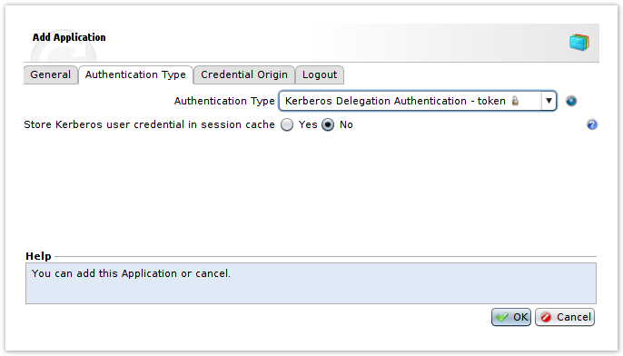
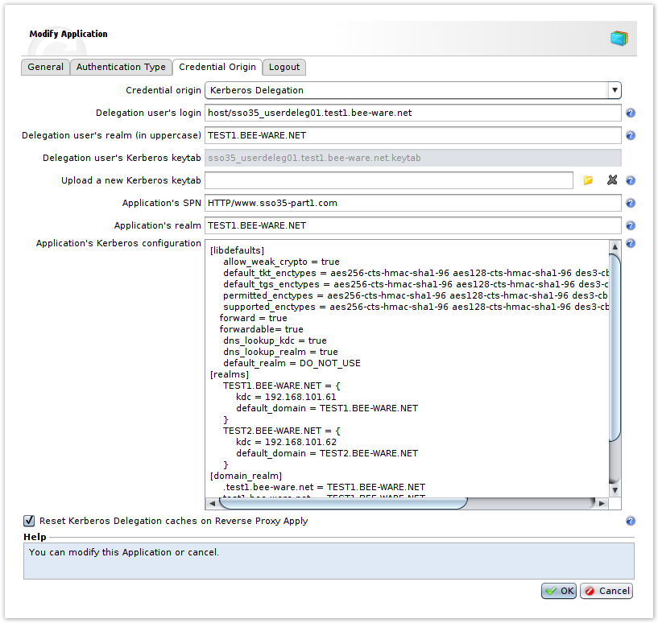

# Kerberos Constrained Delegation (KCD)

- [Kerberos Constrained Delegation (KCD)](#kerberos-constrained-delegation-kcd)
- [Description](#description)
- [Kerberos Constrained Delegation](#kerberos-constrained-delegation)
- [Cross-domain, cross-forest](#cross-domain-cross-forest)
- [Configuring the Microsoft server](#configuring-the-microsoft-server)
  - [Application](#application)
  - [Delegation account](#delegation-account)
- [Configuring the WAF](#configuring-the-waf)

# Description 
Kerberos has been implemented for perimeter authentication since V4 and for application authentication since 5.3.1-SP2. This document discusses only the second aspect.

The **“Kerberos Constraint Delegation”** functionality is based on the Microsoft Service-for-User (S4U) extensions. The user will be able to access an IIS application protected by Kerberos (or another “Kerberized” application) without necessarily being in the domain. The UBIKA WAAP Gateway & Cloud is able to generate an access token for the application, on the user’s behalf, thanks to a delegation account associated with the applications. In addition, the WAF can implement a protocol break and authenticate the user at the perimeter using totally different means (x509, form, etc.)

This implementation is based on the library developed by the [Massachussets Institute of Technology (MIT) version 1.14.4](http://web.mit.edu/kerberos/), which has included Microsoft Service-for-User since its version 1.8.

# Kerberos Constrained Delegation
We use the term “Kerberos Constrained Delegation” (KCD) because the list of services for which the delegation account can generate a token is restricted and controlled.

# Cross-domain, cross-forest
Delegation allows a user be authenticated via Kerberos on an application in his/her domain, another domain in the same forest, or another domain in another forest, as long as the domains or forests have set up a Trust relationship between them.

Cache management on Kerberos requests (authentication of the delegation account is done one single time) enables the creation of new tokens for the user without additional connections to the KDC server).

In the following examples, we will use the following names:

- Realm: KRB5.BEE-WARE.NET
- Domain: krb5.denyall.com
- Delegation account: iddkerb
- Application on the IIS server: XCHANGE
- Name of KDC server: ADKDC

> **_Important_:** WAF appliance(s) must be time-synchronized with the Windows server.

# Configuring the Microsoft server

## Application
- Enabling Kerberos authentication on the application in IIS:
On the site or directory involved, we will implement 401 authentication in the form of an Integrated Windows Authentication, and base that authentication on Kerberos. In the authentication configuration (“Authentication” group):
- Enable “Windows authentication”.
  * Enable only the Provider “Negotiate”.
  * Set “Extended Protection” to “Required”, and enable Kernel mode.
- Disable Anonymous authentication.

The application’s SPN must then be declared on the Windows server, in the command prompt of the server hosting the application.The application’s SPN will be **HTTP/XCHANGE.kbr5.denyall.com**.

> Pay careful attention to upper and lower case.

```
setspn -S HTTP/XCHANGE.krb5.denyall.com ADKDC
```

---

**_Important_**

At this stage, connecting a browser to the Kerberos application from a computer in the domain requires prior verification. As long as the application is not operating directly (without transiting through the WAF), it will not function once the WAF is configured.

---

## Delegation account
A delegation account must be created for each Microsoft domain. It will then be able to perform delegation for several applications in the same domain.

- Create a “user” account. For example, iddkerb
- Declaring an SPN on the account:

```
setspn -S host/iddkerb.krb5.denyall.com iddkerb
```
This operation enables the “Delegation” tab in the properties of the delegated user (the user may first need to be Refreshed).
- In the “Delegation” tab:
  * Enable Option 3 (“Trust this computer for delegation to specified services only”). “Constrained” delegation is so called because of this restriction.
  * Enable use of all protocols (“Use any authentication protocol”).
  * Then add the SPN via a search for the service at the level of the Domain Controller. Search for the name of the computer on which the application is declared, then select the HTTP service corresponding to the application.

- Exporting the keytab (the file containing the delegated user’s shared keys):

```
C:\> ktpass -princ host/iddkerb.krb5.denyall.com@KRB5.BEE-WARE.NET \
-mapuser iddkerb -crypto ALL -pass password -out iddkerb.keytab -kvno 0

```
> After modifying certain parameters applying to the delegated user, such as the password, this file will have to be re-created and re-imported into the WAF.

# Configuring the WAF
For each target application, an [Application WAM](https://documentation.rscyber.fr/display/waf68en/Application+WAM+Parameters) must be created.
- In the Application WAM configuration, [Authentication type](https://documentation.rscyber.fr/display/waf68en/Application+WAM:+Authentication+Type) tab, select “Kerberos Authentication Delegation - token”



When enabling "Store Kerberos user credential in session cache", user credential are store in session to avoid credential request to KDC on each backend request.

- In the “Credential origin” tab, choose “Kerberos Delegation”, then fill in the fields:

Information on the delegation account:

- Delegation user’s login : host/iddkerb.krb5.beeware.net
- Delegation user’s realm : KRB5.BEE-WARE.NET
- Delegation user’s Kerberos keytab : iddkerb.keytab (file extracted from the KDC with the ktpass command).

Information on the application:

- Application’s SPN (pay attention to upper and lower case): HTTP/XCHANGE.krb5.denyall.com
- Application’s realm : KRB5.BEE-WARE.NET
- Application’s Kerberos configuration: This is the configuration of the MIT KRB5 library; here is a link to its online documentation.

As an example, here is a configuration that specifies a KDC server and its associated domain:



```
[libdefaults]
    allow_weak_crypto = true
    default_tkt_enctypes = aes256-cts-hmac-sha1-96 aes128-cts-hmac-sha1-96 des3-cbc-sha1 rc4-hmac des-cbc-md5 des-cbc-crc
    default_tgs_enctypes = aes256-cts-hmac-sha1-96 aes128-cts-hmac-sha1-96 des3-cbc-sha1 rc4-hmac des-cbc-md5 des-cbc-crc
    permitted_enctypes = aes256-cts-hmac-sha1-96 aes128-cts-hmac-sha1-96 des3-cbc-sha1 rc4-hmac des-cbc-md5 des-cbc-crc
    supported_enctypes = aes256-cts-hmac-sha1-96 aes128-cts-hmac-sha1-96 des3-cbc-sha1 rc4-hmac des-cbc-md5 des-cbc-crc
    forward = true
    forwardable= true
    dns_lookup_kdc = true
    dns_lookup_realm = true
    default_realm = DO_NOT_USE
[realms]
    KRB5.BEE-WARE.NET = {
        kdc = 192.168.151.30
        default_domain = KRB5.BEE-WARE.NET
    }
[domain_realm]
    .krb5.denyall.com = KRB5.BEE-WARE.NET
    krb5.denyall.com  = KRB5.BEE-WARE.NET
[logging]
default = CONSOLE
```
It is possible to specify additional domains so that the delegation account can authenticate the user on applications in other domains. To do so, add the domain names under [realm] and the necessary aliases under [domain_realm].

> Since DA WAF 6.4, it is mandatory to set " default_realm = DO_NOT_USE" option in "libdefaults" part.

When enabling option **"Reset Kerberos Delegation caches on Reverse Proxy Apply"**, authentication caches (delegation user and user) are reseted on apply.

---
**_Note_**

The User Agent effectively used for Kerberos can be modified and change from IE version 8 or 9 to IE 7; this is due to the use of a compatibility mode forced by the authentication.

---

You can verify what SPN is attached to a domain, a server or a user:

```
C:\Users\Administrator>setspn -L WIN-ADKDC
Registered ServicePrincipalNames for CN=ADKDC,OU=Domain
Controllers,DC=krb5,DC=bee-ware,DC=net:
 HTTP/XCHANGE
 HTTP/XCHANGE.krb5.denyall.com
...
```
```
C:\Users\Administrator>setspn -L XCHANGE
Registered ServicePrincipalNames for
CN=XCHANGE,CN=Computers,DC=krb5,DC=bee-ware,DC=net:
 HTTP/XCHANGE
 HTTP/XCHANGE.krb5.denyall.com
...
```
Logs of successful delegations (Error log of the Tunnel with debug enabled):

The key stages are:
- Delegated user is now authenticated
- Launch first TGS_REQ S4U2SELF
- Launch second TGS_REQ S4U2PROXY
- and finally availability of the token.


[File 1](https://documentation.rscyber.fr/download/attachments/45384459/6.4_traces_appli_cacheoff_light.txt?version=1&modificationDate=1498234798356&api=v2)


[File 2](https://documentation.rscyber.fr/download/attachments/45384459/6.4_traces_appli_cacheon_light.txt?version=1&modificationDate=1498234798584&api=v2)

Note that if **“clock skew”** appears in the logs, this means there is poor synchronization of the clocks of the members used for Kerberos implementation. The window size is configurable:

```
HKLM\SYSTEM\CurrentControlSet\Control\Lsa\Kerberos\Parameters
Entry: SkewTime
Type: REG_DWORD
Default value: 5 (minutes)
```

Windows Kerberos logs can also be enabled in the Registry:

```
HKLM\SYSTEM\CurrentControlSet\Control\Lsa\Kerberos\Parameters
Entry: LogLevel
Type: REG_DWORD
Value: 1
```

More generally, there are many values that can be set for Kerberos: https://support.microsoft.com/en-us/help/837361/kerberos-protocol-registry-entries-and-kdc-configuration-keys-in-windows-server-2003