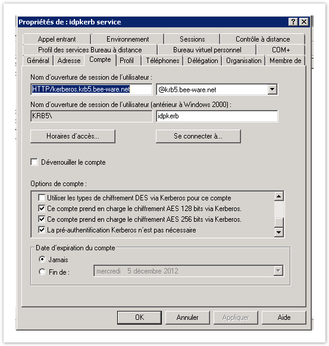
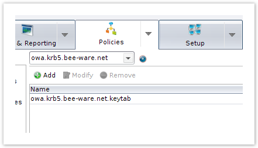
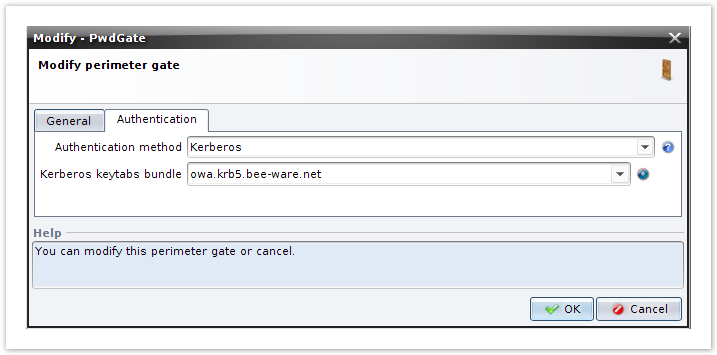
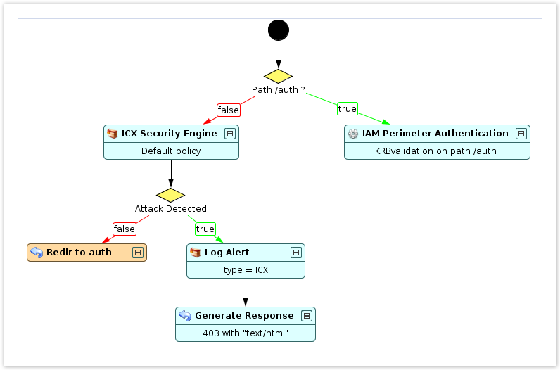
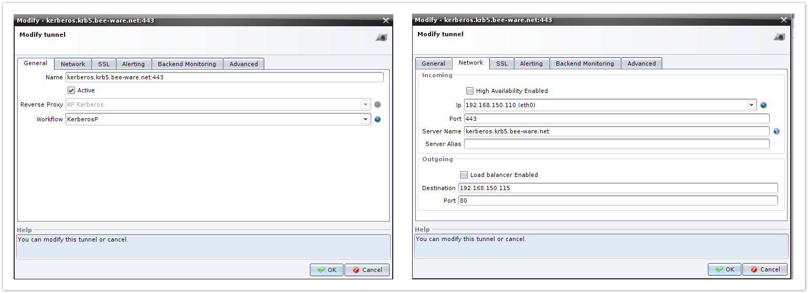
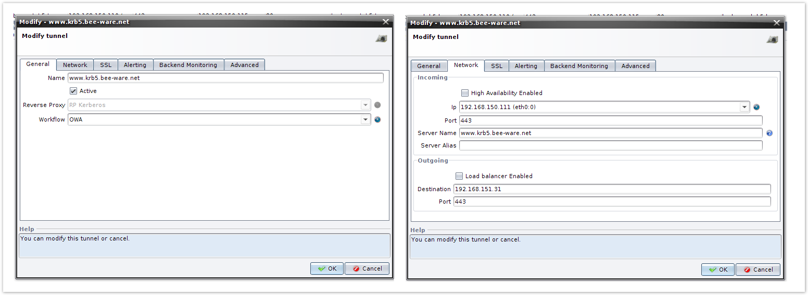

# Kerberos perimeter authentication on the WAF

- [Kerberos perimeter authentication on the WAF](#kerberos-perimeter-authentication-on-the-waf)
  - [Description](#description)
  - [The 3 Actors](#the-3-actors)
    - [1) the KDC can be:](#1-the-kdc-can-be)
    - [2) The CLIENT contains:](#2-the-client-contains)
    - [3) a SERVICE (WAF Tunnel) protected by Kerberos](#3-a-service-waf-tunnel-protected-by-kerberos)
  - [Prerequisites](#prerequisites)
  - [Configuring the AD KDC](#configuring-the-ad-kdc)
    - [Configuring a DC on Active Directory](#configuring-a-dc-on-active-directory)
    - [Configuring the IP](#configuring-the-ip)
    - [Creating an account for the test User](#creating-an-account-for-the-test-user)
    - [Creating/Mapping an account for the service to be Kerberized](#creatingmapping-an-account-for-the-service-to-be-kerberized)
      - [Mapping the Kerberos Principal on the account of the Kerberized service](#mapping-the-kerberos-principal-on-the-account-of-the-kerberized-service)
      - [Creating a keytab for the Kerberized service](#creating-a-keytab-for-the-kerberized-service)
  - [Configuring the WAF Tunnel](#configuring-the-waf-tunnel)
    - [Creating a Kerberos Gate based on the Kerberos profile you created](#creating-a-kerberos-gate-based-on-the-kerberos-profile-you-created)
    - [Creating a Kerberos Gate based on the Kerberos profile you created](#creating-a-kerberos-gate-based-on-the-kerberos-profile-you-created-1)
    - [Configuring the two Tunnels](#configuring-the-two-tunnels)
    - [Connecting the workflows](#connecting-the-workflows)
  - [Configuring a client](#configuring-a-client)
    - [Configuring Internet Explorer](#configuring-internet-explorer)
      - [If applicable, if IE is used on the same machine as the KDC](#if-applicable-if-ie-is-used-on-the-same-machine-as-the-kdc)
      - [If IE is on an other client machine](#if-ie-is-on-an-other-client-machine)
      - [In both cases](#in-both-cases)
    - [Configuring Firefox](#configuring-firefox)
      - [Install the “krb5-user” and “krb5-config” client packages.](#install-the-krb5-user-and-krb5-config-client-packages)
      - [Configure the krb5.conf file](#configure-the-krb5conf-file)
      - [Configuring the DNS](#configuring-the-dns)
      - [Check access to the Windows KDC](#check-access-to-the-windows-kdc)
      - [Configuring Firefox](#configuring-firefox-1)
      - [Finally, make a call to the application](#finally-make-a-call-to-the-application)
  - [Appendices](#appendices)
    - [Configuring encryption](#configuring-encryption)
      - [Windows 7](#windows-7)
    - [Synchronizing the time (NTP)](#synchronizing-the-time-ntp)
    - [Troubleshooting](#troubleshooting)


## Description
In this documentation, we will explain how to configure Kerberos authentication on WAF, based on a Windows KDC. Authentication is between the browser and the WAF, and not between the WAF and the Web backend (Kerberos Delegation mechanisms are used for that).

This documentation is “operation” oriented (there are a lot of operations under Windows).

## The 3 Actors
Kerberos authentication calls on the following three actors:

### 1) the KDC can be:

a. Under Windows 2000 (W2K), an Active Directory Domain Controller (e.g.: in Windows Server 2003 or 2008).

b. Under Linux, a distribution with krb5-kdc/krb5-admin (MIT or HEIMDAL).

### 2) The CLIENT contains:

a. The client binary itself:

   - Firefox (under Linux);

   - Internet Explorer (under W2K);

   - Another application, such as a JAVA client?…

b. A TGT cache:

   - The TGT service (in a W2K session, internal to IE);

   - kinit (with a Linux client).

---

The TGT/TGS cache is indissociable from the "client".

With a Linux client, "kinit" is the tool (krb5-user) that recovers the TGT and caches it locally.

With a W2K client, the TGT is automatically recovered when the session opens.

---

The client must be able to communicate with the GSS-API protocol.

### 3) a SERVICE (WAF Tunnel) protected by Kerberos

Generally a Web application (Apache, IIS, etc.)

The Kerberized service is the application that is protected by Kerberos authentication.

Here we will use www.krb5.denyall.com associated with the IP address 192.168.150.111. The two services (SSO and the Kerberized service) will have to be within the browser’s trusted sites (intranet zone) so that the browser sends the Kerberos information to the sites concerned.

## Prerequisites

In this documentation, we assume that we are in an WAF + Windows context.

- The KDC is :

    A Windows Server 2003 or 2008, with a configured Domain Controller.

    The domain name is: KRB5.BEE-WARE.NET. The DNS of the domain is: krb5.denyall.com

- The CLIENT is :

    Internet Explorer, with its internal TGT cache, recovered at the start of the Windows session.

- The  Kerberized SERVICE is :

    one (or two) Tunnel(s) defined on WAF.

    We assume here that there are two Tunnels/Workflows:

    One Tunnel for perimeter authentication (WAM Perimeter Authentication or WAM Perimeter Authentication Standalone) (e.g.: Kerberos.krb5.denyall.com).

    One tunnel for application authentication (WAM Application Access) (e.g.: kerbbeebackends.krb5.denyall.com).

## Configuring the AD KDC

### Configuring a DC on Active Directory

At the end of the installation of the OS (e.g.: Windows Server 2003), the DC is installed with the command:
```
c:> dcpromo
```
Example:
```
domain: krb5.denyall.com
machine name: adkdc.krb5.denyall.com
```

### Configuring the IP

Example:
```
192.168.100.115
```

### Creating an account for the test User

“Start > Programs > Administrative Tools > Active Directory Users and Computers > krb5.denyall.com > Users” [right-click] > “New > User”

Example:
```
testuser/test
```
---

**_Specific to Windows 2003: Installing the standard Windows Support Tools_**

The Windows Support Tools contain (among others) Kerberos utilities such as: ktpass, setspn, etc.

On the installation CD:

SUPPORT > TOOLS > file: suptools.msi

The Tools are installed in C:\Program Files\Support Tools.

REMARK:

You also see, in the “Start” menu:

“Start > Programs > Windows Support Tools > …”

---

### Creating/Mapping an account for the service to be Kerberized
Creating an account for the service

The service to be Kerberized is the one that handles perimeter authentication – that is, in this case, the Tunnel:

idpkerb.krb5.denyall.com

To proceed:

“Start > Programs > Administrative Tools > Active Directory Users and Computers…” then: “krb5.denyall.com”

[right-click] > New > Organizational Unit

Enter: “Unix services” (for example)

“Unix services”

[right-click] “> New > User”

… then:

Complete Name: “idpkerb service” Name for opening a user session: idpkerb pwd: idpkerbpwd (the password never expires, and the user cannot change the password).

Later, AES protocols will be associated with this account (see the “Windows 7” section).

#### Mapping the Kerberos Principal on the account of the Kerberized service

Open a console (or

“Start > Programs > Windows Support Tools > Command Prompt)”

```
c:\> cd "c:\Program Files\Support Tools\ "
c:\> setspn -A HTTP/idpkerb.krb5.denyall.com idpkerb
Registering...
Updated object
[...]
```

#### Creating a keytab for the Kerberized service

Open a console…
```
c:\> cd "c:\Program Files\KerberosFiles\ "
```
(the KerberosFiles directory needs to have been created beforehand).
```
c:\> ktpass -princ HTTP/idpkerb.krb5.denyall.com@KRB5.BEE-WARE.NET
 -mapuser idpkerb@krb5.denyall.com -crypto ALL -pass idpkerbpwd -out idpkerb.krb5.denyall.com.keytab
```
A KEYTAB file, “idpkerb.krb5.denyall.com.keytab”, is created in the current folder.

This formality enables support of AES encryption (since DES is considered not sufficiently reliable).

---

If we return to “> Active Directory Users and Computers”, we note that:

The “User Logon Name” has changed from “idpkerb” to “HTTP/idpkerb.krb5.denyall.com” (“idpkerb service user Account” tab).

This is where the AES 128- and 256-bit protocols can be enabled.

 

---

## Configuring the WAF Tunnel
### Creating a Kerberos Gate based on the Kerberos profile you created
- Recover the.keytab created on the Windows KDC: C:\Program Files\KerberosFiles\idpkerb.krb5.denyall.com.keytab (copy it via SSH using an application like PuTTY PSCP, etc.)
- Upload this.keytab to the Kerberos bundle.

Click the blue button and add a new keytab, and upload the file to this keytab.



### Creating a Kerberos Gate based on the Kerberos profile you created



### Configuring the two Tunnels

- The first Tunnel for Perimeter Authentication (our Kerberized service) and its associated Workflow (KerberosP).

Example: `kerberos.krb5.denyall.com`


    
- The Tunnel for Application authentication and its associated Workflow (OWA)

Example: `www.krb5.denyall.com`


### Connecting the workflows





The Workflow connected to the “www.krb5.denyall.com” Tunnel in particular must use the Kerberos Gate.

## Configuring a client

### Configuring Internet Explorer

With IE, there is no operation to perform beforehand to recover the TGT; it is automatically recovered at the start of a session, thanks to the implicit association with the KDC’s domain.

The TGT cache mechanism is transparent. However, tools from the “RKTools” (Windows Server 2003 Resource Kit Tools:  http://www.microsoft.com/downloads/en/details.aspx?familyid=9d467a69-57ff-4ae7-96ee-b18c4790cffd ) can be used to view the Kerberos tickets that are recovered implicitly during the phase of connection to the KDC:

- klist tickets (in a console)
- kerbtray (graphical)
- kerbtray (graphique)

#### If applicable, if IE is used on the same machine as the KDC
Authorize logon for the test User.

By default, Windows only allows local logon (that is, on the Domain Controller) to administrators. To authorize logon for the test User:

- “Start > Programs > Administrative Tools > Active Directory Users and Computers > Domain” [e.g. “krb5.denyall.com”]
- \> “Domain Controllers” > right-click (Properties)
- \> “Group Strategy” tab > Double-click “Default Domain Policy” …
- \> a “Group Policy Object Editor” opens
- In “Computer Configuration > Windows Settings > Security Settings > Local Policies > User Rights Assignment > Allow log on locally >” add the test User.

#### If IE is on an other client machine

a. The W2K client workstation needs to be attached to KDC.

- In an Admin session:

    “My Computer” icon > [right-click] “Properties > Computer Name > Change > Member of” …

    Enter the Domain Name (e.g.: “BeeWare”), not the DNS!

- Then: Reboot

b. Open a session with a user of the KDC, SPECIFYING the domain of the KDC in THE LOGIN DIALOG.

Then log on with a user who is declared on the KDC (and not a local user).

#### In both cases

(IE on KDC or IE on an independent machine),

a. In IE, the Kerberos authentication Tunnel must be declared in the “Local intranet” area.

- I.E > Outils > Internet options > Security tab > “Local Intranet” zone > Sites > Advanced

- Add the site : kerberos.krb5.denyall.com et www.krb5.denyall.com.

- Restart IE.

b. Configure the DNS (if there is not yet an IP address / host correspondence).

In C:\WINDOWS\System32\drivers\etc\hosts, add:
```
192.168.150.111 www.krb5.denyall.com
192.168.150.110 kerberos.krb5.denyall.com
```

### Configuring Firefox

Unlike IE/W2K, under Linux, there is no association with any Windows domain. The TGT must be recovered “manually”, using the utilities detailed below.

#### Install the “krb5-user” and “krb5-config” client packages.

The “krb5-user” package contains the utilities: kinit and kdestroy. The “krb5-config” package contains the conf file: /etc/krb5.conf

#### Configure the krb5.conf file
```
sudo vim /etc/krb5.conf
```
```
[libdefaults]
    default_realm = KRB5.BEE-WARE.NET
 
[realms]
    KRB5.BEE-WARE.NET = {
        kdc = adkdc.krb5.denyall.com:88
#        kdc = beew-kerb-w2k.beeware.org:88
        default_domain = krb5.denyall.com
    }
 
[domain_realm]
    .krb5.denyall.com = KRB5.BEE-WARE.NET
    krb5.denyall.com = KRB5.BEE-WARE.NET
```

The other krb5.conf directives can be found in the man page (> man krb5.conf).

#### Configuring the DNS
```
sudo vim /etc/hosts
```
```
[...]
192.168.100.115 adkdc.krb5.denyall.com adkdc
[...]
```

#### Check access to the Windows KDC

kdestroy: clears the local TGT cache.

kinit testuser: The TGT for the user “testuser” is recovered from the KDC. Password for testuser@KRB5.BEE-WARE.NET:

klist: Dumps the Ticket cache. cache: FILE:/tmp/krb5cc_1000 Default principal: testuser@KRB5.BEE-WARE.NET

Valid starting Expires Service principal 09/21/10 15:16:29 09/22/10 01:16:31

krbtgt/KRB5.BEE-WARE.NET@KRB5.BEE-WARE.NET renew until 09/22/10 15:16:29

OK: A TGT has been recovered.

#### Configuring Firefox

Enter the URL: “about:config” then, in the “network.nego*” keys

network.negotiate-auth.trusted-uris = “.krb5.denyall.com”

#### Finally, make a call to the application

Once the TGT has been recovered for a given user, we can make a call to the application (WAF Tunnel) protected by Kerberos authentication in Firefox …

…and also debugging information under Firefox.

Close Firefox in a console:

```
export NSPR_LOG_MODULES=negotiateauth:5
firefox -console
```

or :

```
export NSPR_LOG_MODULES=negotiateauth:5
export NSPR_LOG_FILE=/tmp/negotiateauth.log
tail -f /tmp/negotiateauth.log
firefox
```

## Appendices

### Configuring encryption

#### Windows 7

The configuration of exchanges includes negotiation of the protocol used; since DES encryption is not sufficiently secure, there is the option either of enabling it on the client or enabling the AES protocols on the Kerberos server.

Case 1:

DES encryption protocols are not enabled by default in Windows 7. AES is used by default.

Enabling the encryption protocols:

-    Open a Management Console (MMC).
-    Add “Group Policy Object Editor”.
-    In “Computer Configuration > Windows Settings > Security Settings > Local Policies > Security Options”
-    Select “Network security: Configure encryption types allowed for Kerberos” and check “DES-CBC-CRC”, “DES_CBC_MD5”, and “RC4_HMAC_MD5”.

Case 2:

Enabling the AES protocols on the server:

Edit the properties for the user idpkerb created earlier, and for whom we’ll authorize the use of the AES 128- and 256-bit protocols.

### Synchronizing the time (NTP)

It’s important for the server and clients to be synchronized because the tokens that are generated are time-stamped.

Be sure to synchronize the Bee Ware RP on an NTP server (you’ll find a few NTP server addresses here:  http://www.pool.ntp.org/)

Also, don’t forget to synchronize the client. Synchronization is done via the Domain Controller.

For that, it may be necessary to install a patch on Windows Server (Microsoft Fix it 50395

The clocks on the elements involved (Domain Controller, client, and Bee Ware appliance) will have to be synchronized; the maximum acceptable time skew for the group is 300 seconds.

### Troubleshooting

The following tools can help make it easier to implement Kerberos:

- Windows Server Event Viewer (“Start > Administrative Tools > Event Viewer”): Helps detect problems with the KDC.
- Kerbtray or the “klist tickets” command let you see the available tokens (on a client PC).
- Wireshark lets you see exchanges and encryption method negotiations.
- The hexer command (under Linux) can display the keytab to see how many encryption methods have been used.
  
It is possible for errors to appear with the KDC (Windows error ID 14 / 16):

- http://technet.microsoft.com/en-us/library/dd348670(WS.10).aspx
- http://technet.microsoft.com/en-us/library/dd348717(WS.10).aspx

The solution is to reinitialize the password for user krbtgt and idpkerb (take care not to make a mistake with the password for the idpkerb account and that it corresponds to the one in the keytab).

A 401 authentication popup can appear when the site is not among the trusted sites (Intranet zone).

403 errors can also be raised if the hostname is not declared in the Server Name area (“Server Alias”) of the Tunnel or when “Block unknown hostnames” is enabled on the Reverse Proxy.