# Microsoft SharePoint and WAM

- [Microsoft SharePoint and WAM](#microsoft-sharepoint-and-wam)
- [Description](#description)
- [Prerequisites](#prerequisites)
- [Creating a Workflow](#creating-a-workflow)
- [Setting up the Tunnel](#setting-up-the-tunnel)
- [Functional test](#functional-test)
- [Setting up SSO](#setting-up-sso)
  - [Configuring perimeter authentication](#configuring-perimeter-authentication)
- [Configuring application authentication](#configuring-application-authentication)

# Description
This tutorial shows you how to set up NTLM authentication on a SharePoint server. The authentication protects access to SharePoint.
The end result is that if a user tries to connect to the SharePoint server, the connection transits through the Tunnel, which relays it to WAM. WAM allows or refuses the connection to the SharePoint server. 

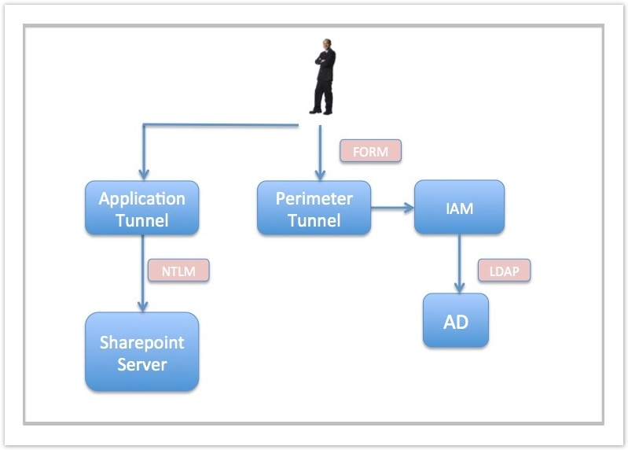

# Prerequisites
Minimum i-Suite version: 5.3.1. SP1

# Creating a Workflow
First of all, we create a Workflow based on the **i-Sentry Default** template, but we modify the default policy. We apply an Empty policy for the **ICX Security Engine** node.

# Setting up the Tunnel
In order to proxify user traffic to the server SharePoint, we create a Tunnel: **Infrastructure > Tunnels > Add button**

In the **General** tab, enter a name for the Tunnel in natural language and choose the Workflow we created previously.

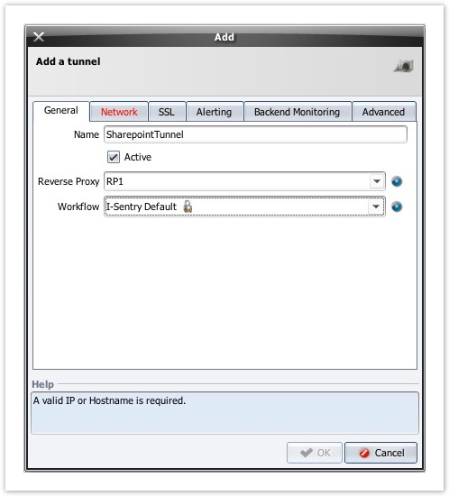

In the Network tab, enter the hostname of the SharePoint server (Server Name) and its IP address (Destination).

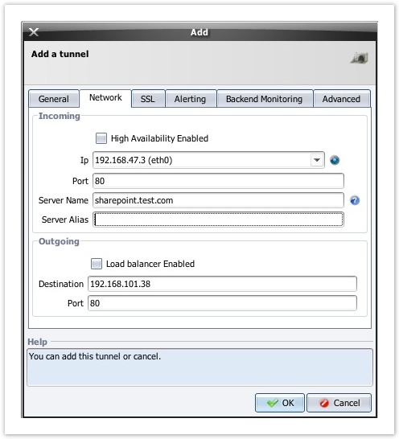

---

The name of the server must be the same as one of the ones proposed in the administration area of SharePoint (see image).

---

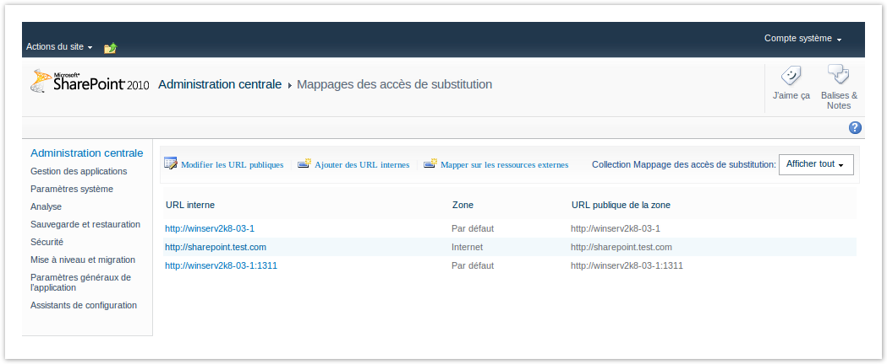

In the **Advanced** tab, enable **Enable access logs** and **Advanced body fetching**.

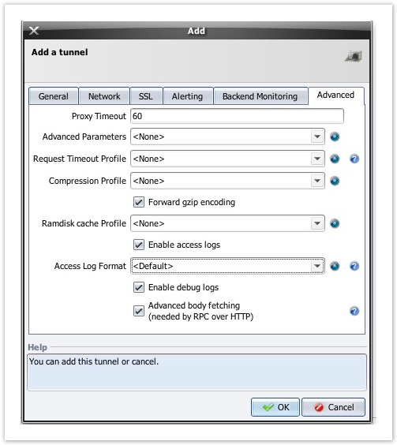

Now, traffic is returned to the Tunnel, and it communicates with the SharePoint server.

# Functional test

First you have to edit your “hosts” file to point the hostname of the server to the Incoming IP address of the Tunnel. Then, once configuration is complete and functional, the internal DNS servers will have to be modified accordingly.

To verify that traffic is moving as it should, open your browser and enter the address of the SharePoint server. The home page of the site should be displayed. 

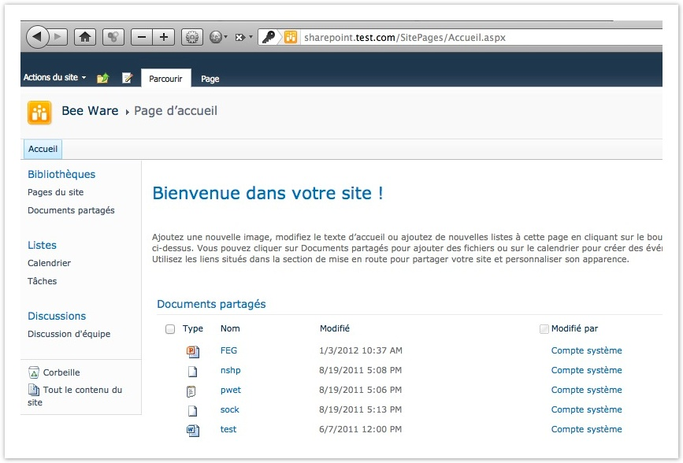

# Setting up SSO
## Configuring perimeter authentication

- We create a Perimeter Gate called "GatePerim" to handle the authentication requests.

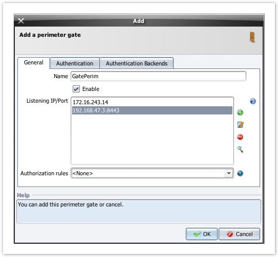

- In the Perimeter Gate configuration dialog, we choose Form as the Authentication method.

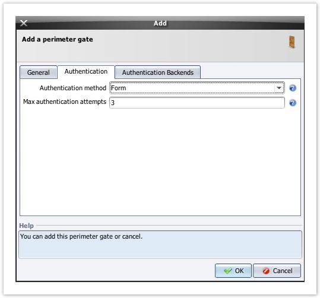

- In the **Authentication Backends** tab, un-check **Internal Authentication** Server and create an LDAP one.
  Create an LDAP datastore. The IP address you should enter is the one to the Active Directory server.

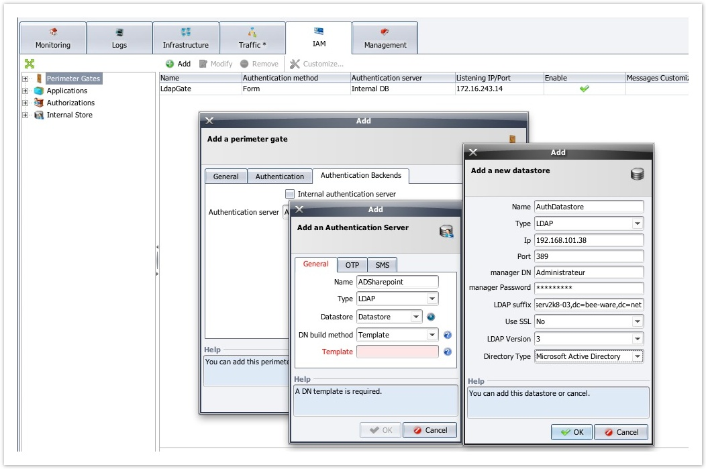

- Expand the **Perimeter Gates** menu, click on **Authentication Servers**, then on the Test button to verify your configuration’s connectivity.
  The result of the test is displayed in a message box.

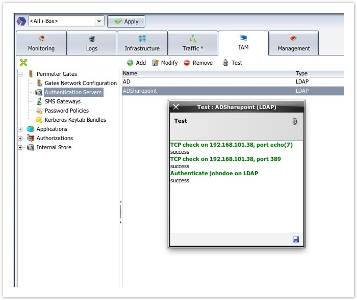

- We create an empty "AuthenticationWorkflow" (no template is used) dedicated to authentication.

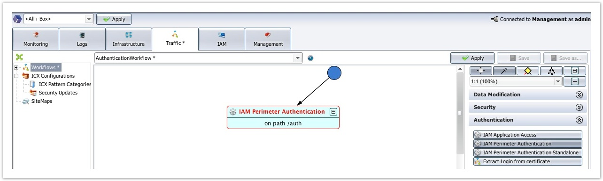

- We add a WAM Perimeter Authentication node.
  
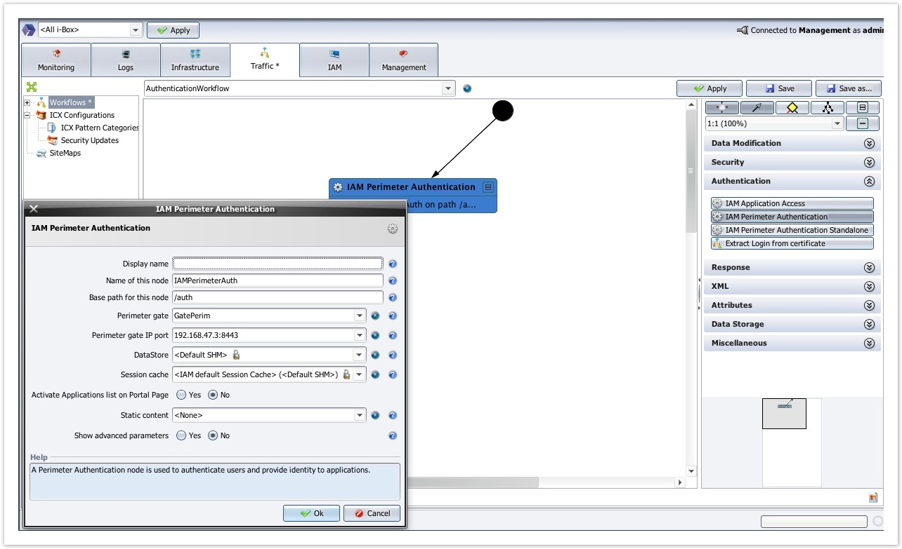

- We have created an "AuthenticationRP" Reverse Proxy dedicated to authentication, to which we will now link our new Tunnel. For all these operations, you can you refer to the Use Case [WAM: LDAP (AD) + HTTP Basic Authentication]("https://github.com/Rohde-Schwarz/r-s-waf-extra/tree/main/use-cases/WAM%20and%20authentication/Implementing%20HTTP%20Basic%20Authentication%20with%20LDAP%20server") (starting with 5.3.1 SP1).

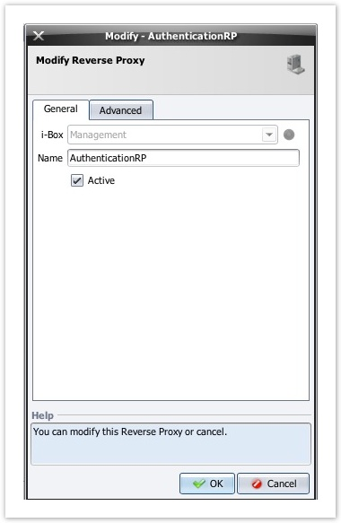

- Now we’re going to create a second **“AuthenticationTunnel”** which will be used for perimeter authentication.

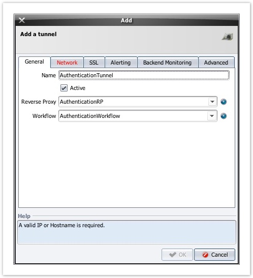

- In the **Network tab**, enter the **Server Name** (in this case, we will call it "auth.test.com"). The Destination is 0.0.0.0. since the Tunnel is not proxifying anything. You have to edit your “hosts” file to point the hostname of the server ("auth.test.com") to the “Incoming” IP address of the Tunnel. Then, once configuration is complete and functional, the internal DNS servers will have to be modified accordingly.

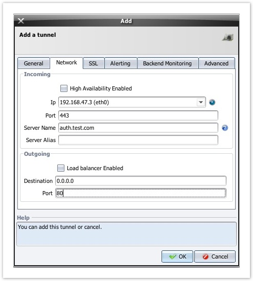

# Configuring application authentication
- Now we’ll create an **Application** in **WAM** > **Applications** > **Add button**.
  This operation will serve to refine the Workflow.
  Give the application a name. Here we’ll call it "SharePoint".

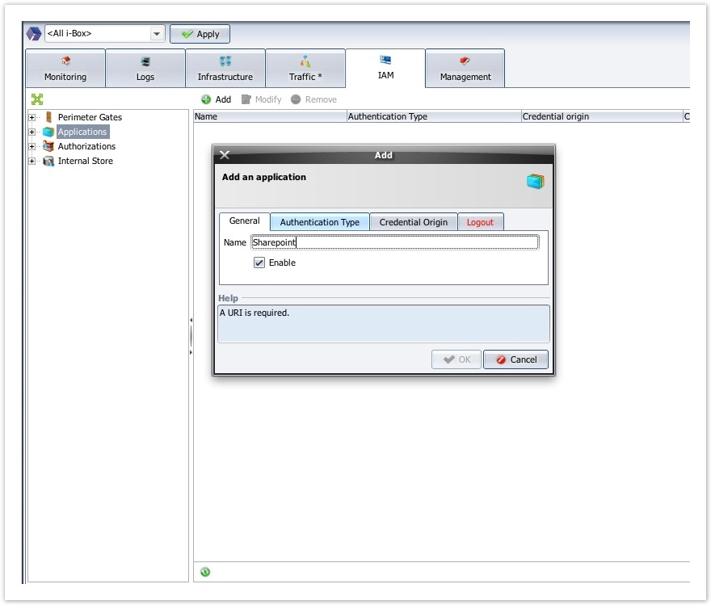

- In the Authentication Type tab, choose NTLM for Authentication Type.

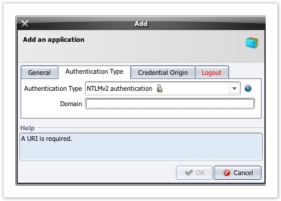

- In the **Credential Origin** tab, choose the **Same as Perimeter login/pass** option.

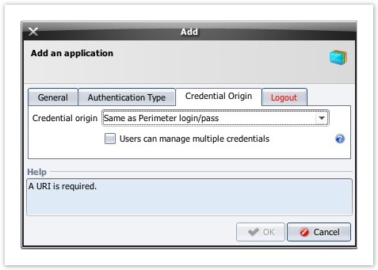

- In the Logout tab, choose the logout URL of the SharePoint server.

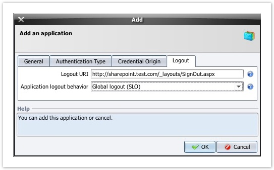

- Now we can return to the "WorkflowSharepoint" Workflow created previously and modify it.
  Remove the Proxy Request node.

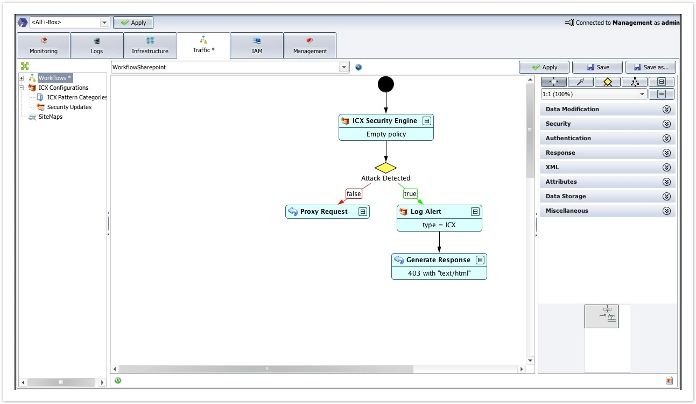

- We replace the **Proxy Request** node with an **WAM Application Access** node.
  In the node parameters, enter the application defined above, and in the Tunnel for Perimeter Auth field, enter the "AuthenticationTunnel"we configured previously.

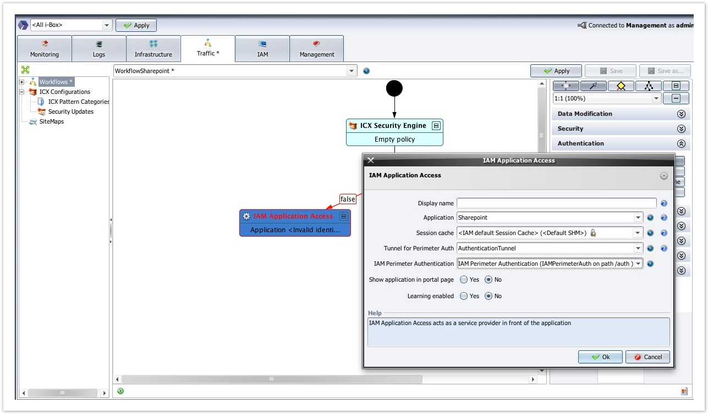

- Launch a browser and enter the address of the SharePoint server – in this case: sharepoint.test.com. An WAM authentication form is displayed.

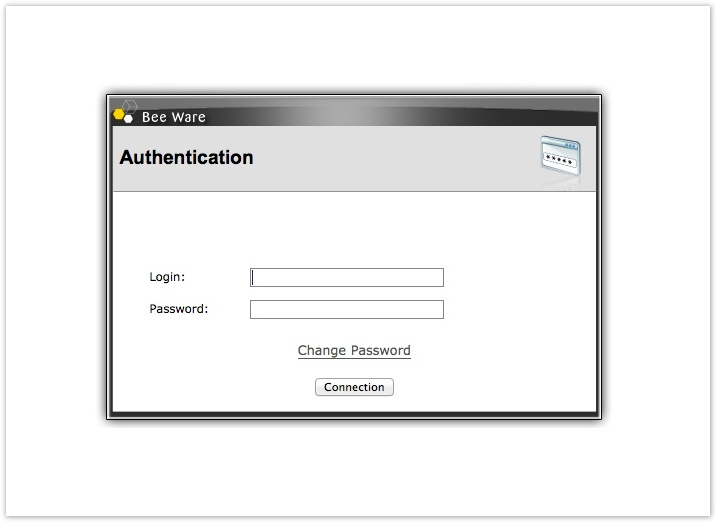

- You can skin the authentication page and [personalize](https://documentation.rscyber.fr/display/WAF68EN/Customizing+WAM+pages) it to suit you.