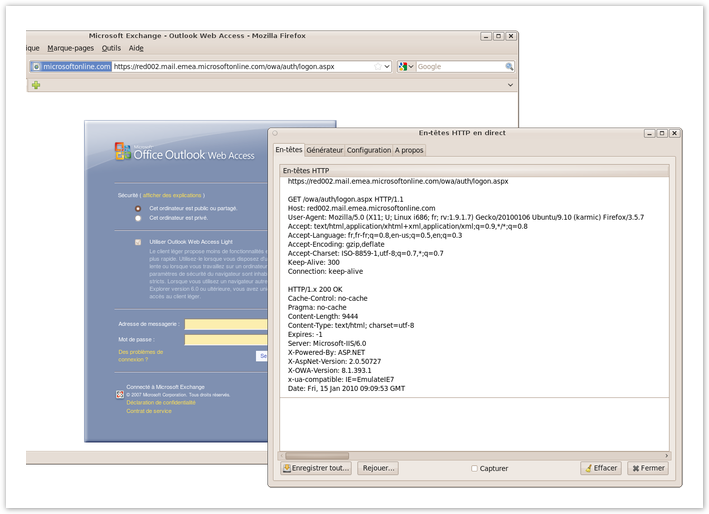
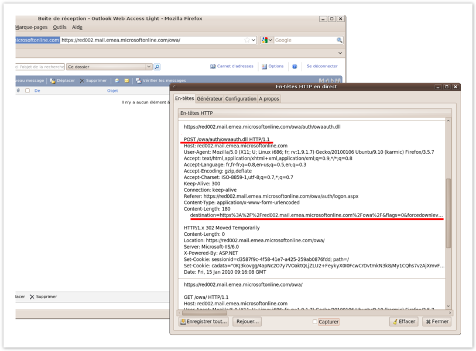
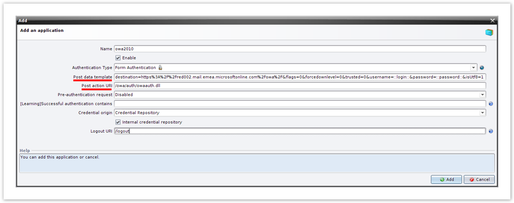
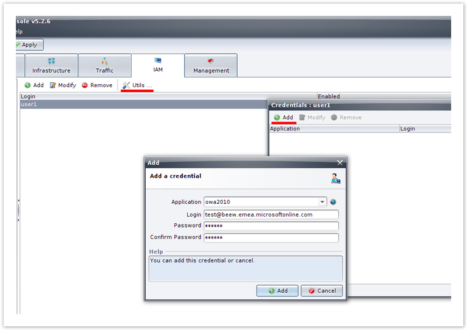
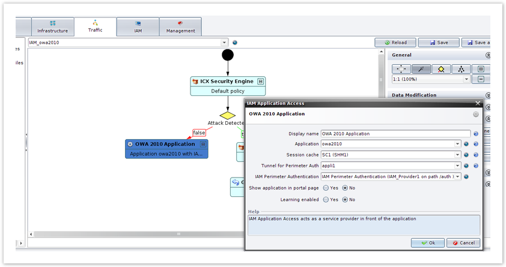
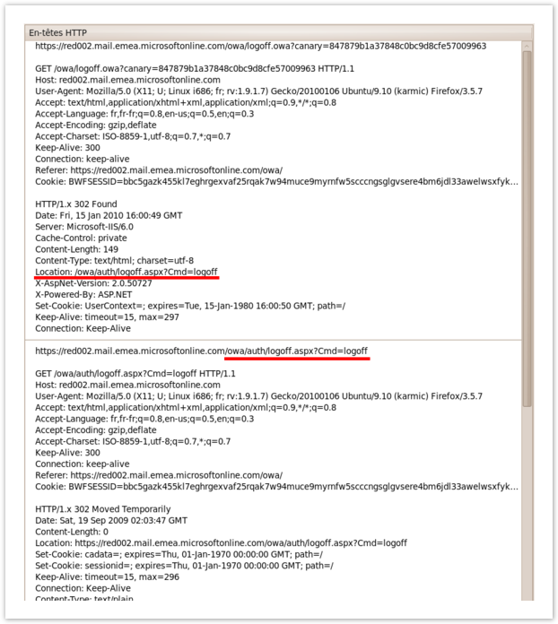
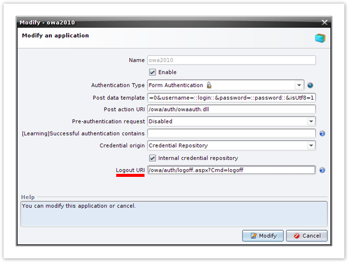
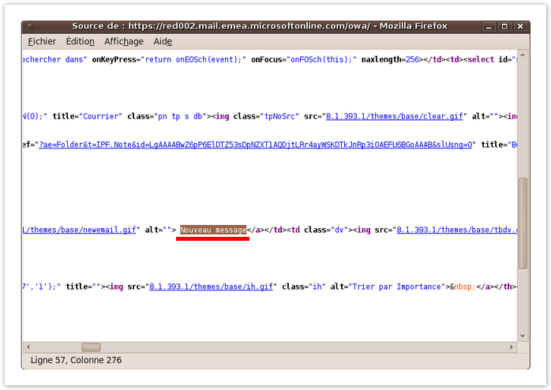
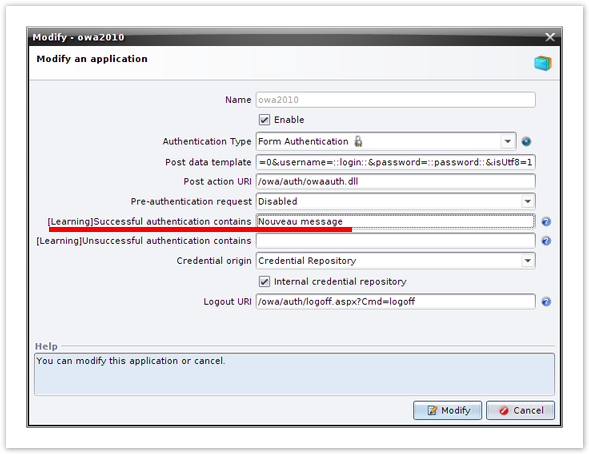
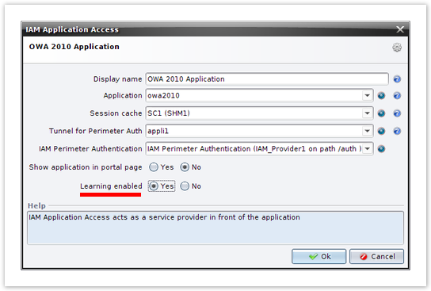

# WebSSO - Configuring a Microsoft Office Outlook Web Access (OWA) Application

- [WebSSO - Configuring a Microsoft Office Outlook Web Access (OWA) Application](#websso---configuring-a-microsoft-office-outlook-web-access-owa-application)
- [Description](#description)
- [Prerequisites](#prerequisites)
- [Analyzing the application](#analyzing-the-application)
- [WAM Application](#wam-application)
- [Workflow](#workflow)
- [Logout](#logout)
- [Learning / Credentials](#learning--credentials)

# Description 
This tutorial explains how to analyze and configure an application that uses form-based authentication (POST). We will use the Microsoft Office Outlook Web Access (OWA) Webmail service application as an example, but the concepts remain similar for most form-type applications.

# Prerequisites
This tutorial assumes that you have a functional perimeter WAM environment (see [Single Sign On (SSO) tutorial](https://documentation.rscyber.fr/pages/createpage.action?spaceKey=DOC&title=Authentification+unique+%28SSO%29)) and a functional Tunnel to the OWA application. Check to see that the application as a whole is operating correctly (authentication, navigation in the application, etc.) The minimum i-Suite version is v5.2.6.

# Analyzing the application
We use an integrated HTTP flow analyzer in the form of a Firefox Add-on: [Live HTTP Headers](https://addons.mozilla.org/fr/firefox/addon/http-header-live/).
Start by deleting any cookies related to the OWA application. Launch the analyzer, then access the application.

Sending the e-mail address and password generates data needed for configuring the WAM application:

Here we retrieve the following data:
- The URL on which the form is sent: /owa/auth/owaauth.dll
- The data sent to the application (POST data): destination=https%3A%2F%2Fred002.mail.emea.microsoftonline.com%2Fowa%2F&flags=0&forcedownlevel=0&trused=0&u

# WAM Application
With this information, we can create the WAM application.

We'll deal with the Logout and Learning parts farther on in this document.

Replace the values of the ID and password in the POST data template with the strings ::**login**:: and ::**password**::

Fill in the POST action URI parameter with the value analyzed earlier.

Save and perform an **“WAM Apply”**.

We’re going to associate an application account with a user we already have, since the application credentials are managed in **“Credential Repository”** mode in Credential Origin. If the IDs and passwords are identical to those used for perimeter authentication, we can use the **“Same as Perimeter login/pass”** mode.

# Workflow

Now all we need to do is to associate our WAM application with an WAM Agent in the Workflow protecting the Tunnel.
Here is our test Tunnel, which uses the perimeter authentication defined in the WAM Basics tutorial.

Save the Workflow, modify the Tunnel so that it uses this Workflow, then apply the changes via an **“Infrastructure & Workflow Apply”**.

After the cookies for the OWA application have been deleted, when we try to access the application, we are now redirected to the WAM Perimeter Authentication component, which offers to authenticate us with the parameters of the corresponding Perimeter Gate. After authentication (here with our user **“user1”**), we are redirected to the application and transparently authenticated to it.

# Logout
The application has a logoff link (here **“Logout”**). Still using our HTTP analyzer, we can determine a characteristic logoff URL by clicking on the link:

When we click the logoff link, the application sends us to a second address:

https://red002.mail.emea.microsoftonline.com/owa/auth/logoff.aspx?Cmd=logoff

It is generally recommended to trigger WAM logoff on the logoff request that results in modification or deletion of application session cookies.
Now we indicate that the application causes a logoff on the URL /owa/auth/logoff.aspx?Cmd=logoff.

Confirm with an **“WAM & Workflow Apply”**.

Delete the different cookies in the browser, and then reconnect to the application. Now, a click on the logoff link is detected by the WAM Application Access component, which triggers a general logout procedure on all the applications accessed by the user (in the context of the Gate). In our example, the browser is finally redirected to a page indicating logout.

# Learning / Credentials
A credentials learning function can be enabled if the credentials are not identical to the perimeter IDs and passwords (Implicit type). To do that, you need to indicate a string that is characteristic of a page displayed following a successful application authentication, and optionally a failed authentication. To do that, retrieve a characteristic string in the source of the page that follows authentication.

For example, we can use the string “New message” as being characteristic of a successful authentication. You can also give a string that is characteristic of an error page, as reinforcement (then both checks will be made), but that isn’t necessary here.

Modifying the configuration of the WAM Application Access component to enable learning:

Apply the changes with an **“WAM and Workflow Apply”**. Check that the application credential for the user is deleted for the tests.

Delete all the application cookies again, and log on to the application.

Following perimeter authentication, the user accesses the application without being authenticated, and it displays its authentication form. Enter the ID and password for the application and click **“OK”**.

Application Access has detected the new credentials and sent them to the WAM server. You can check that by displaying the user’s credentials.

At the next session, the phase of entering the ID and password for the application will be skipped (the agent checks that the credentials are still valid anyway, and will prompt for the application credentials to be entered again if necessary).

You can simulate a change of password for the application by creating a new application credential with an incorrect login or password.