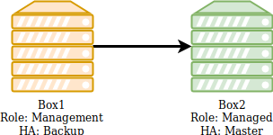
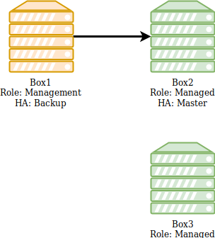
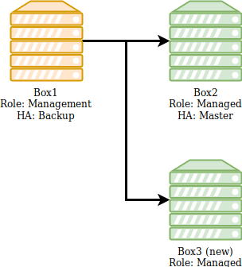
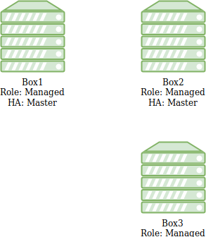

Add a dedicated Management box to an existing cluster
=====================================================

* 1 [Presentation](#presentation)
* 2 [Prerequisite](#prerequisite)
* 3 [Instructions](#instructions)
	* 3.1 [Add new Management box to cluster](#add-new-management-box-to-cluster)
	* 3.2 [Synchronize configuration on Box3](#synchronize-configuration-on-box3)
	* 3.3 [Switch the old Management box to Managed role](#switch-the-old-management-box-to-managed-role)
	* 3.4 [Switch the new box to Management role](#switch-the-new-box-to-management-role)
	* 3.5 [Connect and start new cluster configuration](#connect-and-start-new-cluster-configuration)

Presentation
------------

The following use case describes how to replace a Management box with a new powerful one respecting new recommendations.
Since few years, most of our WAF clusters were mainly composed of a Management box and one Managed box:
* The management box to handle configurations and logs but also applications.
* And the managed box only to handle applications.

> **The black arrow means that the Management box is controlling the Managed box configuration.**

The 6.5 version evolved, and so did needs and recommendations. Hence, we now recommend having a dedicated Management box handling **only configurations, logs and no more applications**. Box prerequisites also change to have more memory and disk capacity.

This new recommendation allows:

* A dedicated role per box (management simplicity and security).
* To centralize logs on the Management box (monitoring, security, access, ... ).
* A minimal performance impact on Managed boxes when handling application logs (access logs).
* Powerful applications and cluster monitoring with dashboards and visualizations.

Clusters hosting a great number of applications should already be composed of a dedicated Management box and few Managed boxes to host application and analyse traffic.

|:warning: **Notes before actions:**|
|:----------------------------------|
|<ul><li>The new Management box will need a new license.</li><li>All existing logs will be lost in this process. A new Management box will start with a new database on the new box and stop previous database definitively.</li><li>Applications on Boxes will still take traffic until the applications restart on step 6.</li><li>High Availability (HA) on applications will still be working during the procedure.</li><li>The old Management box will become a Managed Box hosting applications.</li></ul>|

Prerequisite
------------

We have an existing 2-boxes cluster and we want to add a new dedicated management box. We consider the new box as already installed as a **Managed** with the same version as cluster's boxes.

* Box1 is the old management box.
* Box2 is the managed box.
* Box3 is the new management box.

Instructions
------------

### Add new Management box to cluster

Go to Setup > Boxes > Add, then:

* Choose a name for new management.
* Specify IP address.
* Make sure that **Replicate certificate** setting is checked. The new management box will need certificate files to start all services.
* Press **OK** and wait for the addition of the new box.
* Then, assign a license to the box.

Now we have this new configuration:

### Synchronize configuration on Box3

The cluster configuration has to be pushed on the new Box3:

* Click on the **Apply** button, in the top right corner.
* In the filter list, change **<All Boxes>** to **Box3**.
* Click on **Select all**.
* Finally click on **OK** to apply.
* Wait until configuration synchronization is done.
* Check the summary: all items must be in **SUCCESS** state.

Now, Box3 has got the whole configuration and can be switched to a Management mode.

### Switch the old Management box to Managed role

This is important to avoid having 2 Management boxes in the cluster at the same time (this will induce critical conflicts).

|:warning: **You will be disconnected from the administration interface after switching this Management box to a Managed role.**|
|-------------------------------------------------------------------------------------------------------------------------------|

In this step, we will transform the **old Management** box to a **Managed**. To do so:

* Connect on Box1 TUI and go to: **Appliance mgnt > Appliance role > Change appliance role** 
* Then, select **Managed** and choose **Change role**. 
* Finally wait a few moments until a message telling you **Change appliance role successfully** appear.

Now the cluster is in this status:

### Switch the new box to Management role

To switch the new box to a **Management** role, you have to connect on Box3 TUI and proceed the same way as the previous step except that you will have to select **Management** instead of **Managed** in the **Change appliance role** menu.

Now the cluster is in this status:

### Connect and start new cluster configuration

* Connect with the administration interface to Box3 with its IP address.
* Click on **Apply** button in upper right corner.
* Press **Select all** button.
* Select **Use cold restart when applying reverse proxies** at the bottom, then press **OK** and wait a few moments.

|During cold restart, services will stop and start. Applications will be stopped during the process.|
|---------------------------------------------------------------------------------------------------|

New Management Box3 is now correctly added to your configuration as a **Management** box in place of Box1. No need to change your High Availability (HA) settings, configuration will continue working on the two managed boxes as before. Your dedicated Management box is now receiving the new logs.
