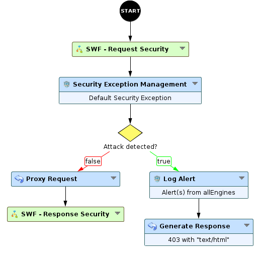
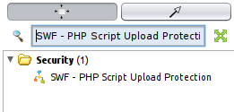
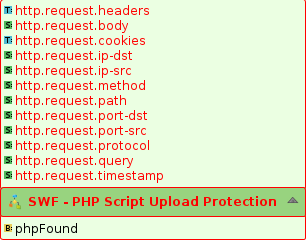
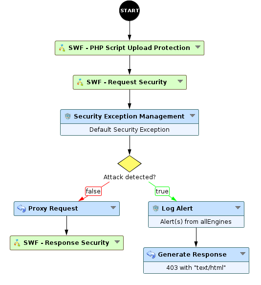
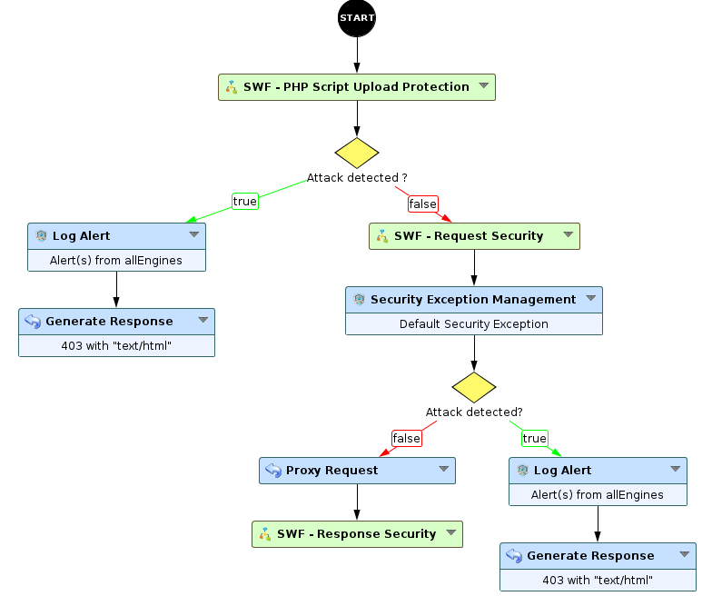

Creating a Workflow using a sub-Workflow
========================================

* 1 [Presentation](#presentation)
* 2 [How to include a Sub-Workflow inside a main Workflow?](#how-to-include-a-sub-workflow-inside-a-main-workflow)

Presentation
============

When you create a Workflow for your applications, you can add subsidiary Workflows named **Sub-Workflows** inside it to do specific tasks. These Sub-Workflows can have numerous parameters, mandatory or not, and have various **Required Attributes** that should be provided by previous nodes.

How to include a Sub-Workflow inside a main Workflow?
=====================================================

In this example, we are going to include the **SWF - PHP Script Upload Protection** Sub-Workflow to a main Workflow based on **WAF Default** Workflow.
More information on this Sub-Workflow and its backup file can be found here: [SWF - PHP Script Upload Protection](../../Security/Protecting%20against%20PHP%20script%20upload%20and%20shellcode%20attacks).

First of all, we need to create a Workflow based on **WAF Default**, to do so:
* Go to **Policies > Workflows**
* Click on **WAF Default**, unroll **Save** and press **Save As**.
* Select a unique name and press **OK**.

You should have a Workflow that looks like that: 

Then, you need to search the Sub-Workflow you want to add, here it is **SWF - PHP Script Upload Protection**.

Next, drag and drop the Sub-Workflow to your main Workflow, it should appear in red as it is still not linked to any node and parameters are not set.
Unroll the Sub-Workflow node to show **Required attributes** that must be provided by previous nodes, and **Provided Attributes** that are sent by the Sub-Workflow.

Finally, link the Sub-Workflow to other nodes depending on which attributes should be provided and sent, here we will place the Sub-Workflow right after the **Start** node and before **SWF - Request Security**, and set parameters.

But this new Sub-Workflow is not really useful yet as its **Provided Attributes** are not used. In this case, we will add a **Decision** node to check the value **phpFound** provided by the Sub-Workflow, and accept the request if there is no attack or block and log the request if something is detected.

