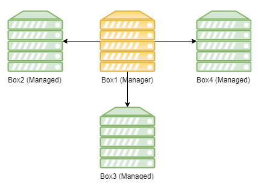
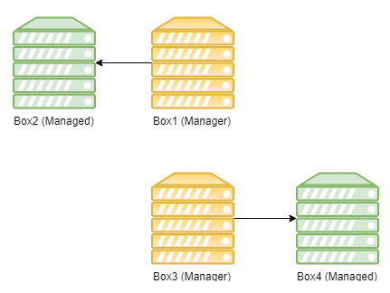
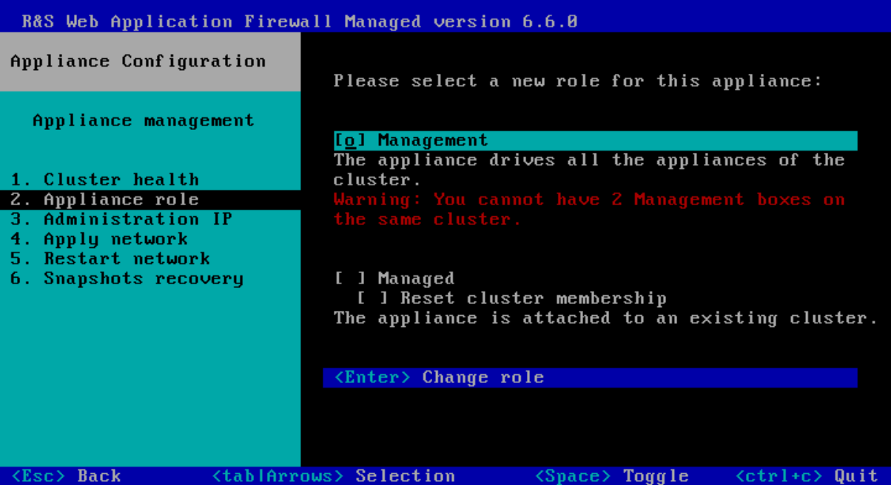
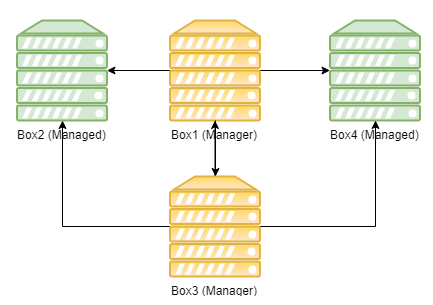
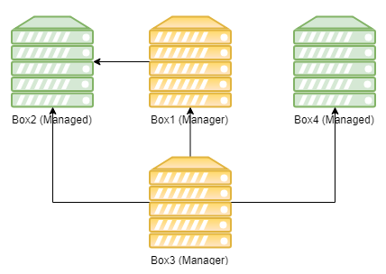
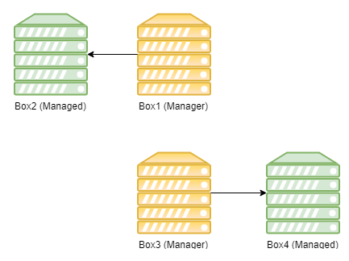

Divide a WAF Cluster
====================

* 1 [Presentation](#presentation)
* 2 [Instructions](#instructions)
	* 2.1 [Check certificates replication](#check-certificates-replication)
	* 2.2 [Make Box3 a manager](#make-box3-a-manager)
	* 2.3 [Remove Box4 and Box3 from Box1's configuration](#remove-box4-and-box3-from-box1s-configuration)
	* 2.4 [Remove Box2 and Box1 from Box3's configuration](#remove-box2-and-box1-from-box3s-configuration)

Presentation
============

This use case describes how to divide a WAF cluster into two distinct clusters.

| :warning: Warnings|
|:------------------|
|<ul><li>The cluster must be divided in a logical way. Appliances sharing the same configuration items must be grouped together. A specific attention must be paid to VRRP Clusters, Backend Balancers and WAM items. First of all, each cluster must have its complete configuration available, and dependencies resolved.</li><li>Performing a full backup is needed before doing anything.</li><li>Concerning High Availability configurations, VRRP Clusters ids must be unique.</li></ul>|

Suppose the following configuration with Box1 as a **Management** box and Box2, Box3, and Box4 as **Managed** boxes:

The use case describes how to obtain two separate clusters, as this:

Instructions
============

### Check certificates replication

* **Once full backup has been performed**, connect to Box1's administration console, to manage Box3 which is subordinate to Box1.
* Check that certificates are replicated on Box3, go to **Setup > Boxes > Box3 >Modify > Advanced**, tick **Replicate certificates** and press **OK**.
* Finally, press **Apply** on the top right corner, tick Box3 in the list and press **OK**.

### Make Box3 a manager

* Connect on Box3 TUI and go to: **Appliance mgnt > Appliance role > Change appliance**.
* Then, select **Management** and choose **Change role**. Note that having two **Management** boxes in the same cluster is not recommended, but to achieve this step we have to do so.
* Finally wait a few moments until a message telling you **Change appliance role successfully** appear.

The Cluster is now in this situation:

### Remove Box4 and Box3 from Box1's configuration

* Connect to Box1's administration console.
* Remove Box3 and Box4 from appliances list, go to **Setup > Boxes > Box4 > Remove**, then **Box3 > Remove**.
* Finally, press **Apply**, **Select all** and **OK**.

The cluster is now in this situation:

### Remove Box2 and Box1 from Box3's configuration

* Connect to Box3's administration console.
* Remove Box2 and Box1 from appliances list, go to **Setup > Boxes > Box2 > Remove**, then **Box1 > Remove**.
* Finally, press **Apply**, **Select all** and **OK**.

The cluster is now in this situation:

