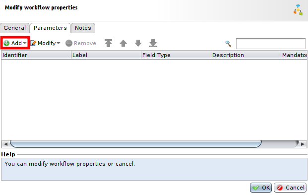
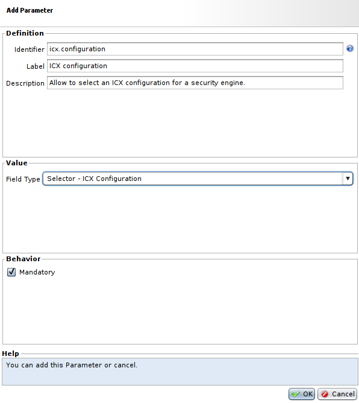
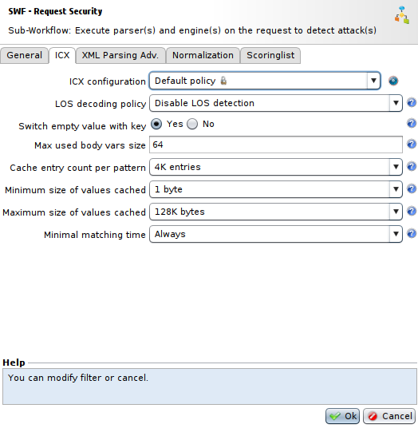
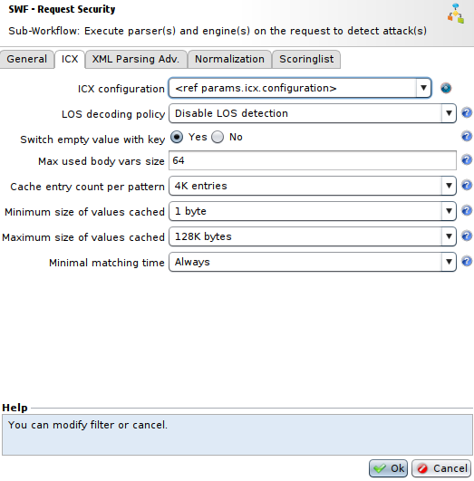
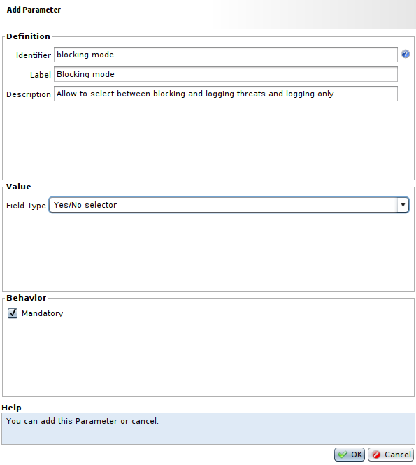
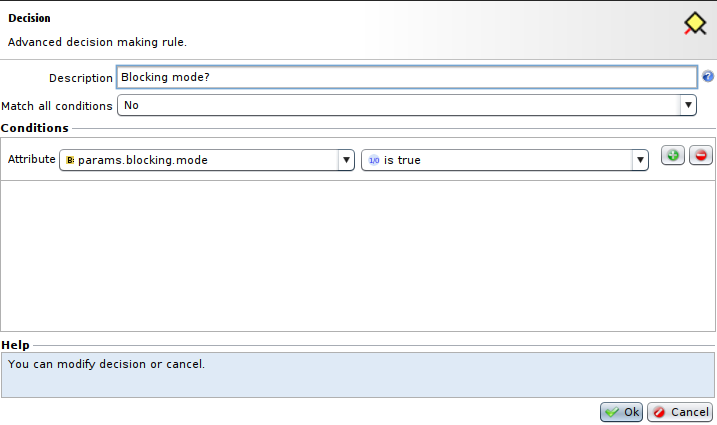
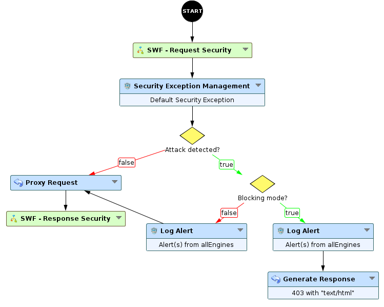
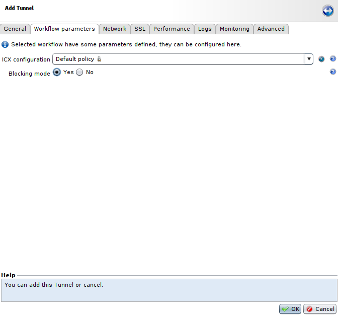

Workflow with parameters
========================

* 1 [Presentation](#presentation)
* 2 [Example of usage](#example-of-usage)
	* 2.1 [Passing an ICX configuration as a parameter](#passing-an-icx-configuration-as-a-parameter)
	* 2.2 [Passing a parameter to choose between different actions](#passing-a-parameter-to-choose-between-different-actions)
	* 2.3 [Selecting values for parameters given to Workflows](#selecting-values-for-parameters-given-to-workflows)

Presentation
------------

This use case will present how to use parameters with Workflows to simplify changes on Workflows behavior, and allowing to use generic workflows for multiple tunnels with customizable calls to define different behaviors depending on the tunnel. 

It offers several advantages:
* Reduce the number of Workflows, due to their reusability in multiple tunnels with changes in parameters like configurations or profiles.
* Reduce the amount of time to change some configurations and attributes in the Workflows if you pass them as parameters, as you won't have to analyze the content of the Workflows to change these parameters and instead just update them in the settings.
* Reduce the risks of mistakes made by modifying an element present in multiple places inside the Workflows.

|Note that Workflows parameters are used the same way as Sub-Workflows parameters, with the "Identifier" of the parameter prefixed with "params."|
|------------------------------------------------------------------------------------------------------------------------------------------------|

Example of usage
----------------

We will start with the Workflow **WAF Default** and add parameters to transform it into a Workflow that will look like **WAF Default with parameters**. We won't add every parameter needed to recreate **WAF Default with parameters** from **WAF Default** and only focus on some parameters:
* The **ICX configuration** will be added to Workflow parameters to be passed to security engines, allowing to have only this Workflow if you want different tunnels using **WAF Default** with different **ICX Configuration**.
* A boolean parameter will also be passed to select if the Workflow should automatically block and log potential attacks detected or only log them.

In this case, we are starting from **WAF Default** Workflow, and so we will need to have another Workflow with the same content as **WAF Default** that we can modify. To do so, go to **Policies > Workflows**, from here you can either select **WAF Default** in the list, click on **Save as**, choose an unique name for your Workflow and press **OK**, or click on **Add**, choose an unique name for your Workflow, select **WAF Default** in the field **Template** and press **OK**.

### Passing an ICX configuration as a parameter

Firstly, we will add a parameter for the **ICX Configuration**. Go to the Workflow created before, click on **Modify**, go to the **Parameters** tab and press **Add** to open the **Add parameter** menu.

Then, fill out the fields as follows to add the new parameter:
* In the **Identifier** field, choose a name for the parameter that will be used inside Workflows. This name should decribe clearly what this parameter represents and should follow the pattern **my.new.attribute**. Here we will name it **icx.configuration**.
* The field **Label** will contain the **label** of the parameter in the parameter list of the Workflow. It should also describe clearly the parameter. We will choose **ICX configuration**.
* The field **Description** is not mandatory, it represents the tooltip that will appear with the parameter. It is used to describe more in-depth the corresponding parameter.
* The field **Field Type** represents the type of the parameter we are creating. In this case, it has to be **Selector - ICX Configuration**.
* The field **Mandatory** should be ticked if you want to force the setup of this parameter. Here we will make this parameter mandatory.

Finally, the new parameter is created, we can now use it in our Workflow.

In the Workflow, double click on the **SWF - Request Security** Sub-Workflow to edit parameters, go to the **ICX** tab.

Instead of the already existing parameter **ICX configuration**, select **\<ref params.icx.configuration\>** in the list (if you used another **Identifier** for this parameter, select the one corresponding in the list)

Now, you have a Workflow allowing to select the **ICX Configuration** from the Workflow parameters.

### Passing a parameter to choose between different actions

Next, we will add a boolean parameter to create two modes of action, one to block and log any threats and another one to only log threats. To access to the **Add parameter** menu, proceed the same way as for the **ICX configuration** parameter.

Then, fill out the fields the same way as for the **ICX configuration** parameter:
* The field **Identifier** will be named **blocking.mode**.
* The field **Label** will contain **Blocking mode** here.
* The field **Field Type** will be **Yes/No selector** in this case.
* The field **Mandatory** will be ticked to make this parameter mandatory.

Next, we will use our new parameter in a **decision** node that we will place right after the **true** branch of the **decision** node that check for threats and labelled **Attack detected?**. In this **decision** node we need to select the **params.blocking.mode** in the list and check if it is set at **true**.

After that, put the **Log Alert** and the **Generate Response** after the **true** branch of the created **decision** node, and a **Log Alert** after the **false** branch, which we will link to the existing **Proxy Request** of the Workflow.

We have added a parameter to the Workflow to allow to select different modes of usage with only one Workflow.

### Selecting values for parameters given to Workflows

Finally we can set values for parameters we have just created. To do so, go to **Applications**, select a tunnel using the new Workflow with parameters or create one that will use it and go to the **Workflow parameters** tab.

Here you can select values for new parameters:
* The **ICX configuration** field that contains the ICX configuration that we will send to the security engine. In this example we will select **Default Policy**.
* The **Blocking mode** field is a boolean that represents if we should block and log every threat or log them only. Here we will set it at **Yes** to block and log threats.

