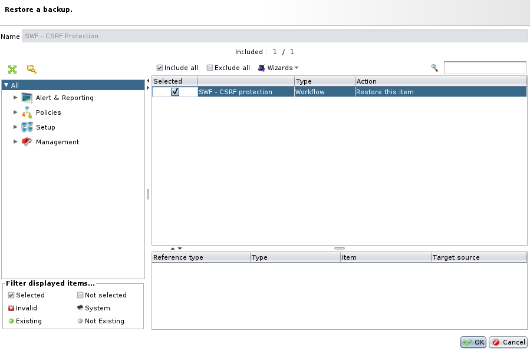

Use cases
=========

This section list use cases for the UBIKA WAAP.

Use cases are classified by categories:
 * [Security](./Security)

Documentation:
* 1 [How to import a subworkflow in the WAF](#how-to-import-a-subworkflow-in-the-waf)
* 2 [UBIKA WAAP documentation](#ubika-documentation)

How to import a subworkflow in the WAF
--------------------------------------

Use case can provide backups to deploy it on a UBIKA WAAP.

You can import a backup file through the UBIKA WAAP Administration Interface. Go to Management > Backup view:

Click on "Upload":

Choose the backup file and import it:

Right click on the imported backup file and click on "Restore":

Select all the elements (here there is one sub-workflow, but it could contain multiple subworkflows, ICX rules, static bundles...), and click on "OK":

Now, in your workflow list, you can use your imported sub-workflow.

UBIKA documentation
-------------

For more information, see the official documentation at https://documentation.ubikasec.com/x/QRw9
