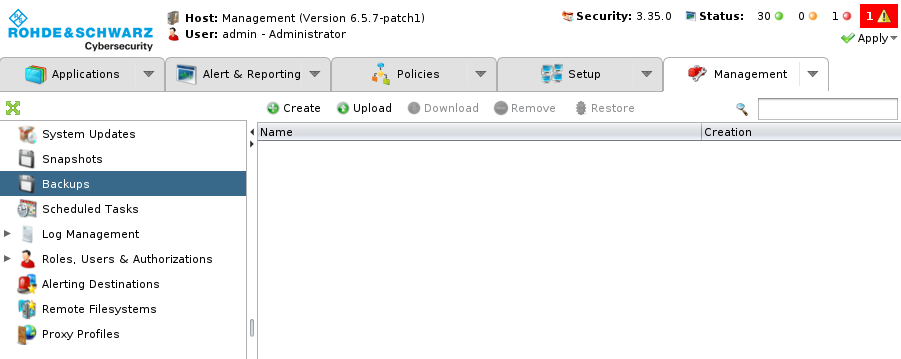
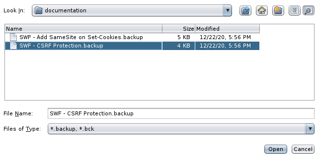
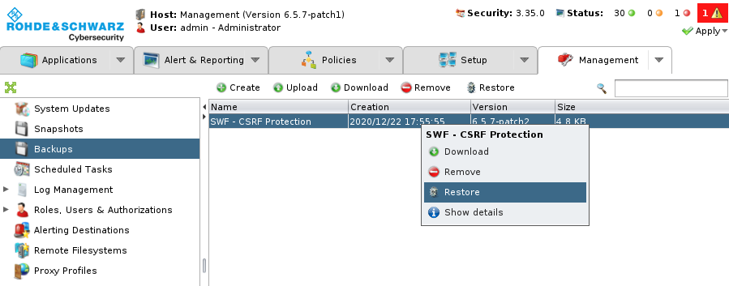

# Use case

This section list use cases for the R&S WAF.

## How to import a subworkflow in the WAF

Use case can provide backups to deploy it on a R&S WAF.

You can import a backup file through the R&S WAF Administration Interface. Go to Management > Backup view:

Click on "Upload":

Choose the backup file and import it:

Right click on the imported backup file and click on "Restore":

Select all the elements (here there is one sub-workflow, but it could contain multiple subworkflows, ICX rules, static bundles...), and click on "OK":

Now, in your workflow list, you can use your imported sub-workflow.

For more information, see the official documentation at https://documentation.appsec.rohde-schwarz.com/
