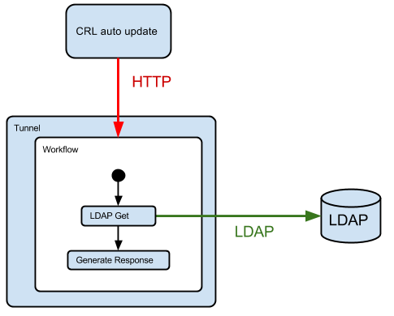
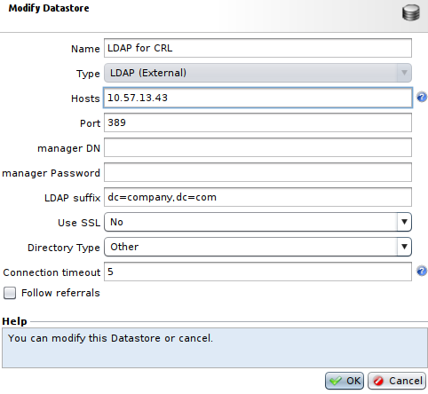
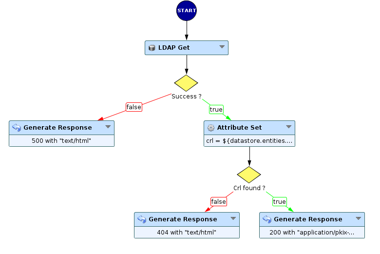
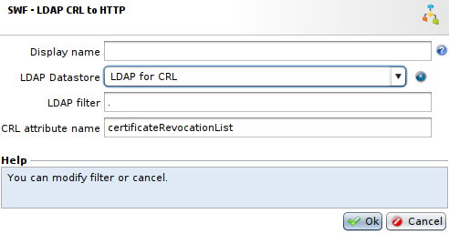
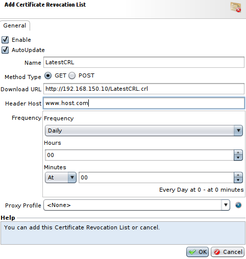

Automatic CRL updating via LDAP
===============================

* 1 [Presentation](#presentation)
* 2 [Backup](#backup)
* 3 [Instructions](#instructions)
	* 3.1 [Datastore](#datastore)
	* 3.2 [Workflow](#workflow)
	* 3.3 [Tunnel](#tunnel)
	* 3.4 [CRL auto-update](#crl-auto-update)
	* 3.5 [Improvements](#improvements)

Presentation
------------

UBIKA WAAP Gateway and Cloud offers the possibility of automatically updating CRLs configured on the product via HTTP requests, but does not include automatic updating of CRLs from an LDAP directory as standard. However, Workflows contain all the necessary nodes for setting up a CRL connector via LDAP.

The principle is to configure a CRL auto-update based on a tunnel retrieving the CRL from the LDAP. This specific Tunnel relays the request to the LDAP directory and transforms the LDAP response into the expected format using the CRL auto-update mechanism.

Backup
------

You can download the Sub-Workflow here: [SWF - LDAP CRL to HTTP](./backup/SWF%20-%20LDAP%20CRL%20to%20HTTP.backup).

Instructions
------------

### Datastore

We begin by declaring an **LDAP Datastore** on which the CRL is available. To do so, go to the **Policies** tab, in the **Datastores** section and press **Add**.

In our example, the directory is accessible anonymously, which means that no manager DN/Password is necessary.

| :warning: Pay attention to DNS resolution. If you use a hostname instead of an IP, remember to enter the IP/hostname correspondence in the Box (Hosts tab) or enable the DNS (DNS tab).|
|:--------------------|

### Workflow

The Sub-Workflow **SWF - LDAP CRL to HTTP** will handle LDAP query operations, transformation into an HTTP response and error handling. The first **LDAP Get**node retrieves the CRL from the LDAP directory. When no error is detected, the Sub-Workflow generates a response whose content is the CRL in binary format, otherwise if an error is raised, a 500 error page is returned.

### Settings

This Sub-Workflow is available in the **Response** category, and must be configured: 

* The field **LDAP Datastore** selects the **datastore** declared previously.
* The field **LDAP Filter** allows to select a filter to search for the object having the CRL.
* The field **CRL attribute name** represents the name of the LDAP attribute containing the CRL.

### Tunnel

Associate the Workflow with a new or existing Tunnel, then Apply the configuration. 

Now, send a request to the tunnel to download the CRL. 

### CRL auto-update

Lastly, declare a Certificate Revocation List entry: 
* Go to: **Setup > SSL > Certificates Bundles**.
* Select a **Certificates Bundle**, go to **Certificate Revocation Lists** and press **Add**.
* Tick **AutoUpdate** option, select a **Name** and method **GET**.
* In the **Download URL** field, enter the address of the tunnel supporting the **LDAP CRL to HTTP** connector and the server name of the tunnel in the **Header Host** field.

When the **OK** button is pressed, the request is sent to the identified Tunnel, and the CRL is downloaded and updated in the list. 

|CRLs are downloaded automatically as long as the Certificate Bundle is used by at least one Tunnel.|
|:--------------------------------------------------------------------------------------------------|

### Improvements

The Workflow created will retrieve the CRL at each request, regardless of the URL used on the Tunnel. The Sub-Workflow can be inserted in an already existing Workflow (to avoid monopolizing a Tunnel especially for this connector), behind a decision node – for example one that restricts the path of the URL and the source IP address of the request.
