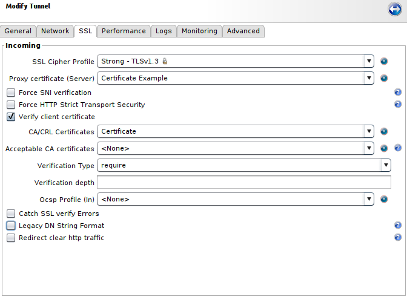
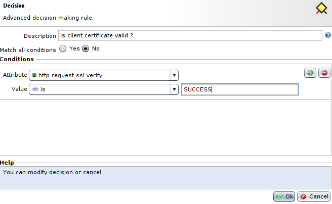

Implementing SSL authentication using X509-PKI certificates
===========================================================

* 1 [Presentation](#presentation)
* 2 [Enabling the SSL protocol for Tunnels](#enabling-the-ssl-protocol-for-tunnels)
	* 2.1 [Incoming settings](#incoming-settings)
* 3 [Installing X509 certificates](#installing-x509-certificates)
	* 3.1 [Generating a private key for the user](#generating-a-private-key-for-the-user) 
	* 3.2 [Generating a Certificate Signing Request for the user](#generating-a-certificate-signing-request-for-the-user) 
	* 3.3 [Purchasing the certificate from a CA](#purchasing-the-certificate-from-a-ca)
	* 3.4 [Generating a PKCS#12 certificate](#generating-a-pkcs12-certificate)
	* 3.5 [Integrating the PKCS#12 certificate into the browser](#integrating-the-pkcs12-certificate-into-the-browser)
	* 3.6 [Installing public CA certificate in the WAF](#installing-public-ca-certificate-in-the-waf)

Presentation
------------

Rohde & Schwarz's WAF lets you perform mutual client-server SSL authentications via X509 certificates managed by a PKI. The next part of this document shows you the configuration to follow for authenticating via X509 certificate.

Enabling the SSL protocol for Tunnels
-------------------------------------

You need to enable the SSL protocol as well as the PKI for the Tunnel in the **Applications** panel of the GUI.

SSL enables proof of server authentication and confidentiality and integrity of the data being exchanged, along with optional, strong authentication of the client with the use of a digital certificate. This documentation proposes implementing this security objective of the SSL protocol. The PKI (Public Key Infrastructure) is a system of management of public keys enabling proof of users’ authenticity.

The SSL part can be configured independently of the PKI part, but the reverse is not possible due to the fact that the PKI is an integral part of the security protocol.

### Incoming settings

Specifies the SSL parameters on the listening interface of the Tunnel – that is, the data flow coming from the clients. When the **Verify client certificate** is enabled, verification of the client x509 certificate is performed. The Tunnel requires that the client send a certificate in order to be authenticated.



|Parameter|Description|
|---------|-----------|
|SSL Cipher Profile|Selects a combination of authorized protocols and ciphers, customizable or by default.|
|Proxy certificate (Server)|Selects the **SSL certificate** previously added or generated from the **SSL** certificate menu of the **Setup** panel. The blue button at the right can also be used (**Add** or **Generate**).|
|Force SNI verification|This setting blocks any initialization of an SSL connection that does not contain an SNI (Server Name Indication) extension. Since SNI is a TLS extension, an **SSL Cipher Profile** that accepts TLS is required.|
|Force HTTP Strict Transport Security|This parameter allows to protect visitors by ensuring that their browsers always connect to a website over HTTPS. This HSTS header is added into virtualhost section of SSL tunnel and expire after 1 hour.|
|Redirect clear http traffic|Enables or disables redirection of HTTP traffic to HTTPS using a **301 Redirect**. It adds a **Clear traffic port** field allowing to select the port corresponding to HTTP traffic that will be redirected to HTTPS.|
|Verify client certificate|This parameter allows to verify client certificate. If enabled, the following parameters will become available. |
|CA/CRL Certificates|Selects a set of certificates (CAs) and revocation lists (CRLs) used to validate client's cetificate. You can manage these sets in **Setup > SSL > Certificates Bundles**.|
|Acceptable CA certificates|This field allows to select another set of certificates that will be sent to the client to validate the certificate, different from the one selected in **CA/CRL Certificates**. It can be used if the client has various certificates from different **subordinate certification authorities** with identical **root CA** to send him a reduced list of **Sub CAs** to restrict its choice of certificates.|
|Verification Type|Sets the level of x509 authentication of the client. It can have following values: <ul><li>**none**: No client certificate is required. This setting has the same effect as un-checking the **Verify client certificate** option, but it keeps the settings for quick enabling or disabling of verification for testing purposes.</li><li>**require**: The client must present a valid X509 certificate.</li><li>**optional**: The client may present a valid x509 certificate. It is not blocked when the SSL connection is made if none is presented (but it is possible to handle the case later in Workflows).</li><li>**optional_no_ca**: The client can present a certificate, but its validity is not verified. This option should be used only for tests.</li></ul>|
|Verification depth|This parameter, which is optional, lets you limit the depth of verification of the client certificate. It represents the maximum number of Sub CAs involved in the certificate chain. No value means that no limit is applied to the verification. A value of 0 allows only self-signed certificates. A value of 1 allows only self-signed certificates or certificates signed directly with a Certificate Authority whose certificate is found in the selected Certificates Bundle.|
|OCSP Profile (In)|Selects an OCSP profile for verifying the client certificate, following the OCSP (Online Certificate Status Protocol). OCSP is an alternative to CRLs. OCSP profiles are managed in: **Setup > SSL > OCSP Profiles**.|
|Catch SSL verify Errors|If the client's certificate does not correspond, blocking of the request is not done at SSL level and the request is sent directly to the Workflow of the tunnel in question. In this case, the certificate verification error **MUST** be handled. Two request attributes must be used to handle verification errors: **http.request.ssl.verify-error** and **http.request.ssl.verify**. This allows to deal with errors differently than with an SSL error message.|
|Legacy DN String Format|This parameter influences the value of the DN (Distinguished Name) certificate. Since Apache 2.4, the DN order has changed and is now compliant to the RFC 2253 format, the **CN** is now at the beginning of the DN string instead of the end and delimiters are now commas: `CN=rootCA,OU=QA,O=Rohde-Schwarz,ST=Herault,C=FR`. So, this option allows to keep Apache 2.2 behavior with the DN order inverted: `/C=FR/ST=Herault/O=Rohde-Schwarz/OU=QA/CN=rootCA`, and avoid influencing workflows using this format like **SWF - Extract Login from certificate**.||

For the **Catch SSL verify Errors** parameter you can use a **Decision** node like this to handle it via the Workflow:



Installing X509 certificates
----------------------------

Tools such as OpenSSL, Java Keytool, Cigwin, and others can generate private key, CSR and PKCS#12 files. OpenSSL will be used in the following examples.

### Generating a private key for the user

First of all, we are going to create a private key for the user with the following command: 

```
openssl genrsa -out <file_rsa.key> 2048
```

It will generate an RSA private key of **2048 bits** in the **<file_rsa.key>**, which will be used to generate the CSR. You will get a file containing the private key.
**Make sure to backup this file**, if you loose the key and have to create a new one, the certificate will be invalid. 

And make the file unreadable by the other users using the following command: 
```
chmod 400 <file_rsa.key>
```

### Generating a Certificate Signing Request for the user

Then, we need to generate a CSR (Certificate Signing Request) file to create a valid certificate for the user. To do so, write the command:

```
openssl req -new -key <file_rsa.key> -out <file_rsa.csr>
```
The prompt will ask a serie of questions, and the responses will be included in the final certificate. The important one is the **Common Name**, it must contain the complete name of the user to secure. It will generate a CSR in the **<file_rsa.csr>** file, which will be used to generate the X509 certificate.

### Purchasing the certificate from the CA

On Verisign (or other CA), choose a certificate type, fill in the personal information, and indicate the platform.

Next, paste the content of the CSR file generated in the previous stage. Open the file with a basic editor and paste the entirety of the CSR into the field of the Verisign form. Once pasted, check the validity of the extracted information, in particular the domain name. Provide a challenge passphrase as requested.

Once the command is entered you will obtain the final certificate.

### Generating a PKCS#12 certificate

Finally, we will create a PKCS#12 certificate, that consists in a file format used to store a private key with the associated X509 certificate.

Use the following command: 
```
openssl pkcs12 -export -out <file_pkcs12_cert.pfx> -inkey <file_rsa.key> -in <file_cert.crt>
```

It will create the PKCS#12 file **<file_pkcs12_cert.pfx>**.

### Integrating the PKCS#12 certificate into the browser

This file will have to be added in the browser to allow the user authentication.

Below is the procedure for importing this certificate into **Mozilla Firefox**.

* Go to **Preferences > Privacy & Security** or type `about:preferences#privacy` in the **Address Bar**.
* Scroll down to **Security** part and click on **View Certificates** in **Certificates** section.


* Go to **Your Certificates** tab, press **Import** and select the previously created **<file_pkcs12_cert.pfx>**.


### Installing public CA certificate in the WAF

Recover **public key certificates** of the CA and the sub-CAs on their support sites. To upload them to the WAF: 
* Go to **Setup > SSL > Certificates Bundles**.
* Click on the **Certificates Bundle** and create a new bundle or open a bundle already used by our tunnel. 


* On the **Certificates Authorities** tab below, press **Upload** and select public key certificate file.


The Certificate Bundle can now be linked to the HTTPS tunnel. Go to SSL tab, enable **Verify client certificate** and in the **CA/CRL Certificates** option, select the Certificate Bundle where the public key certificate has been uploaded.

To finish, apply the tunnel and try to connect to the tunnel with the browser using the pkcs12 file. The WAF will verify it against the public key certificate and validate the authentication.