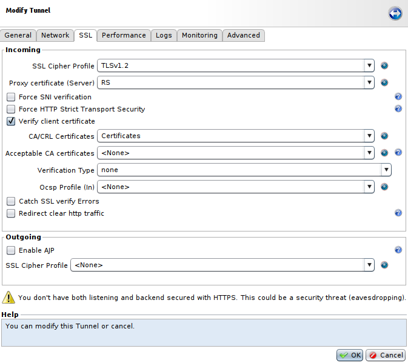
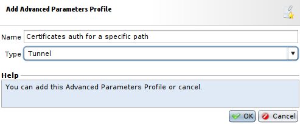
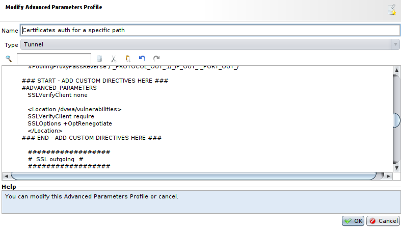
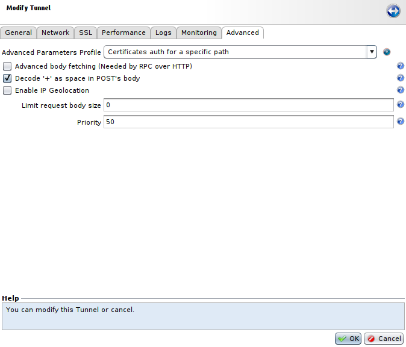

Implementing SSL authentication using X509-PKI certificates
===========================================================

* 1 [Presentation](#presentation)
* 2 [Enabling the SSL protocol for Tunnels](#enabling-the-ssl-protocol-for-tunnels)
	* 2.1 [Incoming settings](#incoming-settings)
* 3 [Authentication on a specific path](#authentication-on-a-specific-path)
	* 3.1 [Cipher Profile](#cipher-profile)
	* 3.2 [Configuration of the Tunnel](#configuration-of-the-tunnel)
	* 3.3 [Advanced Parameters](#advanced-parameters)

Presentation
------------

Rohde & Schwarz's WAF lets you perform mutual client-server SSL authentications via X509 certificates managed by a PKI. The next part of this document shows you the configuration to follow for authenticating via X509 certificate. It will also show you how to perform SSL authentication with x509 certificates on a specific path different from **/**.

You can find more information about the installation of certificates for clients here: [Installing X509 certificates on clients and CA on the WAF](../Installing%20X509%20certificates%20on%20clients%20and%20CA%20on%20the%20WAF)

Enabling the SSL protocol for Tunnels
-------------------------------------

You need to enable the SSL protocol as well as the PKI for the Tunnel in the **Applications** panel of the GUI.

SSL enables proof of server authentication and confidentiality and integrity of the data being exchanged, along with optional, strong authentication of the client with the use of a digital certificate. This documentation proposes implementing this security objective of the SSL protocol. The PKI (Public Key Infrastructure) is a system of management of public keys enabling proof of users’ authenticity.

The SSL part can be configured independently of the PKI part, but the reverse is not possible due to the fact that the PKI is an integral part of the security protocol.

### Incoming settings

Specifies the SSL parameters on the listening interface of the Tunnel – that is, the data flow coming from the clients. When the **Verify client certificate** is enabled, verification of the client x509 certificate is performed. The Tunnel requires that the client send a certificate in order to be authenticated.


|Parameter|Description|
|---------|-----------|
|SSL Cipher Profile|Selects a combination of authorized protocols and ciphers, customizable or by default.|
|Proxy certificate (Server)|Selects the **SSL certificate** previously added or generated from the **SSL** certificate menu of the **Setup** panel. The blue button at the right can also be used (**Add** or **Generate**).|
|Force SNI verification|This setting blocks any initialization of an SSL connection that does not contain an SNI (Server Name Indication) extension. Since SNI is a TLS extension, an **SSL Cipher Profile** that accepts TLS is required.|
|Force HTTP Strict Transport Security|This parameter allows to protect visitors by ensuring that their browsers always connect to a website over HTTPS. This HSTS header is added into virtualhost section of SSL tunnel and expire after 1 hour.|
|Redirect clear http traffic|Enables or disables redirection of HTTP traffic to HTTPS using a **301 Redirect**. It adds a **Clear traffic port** field allowing to select the port corresponding to HTTP traffic that will be redirected to HTTPS.|
|Verify client certificate|This parameter allows to verify client certificate. If enabled, the following parameters will become available. |
|CA/CRL Certificates|Selects a set of certificates (CAs) and revocation lists (CRLs) used to validate client's cetificate. You can manage these sets in **Setup > SSL > Certificates Bundles**.|
|Acceptable CA certificates|This field allows to select another set of certificates that will be sent to the client to validate the certificate, different from the one selected in **CA/CRL Certificates**. It can be used if the client has various certificates from different **subordinate certification authorities** with identical **root CA** to send him a reduced list of **Sub CAs** to restrict its choice of certificates.|
|Verification Type|Sets the level of x509 authentication of the client. It can have following values: <ul><li>**none**: No client certificate is required. This setting has the same effect as un-checking the **Verify client certificate** option, but it keeps the settings for quick enabling or disabling of verification for testing purposes.</li><li>**require**: The client must present a valid X509 certificate.</li><li>**optional**: The client may present a valid x509 certificate. It is not blocked when the SSL connection is made if none is presented (but it is possible to handle the case later in Workflows).</li><li>**optional_no_ca**: The client can present a certificate, but its validity is not verified. This option should be used only for tests.</li></ul>|
|Verification depth|This parameter, which is optional, lets you limit the depth of verification of the client certificate. It represents the maximum number of Sub CAs involved in the certificate chain. No value means that no limit is applied to the verification. A value of 0 allows only self-signed certificates. A value of 1 allows only self-signed certificates or certificates signed directly with a Certificate Authority whose certificate is found in the selected Certificates Bundle.|
|OCSP Profile (In)|Selects an OCSP profile for verifying the client certificate, following the OCSP (Online Certificate Status Protocol). OCSP is an alternative to CRLs. OCSP profiles are managed in: **Setup > SSL > OCSP Profiles**.|
|Catch SSL verify Errors|If the client's certificate does not correspond, blocking of the request is not done at SSL level and the request is sent directly to the Workflow of the tunnel in question. In this case, the certificate verification error **MUST** be handled. Two request attributes must be used to handle verification errors: **http.request.ssl.verify-error** and **http.request.ssl.verify**. This allows to deal with errors differently than with an SSL error message.|
|Legacy DN String Format|This parameter influences the value of the DN (Distinguished Name) certificate. Since Apache 2.4, the DN order has changed and is now compliant to the RFC 2253 format, the **CN** is now at the beginning of the DN string instead of the end and delimiters are now commas: `CN=rootCA,OU=QA,O=Rohde-Schwarz,ST=Herault,C=FR`. So, this option allows to keep Apache 2.2 behavior with the DN order inverted: `/C=FR/ST=Herault/O=Rohde-Schwarz/OU=QA/CN=rootCA`, and avoid influencing workflows using this format like **SWF - Extract Login from certificate**.||

For the **Catch SSL verify Errors** parameter you can use a **Decision** node like this to handle it via the Workflow:


Authentication on a specific path
---------------------------------

To use the SSL authentication with x509 certificates on a specific path, we will need to use **Advanced Parameters** for the Tunnel. Indeed, on the **SSL** tab of the Tunnel's settings menu, the **Verify client certificate** parameter does not allow to choose a specific path for the certificate authentication.

### Cipher Profile

Firstly, for this use case, we need to create a **Cipher Profile** that will not use ciphers for **TLSv1.3**, because authentication with certificates using this version is not managed by browsers.

For this, we need to go to **Setup > SSL > SSL Cipher Profile**, press **Add**, select a name for this **SSL Cipher Profile** and a list of ciphers to use. In this example we have selected few ciphers used by Mozilla Firefox for TLSv1.2.


### Configuration of the Tunnel

After that, we need to configure the Tunnel:

* Go to **Applications**, select your Tunnel, press **Modify**, and go to the **SSL** tab.
* In the **SSL Cipher Profile** field of the **Incoming** section, select the **SSL Cipher Profile** we have created earlier.
* Enable the parameter **Verify client certificate**.
* Then, in the **CA/CRL Certificates** field, select the **Certificates Bundle** you want to use to validate clients certificates.
* And, set the field **Verification Type** at **none**.



### Advanced Parameters

Now, we need to setup a specific path for the authentication with certificates. To achieve this, go to **Setup > Reverse Proxies > Advanced Parameters Profiles**. Then press **Add**, select a **Name** and fot the **Type** select **Tunnel**.



Now, select the new **Advanced Parameters Profile** and click on **Modify**. Next, between the lines **### START - ADD CUSTOM DIRECTIVES HERE ###** and **### END - ADD CUSTOM DIRECTIVES HERE ###**, write the following lines: 

```
SSLVerifyClient none

<Location /example/path>
     SSLVerifyClient require
     SSLOptions +OptRenegotiate
 </Location>
```

| You will have to replace **/example/path** with the path where the authentication using certificates will be located.|
|----------------------------------------------------------------------------------------------------------------------|



Note that you can also use regular expressions in the path given in the **Location** tag. For this, you will have to add a **~** between **Location** and the path. For example: **<Location ~ /dvwa/vulnerabilities/(brute|captcha)/>**.

After having created this **Advanced Parameters Profile**, go to the Tunnel's settings, in the **Advanced** tab, and in the **Advanced Parameters Profile** select the one we have just created.



Finally, **Apply** every changes made and try to access the tunnel with a valid user certificate.