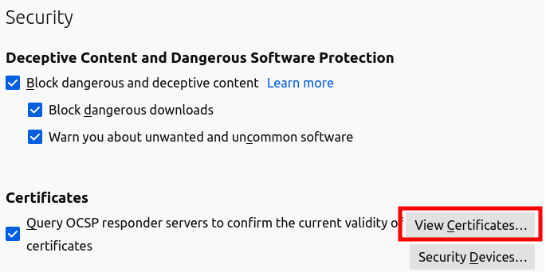
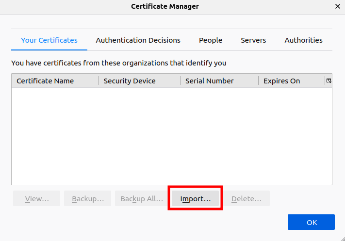
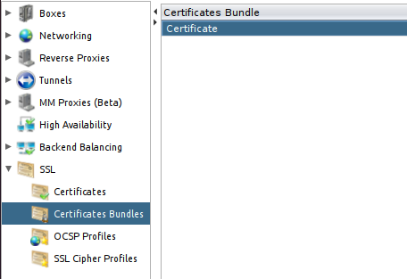
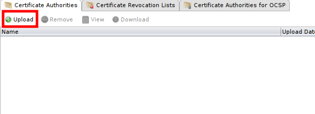

Installing X509 certificates on clients and CA on the WAF
=========================================================

* 1 [Presentation](#presentation)
* 2 [Creating the X509 certificate](#creating-the-x509-certificate)
	* 2.1 [Generating a private key for the user](#generating-a-private-key-for-the-user)
	* 2.2 [Generating a Certificate Signing Request for the user](#generating-a-certificate-signing-request-for-the-user)
	* 2.3 [Purchasing the certificate from the CA](#purchasing-the-certificate-from-the-ca)
	* 2.4 [Generating a PKCS#12 certificate](#generating-a-pkcs12-certificate)
* 3 [Integrating the PKCS#12 certificate into the browser](#integrating-the-pkcs12-certificate-into-the-browser)
* 4 [Installing public CA certificate into the WAF](#installing-public-ca-certificate-into-the-waf)
* 5 [Client authentication and tunnel error logs](#client-authentication-and-tunnel-error-logs)

Presentation
------------

This use case will show you how to create a x509 certificate and install it in your browser to authenticate with it, and how to install the public CA certificates in the WAF.

Creating the X509 certificate
-----------------------------

Tools such as OpenSSL, Java Keytool, Cigwin, and others can generate private key, CSR and PKCS#12 files. OpenSSL will be used in the following examples.

### Generating a private key for the user

First of all, we are going to create a private key for the user with the following command: 

```
openssl genrsa -out <file_rsa.key> 2048
```

It will generate an RSA private key of **2048 bits** in the **<file_rsa.key>**, which will be used to generate the CSR. You will get a file containing the private key.
**Make sure to backup this file**, if you loose the key and have to create a new one, the certificate will be invalid. 

And make the file unreadable by the other users using the following command: 
```
chmod 400 <file_rsa.key>
```

### Generating a Certificate Signing Request for the user

Then, we need to generate a CSR (Certificate Signing Request) file to create a valid certificate for the user. To do so, write the command:

```
openssl req -new -key <file_rsa.key> -out <file_rsa.csr>
```
The prompt will ask a serie of questions, and the responses will be included in the final certificate. The important one is the **Common Name**, it must contain the complete name of the user to secure. It will generate a CSR in the **<file_rsa.csr>** file, which will be used to generate the X509 certificate.

### Purchasing the certificate from the CA

On Verisign (or other CA), choose a certificate type, fill in the personal information, and indicate the platform.

Next, paste the content of the CSR file generated in the previous stage. Open the file with a basic editor and paste the entirety of the CSR into the field of the Verisign form. Once pasted, check the validity of the extracted information, in particular the domain name. Provide a challenge passphrase as requested.

Once the command is entered you will obtain the final certificate.

### Generating a PKCS#12 certificate

Finally, we will create a PKCS#12 certificate, that consists in a file format used to store a private key with the associated X509 certificate.

Use the following command: 
```
openssl pkcs12 -export -out <file_pkcs12_cert.pfx> -inkey <file_rsa.key> -in <file_cert.crt>
```

It will create the PKCS#12 file **<file_pkcs12_cert.pfx>**.

Integrating the PKCS#12 certificate into the browser
----------------------------------------------------

This file will have to be added in the browser to allow the user authentication.

Below is the procedure for importing this certificate into **Mozilla Firefox**.

* Go to **Preferences > Privacy & Security** or type `about:preferences#privacy` in the **Address Bar**.
* Scroll down to **Security** part and click on **View Certificates** in **Certificates** section.



* Go to **Your Certificates** tab, press **Import** and select the previously created **<file_pkcs12_cert.pfx>**.



Installing public CA certificate into the WAF
---------------------------------------------

Recover **public key certificates** of the CA and the sub-CAs on their support sites. To upload them to the WAF: 
* Go to **Setup > SSL > Certificates Bundles**.
* Click on the **Certificates Bundle** and create a new bundle or open a bundle already used by our tunnel. 



* On the **Certificates Authorities** tab below, press **Upload** and select public key certificate file.



CA files can be stored in **Certificates bundle** in 2 different ways:
- A chain file containing all the necessary CA files
- Each CA file uploaded separately

### Unique chain file
When uploading a chain file in a **Certificates bundle**, the order of the CA files is crucial. Inside the chain file, the CA at the top must be the one that signed the client certificate, then, each intermediary CA file and the root CA file at the bottom. An error will occur while validating client certificates if any other order is used in the chain file and authenticating with a client certificate will be impossible on the tunnel.

The chain file must look like this:

--------- BEGIN CERTIFICATE ---------
Subject: Intermediate 1
Issuer: Intermediaite 2
--------- END CERTIFICATE ---------
--------- BEGIN CERTIFICATE ---------
Subject: Intermediate 2
Issuer: root CA
--------- END CERTIFICATE ---------
--------- BEGIN CERTIFICATE ---------
Subject: root CA
Issuer: root CA
--------- END CERTIFICATE ---------

In the above example, the root CA signed the *Intermediate 2* authority which signed the *Intermediate 1* authority. A valid client certificate would be signed by *Intermediate 1* authority to be accepted by this chain file.

### Distinct CA files
When uploading different CA files, the order is not important. All the uploaded CA files are stored in a directory and the verification of the client certificate is done by checking all the CA until a valid order is found. If one CA file is missing (intermediate or root), the client certificate validation fails and the user is rejected.

### Setting up a Certificates bundle in a tunnel
The Certificate Bundle can now be linked to the HTTPS tunnel. 
Visit the following page to get details about the tunnel configuration: [https://gitlab.int.ubika.io/github-rs/r-s-waf-extra/-/tree/main/use-cases/SSL%20and%20Confidentiality/Implementing%20SSL%20authentication%20using%20X509-PKI%20certificates]

Client authentication and error logs
------------------------------------

When the configuration is complete and the tunnel is running, a valid client certificate must be sent by the clients with their requests. You can see below frequents errors from the tunnel error logs in debug mode to help understand the root of the problems.

### Request without client certificate
When the user doesn't provide any client certificate, the error logs contain the following message:
```
SSL Library Error: error:1417C0C7:SSL routines:tls_process_client_certificate:peer did not return a certificate -- No CAs known to server for verification?
```
In this situation, the problem comes from the configuration of the browser used to send requests to the tunnel. Check that the client certificate has been correctly imported in the certificate store of the user's browser.


### Request with incorrect client certificate
If the user send a client certificate that is not signed by a CA from the **Certificates bundle** configured in the tunnel, an error related to the validation of the client certificate is logged in the error logs of the tunnel:
```
[client 172.29.80.5:48520] AH02275: Certificate Verification, depth 0, CRL checking mode: none (0) [subject: CN=Bad Client,OU=DenyAll QA,O=DenyAll,L=Paris,ST=France,C=FR / issuer: CN=subCA,OU=DenyAll QA Certificate Authority,O=DenyAll,ST=France,C=FR / serial: 1008 / notbefore: Mar 10 09:43:19 2016 GMT / notafter: Nov 17 09:43:19 2029 GMT]
[client 172.29.80.5:48520] AH02276: Certificate Verification: Error (20): unable to get local issuer certificate [subject: CN=Bad Client,OU=DenyAll QA,O=DenyAll,L=Paris,ST=France,C=FR / issuer: CN=subCA,OU=DenyAll QA Certificate Authority,O=DenyAll,ST=France,C=FR / serial: 1008 / notbefore: Mar 10 09:43:19 2016 GMT / notafter: Nov 17 09:43:19 2029 GMT]
```
For the client certificate with CN *Bad Client*, the expected CA is named *subCA* which is not present in the chain file imported in the bundle of the tunnel. This leads to the error message *unable to get local issuer certificate*. The CA that signed the client certificate is not present in the bundle and the client certificate verification fails.
This problem can appear if the chain file is incomplete and the issuer certificate is missing. It can also occur if the client try to send a certificate for a different website.

### Request with valid client certificate
When a user send a valid client certificate to a tunnel, a message is also logged in the error logs of the tunnel to display the result of the validation. It allows to confirm that the client certificate successfully passed the verification and that the chain file is complete.
```
AH02275: Certificate Verification, depth 3, CRL checking mode: none (0) [subject: CN=rootCA,OU=DenyAll QA Certificate Authority,O=DenyAll,L=Paris,ST=France,C=FR / issuer: CN=rootCA,OU=DenyAll QA Certificate Authority,O=DenyAll,L=Paris,ST=France,C=FR / serial: 86DA8668E3D86EE2 / notbefore: Nov  5 14:03:59 2015 GMT / notafter: Oct 31 14:03:59 2035 GMT]
AH02275: Certificate Verification, depth 2, CRL checking mode: none (0) [subject: CN=interm2CA,OU=DenyAll QA,O=DenyAll,ST=France,C=FR / issuer: CN=rootCA,OU=DenyAll QA Certificate Authority,O=DenyAll,L=Paris,ST=France,C=FR / serial: 1007 / notbefore: Aug 18 15:21:25 2022 GMT / notafter: Aug 13 15:21:25 2042 GMT]
AH02275: Certificate Verification, depth 1, CRL checking mode: none (0) [subject: CN=interm1CA,OU=DenyAll QA,O=DenyAll,ST=France,C=FR / issuer: CN=interm2CA,OU=DenyAll QA,O=DenyAll,ST=France,C=FR / serial: 1000 / notbefore: Aug 18 15:32:23 2022 GMT / notafter: Aug 13 15:32:23 2042 GMT]
AH02275: Certificate Verification, depth 0, CRL checking mode: none (0) [subject: emailAddress=interm1ca.client01@qa.test,CN=interm1ca-client01,OU=DenyAll QA,O=DenyAll,ST=France,C=FR / issuer: CN=interm1CA,OU=DenyAll QA,O=DenyAll,ST=France,C=FR / serial: 1000 / notbefore: Aug 18 15:56:44 2022 GMT / notafter: Nov 23 15:56:44 2032 GMT]
```
Here, we can see that the verification was successful for client certificate and all the CA files in the chain. The client certificate is validated by its issuer *interm1CA* and each CA is validated by its own issuer up to the root CA which is self-signed and ends the verification process.
