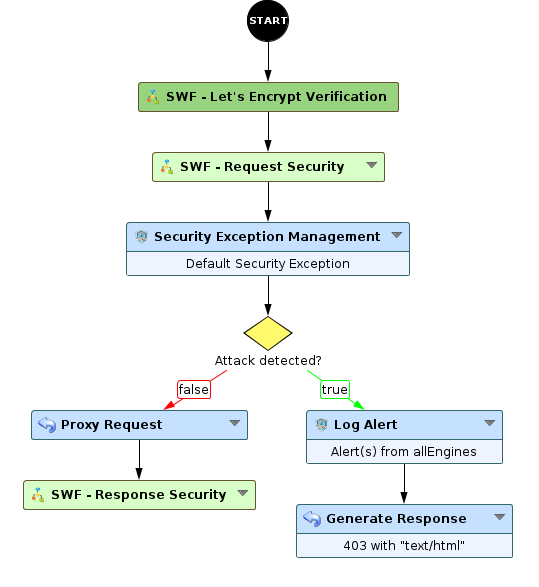
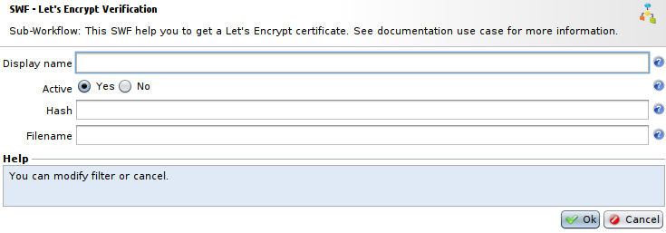
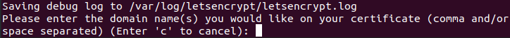
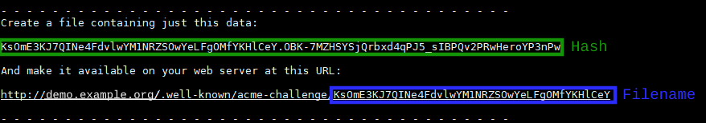
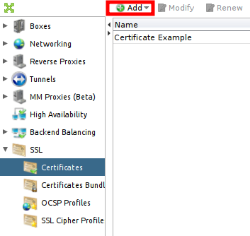

Let's Encrypt certificates usage
================================

* 1 [Presentation](#presentation)
* 2 [Backup](#backup)
* 3 [Sub-Workflow](#sub-workflow)
    * 3.1 [Setting up the Workflow](#setting-up-the-workflow)
    * 3.2 [Settings](#settings)
* 4 [Certbot](#certbot)
    * 4.1 [Generate Hash and Filename for Certbot](#generate-hash-and-filename-for-certbot)
    * 4.2 [Edit SWF - Let's Encrypt Verification node](#edit-swf-lets-encrypt-verification-node)
    * 4.3 [Generate certificates](#generate-certificates)
* 5 [Import certificate in the WAF](#import-certificate-in-the-waf)
* 6 [Configure certificate in the WAF](#configure-certificate-in-the-waf)

Presentation
------------

Let's Encrypt is a CA (Certification Authority) that delivers free certificates using a simple and automated process. Certificates management is made with Certbot tool ( https://certbot.eff.org/ ) that we are going to use in an external way.

Certificates generated this way have a short lifetime (90 days).
* You can use WAF API to automate certificates update with certbot's results 
* You can configure a planned task of type **SSL Certificates expiration check** in the product.

|You will need to have Certbot installed on a device with an internet access.|
|:---------------------------------------------------------------------------|

This use case is not fully automated and requires manual steps. It allows to create a Let's Encrypt certificate that can be set on the WAF tunnel.

Backup
------

You can download the backup file for the Sub-Workflow here: [SWF - Let's Encrypt Verification](./backup/SWF%20-%20Let's%20Encrypt%20Verification.backup).

Sub-Workflow
------------

This Sub-Workflow will be used to validate the verification made by Certbot to ensure that you own the domain name you are creating a certificate for. It consists in sending to Certbot the specific webpage it will ask for, that must contain the appropriate hash.

### Setting up the Workflow

Add the **SWF - Let's Encrypt Verification** Sub-Workflow from the **Security** section. Add it right after **Start** node in your Workflow as shown below:



You can edit the **SWF - Let's Encrypt Verification** node and click on **OK** to validate default values. We will configure its parameters later.

### Settings



* The field **Active** is a boolean allowing to activate and desactivate the Sub-Workflow. It should be set at **Yes** for the verification.
* The field **Hash** must contain the hash that will be set in the webpage requested by Certbot.
* The field **Filename** must contain the random part of the path, generated by Certbot, that it will ask for.

We will set the fields **Hash** and **Filename** later, we need to use Certbot to retrieve this information.

Certbot
-------

### Generate Hash and Filename for Certbot

From the device where Certbot is installed, enter the following command:

```
certbot certonly --manual
```

It will ask you to enter the domain name for your certificate.



Then, Certbot will show you an hash and a path, retrieve the hash and the filename indicated in the path.



### Edit SWF - Let's Encrypt Verification node

Go to the Workflow created ealier and edit **SWF - Let's Encrypt Verification** node, set the **Hash** and the **Filename** gathered before with Certbot in their respective fields. Check that the field **Active** is set at **Yes**. 

**Save** the workflow and select it on the tunnel running your application, the tunnel should listen on port 80. Then, **apply*.

Before continuing and pressing **Enter** on Certbot, check that the URL provided by Certbot shows the appropriate **Hash**. To do so, you need to access to the address provided by Certbot, the hash should appear on a blank page. If it is the case, you can go back to Certbot and press **Enter**.

### Generate certificates

After pressing **Enter** Certbot will start verification, if it finds the hash at the provided address, it will proceed to create certificates files. You can find these certificates files in `/etc/letsencrypt/archives/<domain-name>/`, in this example: `/etc/letsencrypt/archives/demo.example.org/`.

Import certificate in the WAF
-----------------------------

To import the certificate, connect to your box with the GUI, go to: **Setup > SSL > Certificates**. And press **Add**.



You'll need to select files provided by Certbot:

* The file **privkey.pem** in **Key file**.
* The file **cert.pem** in **Crt file**.
* The file **chain.pem** in **Chain file**.

Configure certificate in the WAF
--------------------------------

Finally, edit your tunnel to add the certificate, go to the **SSL** tab and select the certificate in the field named **Proxy certificate (Server)**. Select also the **SSL Cipher Profile** of your choice (strongest recommended).

You can now apply the tunnel and connect it to verify the site certificate.


