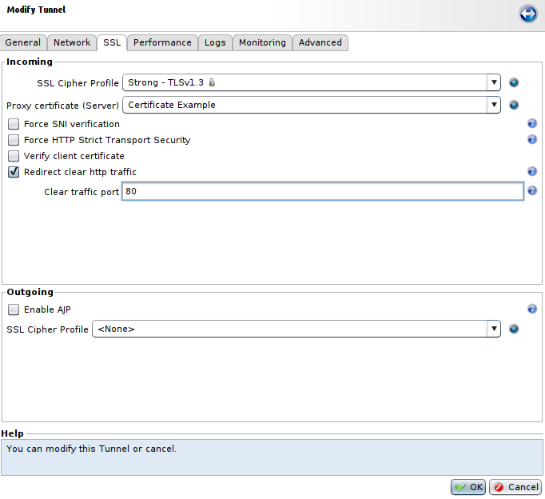
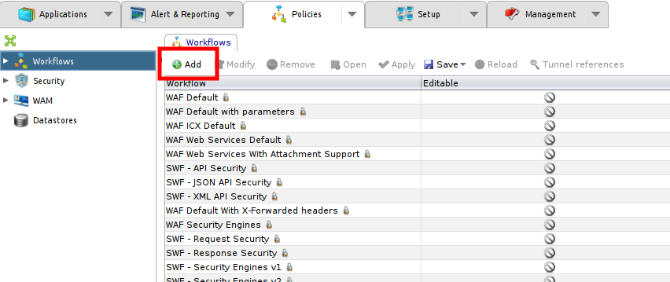
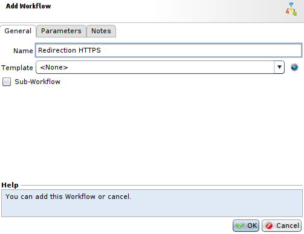
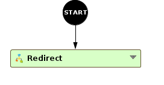
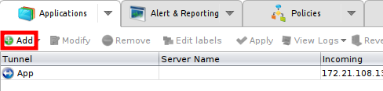
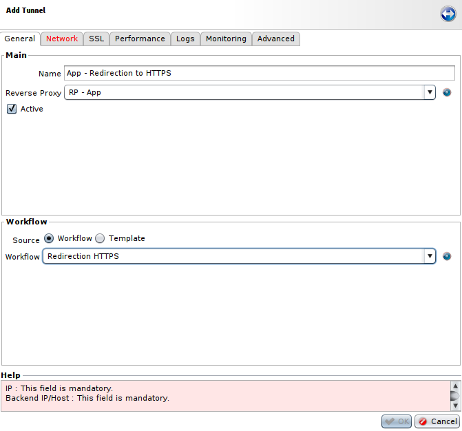
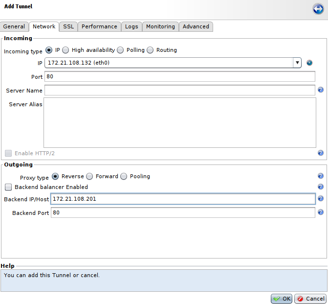

Redirect HTTP to HTTPS
======================

* 1 [Presentation](#presentation)
* 2 [Using tunnel's settings](#using-tunnels-settings)
* 3 [Using Workflow](#using-workflow)
	* 3.1 [Create the redirection Workflow](#create-the-redirection-workflow)
	* 3.2 [Create the Tunnel](#creating-the-tunnel)

Presentation
------------

When you decide to switch your service from HTTP to HTTPS, you also want that the clients using your tunnels with HTTP can connect without problem and still being redirected to HTTPS. And so, we provide several methods to achieve this, using Workflows or tunnel's settings.

|In both cases, we suppose you already have a functionning tunnel using HTTPS.|
|:----------------------------------------------------------------------------|

Using tunnel's settings
-----------------------

|This method should now be used by default as it is more convenient.|
|-------------------------------------------------------------------|

This method is really straightforward and you only need to go to **Applications** tab, select your tunnel using HTTPS, click on **SSL** tab, tick **redirect clear http traffic** field and select a **Clear traffic port**, it should be 80 by default. After an apply, all requests coming on the tunnel IP and port 80 will be redirected (301) to the HTTPS port used by the tunnel.




Using Workflow
-------------

This method explains how to perform a redirection on an HTTPS tunnel using the workflow.

### Create the redirection Workflow

First of all, we need to create the Workflow that will redirect HTTP traffic to HTTPS. To do so, go to the **Policies** tab, then in the **Workflow** section click on the button **Add**.



Give the Workflow a name (e.g.: Redirection HTTPS), and select the **\<None\>** Template. Do not check the **Sub-Workflow** box.



In the newly created Workflow, add a **Redirect** node from the **Response** category, then connect it to the starting node.



Then configure the **Redirect** node. To enable redirection to SSL on the same host, the **redirection URL** field needs to be configured as follows:

```
${url_of(http.request.path, http.request.query, http.request.host, "true")}
```

The expression `${url_of()}` allows to construct an URL from request attributes and to change the protocol to HTTPS. 

### Create the Tunnel

Next, you need to create another tunnel that will use the Workflow created earlier to listen incoming HTTP traffic and redirect it to the tunnel already in use.
Go to **Applications** tab and select **Add**.



Then, in the **General** tab: 
* Choose a name, for example **App - Redirection to HTTPS**.
* Select the same **Reverse Proxy** as the service you're setting up.
* And select the Workflow previously created in the **Workflow** field.



And in the **Network Tab**:

* In the **IP** field, select the same IP address that the one used in your main tunnel.
* And in the **Backend IP/Host** field, select the backend IP address or host used by your application.



Then, press **OK** to create the tunnel and **apply** changes. After the apply, all requests coming on the new HTTP tunnel will be redirected (301) to the HTTPS tunnel.
