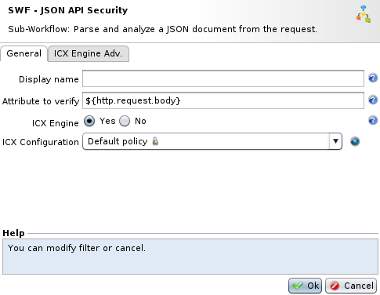
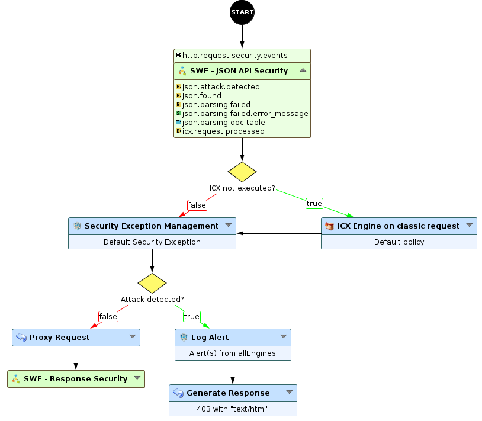
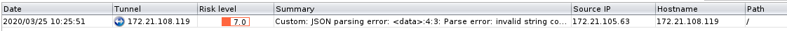
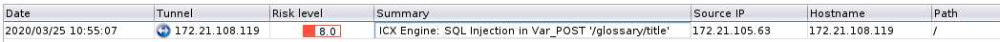

Securing JSON API traffic - blacklist mode
==========================================

* 1 [Presentation](#presentation)
* 2 [Setting up a JSON API protection](#setting-up-a-json-api-protection)
    * 2.1 [Description](#description)
    * 2.2 [Parameters](#parameters)
    * 2.3 [Provided attributes](#provided-attributes)
    * 2.4 [Behaviors to know](#behaviors-to-know)
        * 2.4.1 [Parsing executed whatever the content-type is](#parsing-executed-whatever-the-content-type-is)
        * 2.4.2 [ICX engine](#icx-engine)
    * 2.5 [Usage example](#usage-example)
        * 2.5.1 [Valid request](#valid-request)
        * 2.5.2 [Wrong JSON document format](#wrong-json-document-format)
        * 2.5.3 [Attack inside the JSON document](#attack-inside-the-json-document)

Presentation
------------

JSON (JavaScript Object Notation) is a lightweight data-interchange format. It is easy for humans to read and write. It is easy for machines to parse and generate. JSON is mostly used for HTTP web services exchange between servers and clients.

Like all exchanges of application-related data using a web server, JSON can be vulnerable to the majority of standard web attacks. Therefore it is important to protect this data format just as you protect standard traffic.

In this use case, we will present a way to protect your JSON API traffic using the blacklist mode with ICX.

**Where to find the Sub-Workflow ?**

The Sub-Workflow **JSON API Security** is available in the workflow nodes panel in the API Security category.

Setting up a JSON API protection
--------------------------------

### Description

The WAF includes by default a Sub-Workflow allowing to detect attacks in JSON documents. The Sub-Workflow **JSON API Security** (in API Security category) can parse a JSON document (`http.request.body` by default) then execute the ICX Engine to detect attack in the document.

Here is the detailed flow:

1.  Incoming JSON is parsed with the **JSON to Table** node. It will validate the document structure then generate an equivalent document in table format (key=value pairs).
2.  The **ICX Engine** node will take the generated table and run detection rules on each key=value.

### Parameters



The Sub-Workflow takes few parameters:

*   **Attribute to verify**: by default `http.request.body` as JSON document(s) sent in the body. It can be any other attribute containing a JSON document in string format.
*   **ICX Engine**: enables or not the analyze of the document to detect attacks with ICX. If not enabled, only the JSON format will be validated.
*   **ICX Configuration**: specifies the ICX configuration to use.
*   **ICX Engine Adv.**: allows to configure advanced ICX parameters, like cache.

### Provided attributes

The Sub-Workflow will provide few attributes, like:

*   **json.attack.detected** (boolean): the document is not valid or an attack has been detected.
*   **json.found** (boolean): a JSON document has been found in the provided attribute.
*   **json.parsing.failed** (boolean): the parsing of the provided attribute has failed (Attribute to verify).
*   **json.parsing.failed.error\_message** (string): description of the parsing failure.
*   **json.parsing.doc\_table** (table): attribute containing the JSON document in table format.
*   **icx.request.processed** (boolean): indicates if the ICX engine has been executed in the Sub-Workflow or not.

### Behaviors to know

#### Parsing executed whatever the content-type is

As we do not trust the content-type sent by clients, the Sub-Workflow will try to detect and parse a JSON document on each request:

*   If it contains 'json' and the parsing succeeds, ICX engine will be executed.
*   If it contains 'json' and the parsing fails, an alert will be triggered.
*   If it does not contain 'json' and the parsing succeeds, ICX engine will be executed. It avoids bypass from content-type header manipulation.
*   If it does not contain 'json' and the parsing fails, nothing is done, the Sub-Workflow stops.

#### ICX engine

If the parsing succeeds, ICX engine is executed on the JSON document but also on other parts of the request (path, headers, query vars, ...). 

When executed, the provided attribute `icx.request.processed`  will be set to 'true'. This allows to not run the ICX engine a second time on the request after this Sub-Workflow.

If the ICX engine is not executed, you will have to execute ICX (or other engines) on the request. An example is provided by the default Sub-Workflow "API Security" and bellow.

  

Values from the JSON are analyzed in the POST Vars column from ICX. If an attack is detected, you will see that it has been detected in the Var\_POST field.

### Usage example

The Sub-Workflow can be placed this way in a workflow:



After the Sub-Workflow, we check if ICX has been executed or not. Then we will run the Security Exception node to apply false positive exceptions.

The workflow will continue with classic nodes to proxify or log and block the request.

#### Valid request

We will send a request containing a valid JSON on this workflow, like below:

```
POST / HTTP/1.0
User-Agent: Mozilla/5.0
Content-Type: application/json
Content-Length: 616

{
    "glossary": {
        "title": "example glossary",
        "GlossDiv": {
            "title": "S",
            "GlossList": {
                "GlossEntry": {
                    "ID": "SGML",
                    "SortAs": "SGML",
                    "GlossTerm": "Standard Generalized Markup Language",
                    "Acronym": "SGML",
                    "Abbrev": "ISO 8879:1986",
                    "GlossDef": {
                        "para": "A meta-markup language, used to create markup languages such as DocBook.",
                        "GlossSeeAlso": ["GML", "XML"]
                    },
                    "GlossSee": "markup"
                }
            }
        }
    }
}
```

The JSON format is valid and there is no attack inside. The request is proxified to the backend.

#### Wrong JSON document format

Now, we will send a wrong JSON document with a missing closing double quote on the `title` field:

```
POST / HTTP/1.0
User-Agent: Mozilla/5.0
Content-Type: application/json
Content-Length: 616

{
    "glossary": {
        "title": "example glossary,
        "GlossDiv": {
            "title": "S",
            "GlossList": {
                "GlossEntry": {
                    "ID": "SGML",
                    "SortAs": "SGML",
                    "GlossTerm": "Standard Generalized Markup Language",
                    "Acronym": "SGML",
                    "Abbrev": "ISO 8879:1986",
                    "GlossDef": {
                        "para": "A meta-markup language, used to create markup languages such as DocBook.",
                        "GlossSeeAlso": ["GML", "XML"]
                    },
                    "GlossSee": "markup"
                }
            }
        }
    }
}
```

The Sub-Workflow tries to parse the document from the body and fails because of the missing double quote. The request will be blocked.

In the Security log view, we will find a new log with the following error:

```
JSON parsing error: <data>:4:3: Parse error: invalid string constant "example glossary,", expected valid string constant
```



#### Attack inside the JSON document

In the valid formatted JSON document, we will now add a SQL injection like `999' union all select * --` :

```
POST / HTTP/1.0
User-Agent: Mozilla/5.0
Content-Type: application/json
Content-Length: 616

{
    "glossary": {
        "title": "999' union all select * --",
        "GlossDiv": {
            "title": "S",
            "GlossList": {
                "GlossEntry": {
                    "ID": "SGML",
                    "SortAs": "SGML",
                    "GlossTerm": "Standard Generalized Markup Language",
                    "Acronym": "SGML",
                    "Abbrev": "ISO 8879:1986",
                    "GlossDef": {
                        "para": "A meta-markup language, used to create markup languages such as DocBook.",
                        "GlossSeeAlso": ["GML", "XML"]
                    },
                    "GlossSee": "markup"
                }
            }
        }
    }
}
```

The Sub-Workflow parses the document from the `http.request.body` with success and send the output to the ICX engine. ICX will check every value of the document.

At the end, the engine will detect the SQL injection in the `title` field. The request will be blocked.

In the Security log view, we will find a new log:



You can also take a look at the Sub-Workflow **API Security**. It already includes the ICX engine execution if the Sub-Workflow JSON API Security did not executed it. The Sub-Workflow is available by default in the workflow list.
