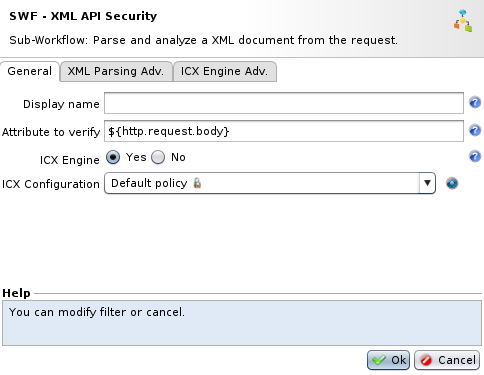
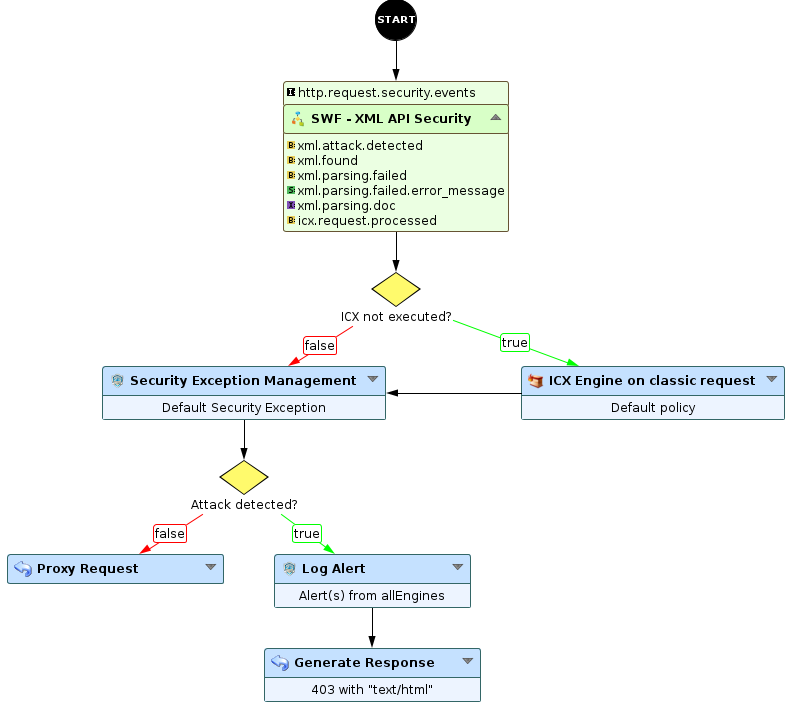
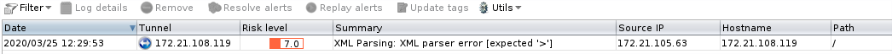
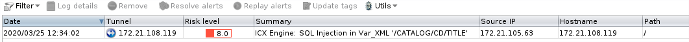

Securing XML API traffic - blacklist mode
=========================================

* 1 [Presentation](#presentation)
* 2 [Setting up a XML API protection](#setting-up-a-xml-api-protection)
    * 2.1 [Description](#description)
    * 2.2 [Parameters](#parameters)
    * 2.3 [Provided attributes](#provided-attributes)
    * 2.4 [Behaviors to know](#behaviors-to-know)
        * 2.4.1 [Parsing executed whatever the content-type is](#parsing-executed-whatever-the-content-type-is)
        * 2.4.2 [ICX engine](#icx-engine)
    * 2.5 [Usage example](#usage-example)
        * 2.5.1 [Valid request](#valid-request)
        * 2.5.2 [Wrong XML document format](#wrong-xml-document-format)
        * 2.5.3 [Attack inside the XML document](#attack-inside-the-xml-document)

Presentation
------------

XML (Extensible Markup Language) is a markup language that defines a set of rules for encoding documents in a format that is both human-readable and machine-readable. XML is historically used by many systems but tends to be phased out in favor of JSON.

This language can be vulnerable to the majority of standard web attacks and also with specific ones using the XML format and extension capabilities.

In this use case, we will present a way to protect your XML API traffic using the blacklist mode with ICX.

**Where to find the Sub-Workflow ?**

The Sub-Workflow **XML API Security** is available in the workflow nodes panel in the API Security category.

Setting up a XML API protection
-------------------------------

### Description

The WAF includes by default a Sub-Workflow allowing to detect attacks in XML documents. The Sub-Workflow **XML API Security** can parse a XML document (`http.request.body` by default) then execute the **ICX Engine** to detect attacks in the document.

Here is the detailed flow:

1.  Incoming XML is parsed with the **XML Parsing** node. It will validate the document structure then generate an equivalent in internal workflow format (key=value pairs).
2.  The **ICX Engine** node will take the generated format and run detection rules on each key=value.

### Parameters



The Sub-Workflow takes few parameters:

*   **Attribute to verify**: by default `http.request.body` as XML document(s) sent in the body. It can be any other attribute containing an XML document in string format.
*   **ICX Engine**: enables or not document analysis to detect attacks with ICX. If not enabled, only the XML format will be validated.
*   **ICX Configuration**: specifies the ICX configuration to use.
*   **XML Parsing Adv.**: allows to configure advanced XML parsing parameters, like the maximum size of the XML document, allowing or not entities, etc ...
*   **ICX Engine Adv.**: allows to configure advanced ICX parameters, like cache.

### Provided attributes

The Sub-Workflow will provide few attributes, like:

*   **xml.attack.detected** (boolean): the document is not valid or an attack has been detected.
*   **xml.found** (boolean): a JSON document has been found in the provided attribute.
*   **xml.parsing.failed** (boolean): the parsing of the provided attribute has failed (Attribute to verify).
*   **xml.parsing.failed.error\_message** (string): description of the parsing failure.
*   **xml.parsing.doc** (xml): internal attribute containing the XML document.
*   **icx.request.processed** (boolean): indicates if the ICX engine has been executed in the Sub-Workflow or not.

### Behaviors to know

#### Parsing executed whatever the content-type is

As we do not trust the content-type sent by clients, the Sub-Workflow will try to detect and parse an XML document on each request:

*   If content-type contains 'xml' and the parsing succeeds, ICX engine will be executed.
*   If it contains 'xml' and the parsing fails, an alert will be triggered.
*   If it does not contain 'xml' and the parsing succeeds, ICX engine will be executed. It avoids bypass from content-type header manipulation.
*   If it does not contain 'xml' and the parsing fails, nothing is done, the Sub-Workflow stops.

#### ICX engine

If the parsing succeeds, ICX engine is executed on the XML document but also on other parts of the request (path, headers, query vars, ...). 

When executed, the provided attribute `icx.request.processed`  will be set to 'true'. This way, ICX engine is not run again on the request after this Sub-Workflow.

If the ICX engine is not executed, you will have to execute ICX (or other engines) on the request. An example is provided by the default Sub-Workflow "API Security" and bellow.

Values from the XML are analyzed in the XML column from ICX.

### Usage example

The Sub-Workflow can be placed this way in a workflow:



After the Sub-Workflow, we check if ICX has been executed or not. Then we will run the Security Exception node to apply false positive exceptions.

The workflow will continue with classic nodes to proxify or log and block the request.

#### Valid request

We will send a request containing a valid XML on this workflow, like below:

```
POST / HTTP/1.0
User-Agent: Mozilla/5.0
Content-Type: application/xml
Content-Length: 432

<?xml version="1.0" encoding="UTF-8"?>
<CATALOG>
	<CD>
		<TITLE>Empire Burlesque</TITLE>
		<ARTIST>Bob Dylan</ARTIST>
		<COUNTRY>USA</COUNTRY>
		<COMPANY>Columbia</COMPANY>
		<PRICE>10.90</PRICE>
		<YEAR>1985</YEAR>
	</CD>
	<CD>
		<TITLE>Hide your heart</TITLE>
		<ARTIST>Bonnie Tyler</ARTIST>
		<COUNTRY>UK</COUNTRY>
		<COMPANY>CBS Records</COMPANY>
		<PRICE>9.90</PRICE>
		<YEAR>1988</YEAR>
	</CD>
</CATALOG>
```

The XML format is valid and there is no attack inside. The request is proxified to the backend.

#### Wrong XML document format

Now, we will send a wrong XML document with a missing closing tag '>' on `TITLE` :

```
POST / HTTP/1.0
User-Agent: Mozilla/5.0
Content-Type: application/xml
Content-Length: 432

<?xml version="1.0" encoding="UTF-8"?>
<CATALOG>
	<CD>
		<TITLE>Empire Burlesque</TITLE
		<ARTIST>Bob Dylan</ARTIST>
		<COUNTRY>USA</COUNTRY>
		<COMPANY>Columbia</COMPANY>
		<PRICE>10.90</PRICE>
		<YEAR>1985</YEAR>
	</CD>
	<CD>
		<TITLE>Hide your heart</TITLE>
		<ARTIST>Bonnie Tyler</ARTIST>
		<COUNTRY>UK</COUNTRY>
		<COMPANY>CBS Records</COMPANY>
		<PRICE>9.90</PRICE>
		<YEAR>1988</YEAR>
	</CD>
</CATALOG>
```

The Sub-Workflow tries to parse the document from the body and fails because of the missing double quote. The request will be blocked.

In the Security log view, we will find a new log with the following error:

```
XML Parsing: XML parser error [expected '>']
```



#### Attack inside the XML document

In the valid formatted XML document, we will now add a SQL injection like `999' union all select * --` :

```
POST / HTTP/1.0
User-Agent: Mozilla/5.0
Content-Type: application/xml
Content-Length: 442

<?xml version="1.0" encoding="UTF-8"?>
<CATALOG>
	<CD>
		<TITLE>999' union all select * --</TITLE>
		<ARTIST>Bob Dylan</ARTIST>
		<COUNTRY>USA</COUNTRY>
		<COMPANY>Columbia</COMPANY>
		<PRICE>10.90</PRICE>
		<YEAR>1985</YEAR>
	</CD>
	<CD>
		<TITLE>Hide your heart</TITLE>
		<ARTIST>Bonnie Tyler</ARTIST>
		<COUNTRY>UK</COUNTRY>
		<COMPANY>CBS Records</COMPANY>
		<PRICE>9.90</PRICE>
		<YEAR>1988</YEAR>
	</CD>
</CATALOG>
```

The Sub-Workflow parses the document from the `http.request.body` with success and send the output to the ICX engine. ICX will check every value of the document.

At the end, the engine will detect the SQL injection in the `/CATALOG/CD/TITLE`  field. The request will be blocked.

In the Security log view, we will find a new log:



You can also take a look at the Sub-Workflow **API Security**. It already includes the ICX engine execution if the Sub-Workflow XML API Security did not execute it. The Sub-Workflow is available by default in the workflow list.
