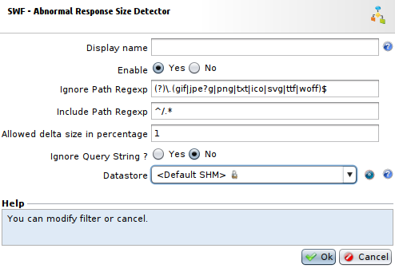
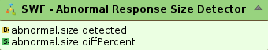
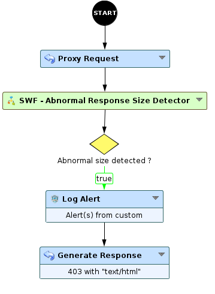

Abnormal Response Size Detector
===============================

* 1 [Presentation](#presentation)
* 2 [Backup](#backup)
* 3 [Sub-Workflow](#sub-workflow)
	* 3.1 [SWF - Abnormal Response Size Detector](#swf-abnormal-response-size-detector)
	* 3.2 [Sub-workflow settings](#sub-workflow-settings)
	* 3.3 [Workflow integration](#workflow-integration)

Presentation
------------

This Sub-Workflow detects the `Content-Length` header variations from the application responses to block and/or log if the length is higher than expected. This solution can avoid unexpected data leak.

Backup
------

You can download the Sub-Workflow here: [SWF - Abnormal Response Size Detector.backup](./backup/SWF%20-%20Abnormal%20Response%20Size%20Detector.backup)

Sub-Workflow
------------

### SWF - Abnormal Response Size Detector

First of all, imagine a key/value pair in memory datastore containing, by example:

|Key                                        |Value   |
|-------------------------------------------|--------|
|www.test.com - /my/page.html               |4130    |
|www.test.com - /my/sensitive/information   |5000    |
|...                                        |XXX     |

By using this **SWF - Abnormal Response Size Detector** Sub-Workflow, you can monitor response size, so every response having a size greater than X will be logged and/or blocked.

So there is a kind of mandatory learning step, to fill the datastore with all responses size for every legitimate URLs. Then, when the URL have a size already recorded in the datastore, the `Content-Length` header of the response will be compared to this size, with a ratio you can set.

If your web application is vulnerable and for many reasons, a hacker could succeeded to fetch a lot of (sensitive) data. This Sub-Workflow is able to alert and/or block the response because its size is abnormal, compared to the recorded one.

For performances reasons, it’s not necessary to monitor statics items (javascript, images, ...). You can set a particular directory to monitor.

### Sub-workflow settings

Let’s take a look at subworkflow settings.

* The field **Ignore Path Regexp** matches with staticfiles you don’t want to monitor.
* The field **Include Path Regexp** sets the path you want to monitor. It can be root (by default), but you can specify a regexp matching a subdirectory.
* The field **Allowed delta size in percentage** gives you the possibility to accept `Content-Length` variations to avoid false positive on dynamic pages.
* The field **Ignore Query String** is important. Let’s take these 2 URLs:`/page.php?id=12345` and `/page.php?id=23456`.
	* If **Ignore Query String = Yes**, these 2 pages will be considered as the same (supposed to have same size).
	* If **Ignore Query String = No**, these 2 pages will be considered as two different pages (supposed to **NOT** have the same size).
* The field **Datastore** is the fast-in-memory key/value store to store initial `Content-Length` for every URLs of your web application.

### Workflow integration

This Sub-Workflow provides 2 attributes that you have to handle in your main workflow:

* **abnormal.size.detected** is a boolean that represents if a response with an abnormal size has been detected or not.
* **abnormal.size.diffPercent** shows the difference in percentage between current size and maximum authorized size if the latter is inferior to current size.

At the end, your main workflow should be something like this:

Finally, use **Log Alert** node to emit **Security Logs** with a **custom** message.
