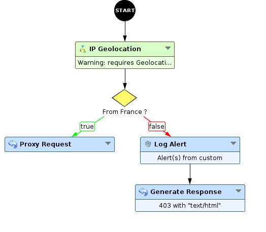
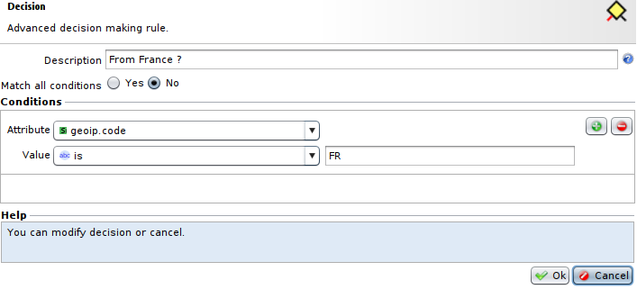

Access Restrictions - Restriction by IP geolocation
===================================================

* 1 [Presentation](#presentation)
* 2 [Reminder](#reminder)
* 3 [WAF configuration](#waf-configuration)
* 4 [Benefits](#benefits)
* 5 [Disadvantages and limits](#disadvantages-and-limits)
* 6 [Deployment strategy](#deployment-strategy)

Presentation
------------

If your applications have an use field geographically limited, this use case explains how to restrict incoming requests by country.
The country name and code of each request can be retrieved using the **IP Geolocation** Sub-Workflow.

Reminder
--------

By default, the IP geolocation is not enabled. However, it can be enabled in tunnel configuration.

WAF configuration
-----------------

Setting up restriction of IP geolocation is done by using the **IP Geolocation** node that will gather geolocation information from client.
Country name and code can be read in provided attributes **geoip.code** and **geoip.name**. Use the **Decision node** to apply the restriction of your choice depending of the country.

Benefits
--------

Block all or accept only requests from specified countries, containing attacks or not.

Disadvantages and limits
------------------------

*   Some IP addresses may not be referenced in the free database from [MaxMind](https://dev.maxmind.com/geoip/geoip2/geolite2/) included by default in the WAF (example: IP TOR, etc...).
We recommend to keep the database up-to-date (for more details, go to the Global Settings menu).
*   Does not prevent attacks from a rebound IP located in another country (using for example a VPN)..
    
*   Can block legitimate users using 3G or 4G, etc...  
    
*   Can impact SEO. Crawlers come from anywhere in the world so it is impossible to maintain an IP whitelist updated.

Deployment strategy
-------------------

Can be deployed on all applications that do not have SEO or mobile access (3G, 4G, etc...). Localisation access must be perfectly controlled.
