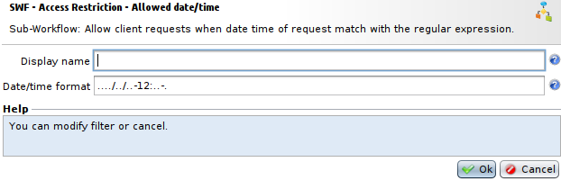
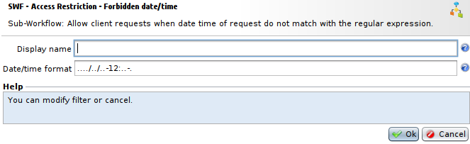

Access Restrictions - Restriction by date and time
==================================================

* 1 [Presentation](#presentation)
* 2 [WAF configuration](#waf-configuration)
* 3 [Benefits](#benefits)
* 4 [Disadvantages and limits](#disadvantages-and-limits)
* 5 [Deployment strategy](#deployment-strategy)

Presentation
------------

In this use case, we use the capability to get date and time from client to filter his access accordingly.

WAF configuration
-----------------

Setting up restriction on date and time is done by using the **SWF - Access Restriction - Allowed date/time** Sub-Workflow, or its negative counterpart the **SWF - Access Restriction - Forbidden date/time** Sub-Workflow.

Note that these Workflows don't have any output and will direclty log an alert and send 403 response to client if access is blocked.

To setup restriction on date and time you need to fill in **Date/time format** field with a regular expression determining date and time during which access will be open for clients.

The negative version can also be used, and follows the same template, except that it will allow access if the date and time **don't match** the regular expression.

Benefits
--------

Block any requests outside the defined timetable scope, whether they contain attacks or not.

Disadvantages and limits
------------------------

Cannot be applied to applications, Web sites, or Web services that are available 24/7.

Deployment strategy
-------------------

*   Can be applied to applications, Web sites or Web services where use of timetables are perfectly controlled.
*   For CMSs, it can be applied on the administration section (/admin).
*   Ensure date coherence on WAF (NTP server).
