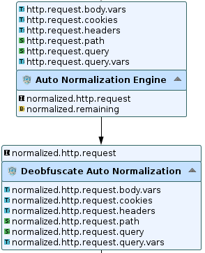
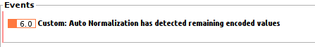

# Auto Normalization engine

* 1 [Presentation](#presentation)
* 2 [How to use the Auto Normalization engine](#how-to-use-the-auto-normalization-engine)
* 3 [Backup](#backup)

# Presentation
With the previous version of the WAAP (< 6.10.0), encoded requests can be normalized by the `Normalization Engine (rWeb)` and then filtered by the different `Advanced Detection Engines` (SQLi, CMD, etc) or 
by the `scoring/black lists`. However, we can not filter the decoded data with the `ICX security engine`, knowing that the latter is our main engine.

To overcome this issue, we created a new node called `Auto Normalization engine`. This new engine performs the following operations:
- Automatically detects the type (eg. base64) and the frequency (1 time, 2 times, etc) of the data encoding;
- Provides decoded data to the `ICX engine`.

There is another node called `Deobfuscate Auto Normalization` that can be used by the WAAP administrator to get the decoded attributes.

The following capture shows both engines and their required and provided attributes:

So as we can see, the `Auto Normalization engine` handles:
- `http.request.body.vars`
- `http.request.cookies`
- `http.request.headers`
- `http.request.path`
- `http.request.query`
- `request.query.vars`
  
and provides:
- `normalized.remaining`: is a boolean that indicates if there is still encoded data;
- `normalized.http.request`: this is an opaque attribute used by the `Deobfuscate Auto Normalization` that it is used by the ICX engine.
  
The `Deobfuscate Auto Normalization` requires the `normalized.http.request` and provides the following attributes:
- `normalized.http.request.body.vars`
- `normalized.http.request.cookies`
- `normalized.http.request.headers`
- `normalized.http.request.path`
- `normalized.http.request.query`
- `normalized.http.request.query.vars`

> The `ICX engine` does not require the provided attributes of the `Deobfuscate Auto Normalization` to get the normalized data.

> The presented normalized attributes of the `Deobfuscate Auto Normalization` can be used for WAAP debug for example.

# How to use the Auto Normalization engine

The schema of the following captures shows an example of a workflow that deploys a basic configuration to use the `Auto Normalization engine` with `ÌCX engine`:

First, we need to configure the value of the ` Maximum number of decodings`. Herein an example the value is set to 3:

If the handled request is encoded more than MAX times, then the `normalized.remaining` value will be set to `true` and workflow should block the request.

Otherwise the `Auto Normalization engine` decodes the request and the result is used later by the `ICX engine`. The latter does not require the `normalized.http.request` attribute or does not have to be selected in the node parameter. `ICX engine` will automatically take the `normalized.http.request` attribute if available before in the workflow. If not, the `ICX engine` will analyse the request from default `http.*` attributes.

Next, we will present two attack cases and explain how this security use case can protect the system from encoded injections.

## Attack case 1

An attacker wants to inject `/bin/cmd.exe` at the request quey:
- first, it encodes it 2 times and obtains `TDJKcGJpOWpiV1F1WlhobA==`;
- then, sends it to the WAAP tunnel;
- the encoded injection is decoded by the WAAP without `normalized.remaining`;
- the ICX engine detects the injection and the attack is blocked.

Herein the obtained log:

> Note: the event is generated by a `Log Alert` deployed in the workflow and not by the node.

## Attack case 2

An attacker wants to inject `/bin/cmd.exe` at the request quey:
- first, it encodes it MAX + 1 times (4 times in this example) and obtains `VkVSS1MyTkhTbkJQVjNCcFZqRkdNVmRzYUc5aVFUMDk=`;
- then, sends it to the WAAP tunnel;
- the encoded injection is not completely decoded by the `Auto Normalization engine` (`normalized.remaining` = `true`);
- the workflow directly blocks the attack.

> Note: the event is generated by a `Custom Security Alert` deployed in the workflow and not by the node.

# Backup

> Important, in the WAAP version 6.10.0, the `Auto Normalization engine` is integrated by default at the `WAAP default` and `HTTP and Websocket` workflows.

A backup of the explained use case of `Auto Normalization engine` can be downloaded here: [ `Auto Normalization engine use case`](./backup/WAAP%20Normalization.backup).
