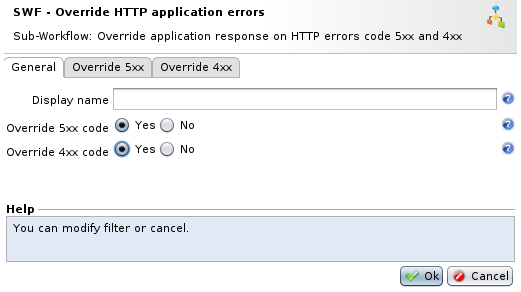
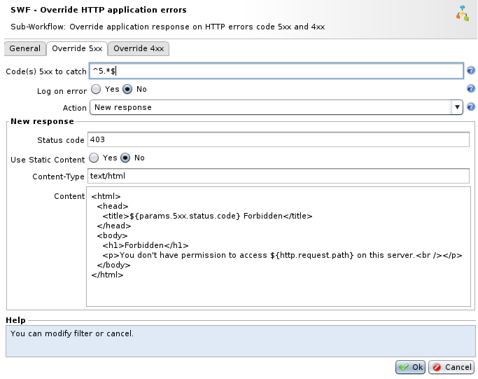
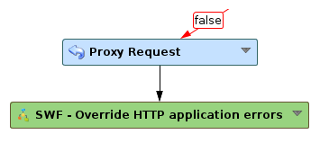

Intercepting and replacing 5xx/4xx errors
=========================================

Presentation
------------

This Sub-Workflow is used to intercept and replace 5xx and 4xx error pages generated by the application. It will avoid sensitive information that might be displayed in the response body when the application crash or simply make an unexpected error (triggered by an attacker for example).

**Where to find the sub-workflow ?**

The sub-workflow **SWF - Override HTTP application errors** is available in the workflow nodes panel in the Response category.

Usage
-----

1.  First, the sub-workflow **SWF - Override HTTP application errors** allows to choose which 5xx or 4xx errors have to be intercepted. By default, all 5xx errors and 4xx errors (except 404) are intercepted.
2.  Secondly, it allows to configure the new response that will be sent to the client instead of the original application response. By default, the response will be a **403 Forbidden**. It is also possible to redirect the client to an other URL.

The node must be placed after the **Proxy Request** node. If a HTTP code is intercepted and a new response has been chosen, other nodes can be placed after this one to modify the new response for example.

If the redirection is enabled, it will be done directly after intercepting the code.

