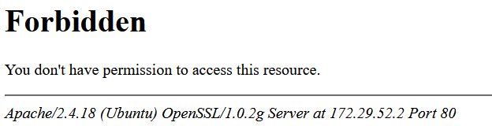
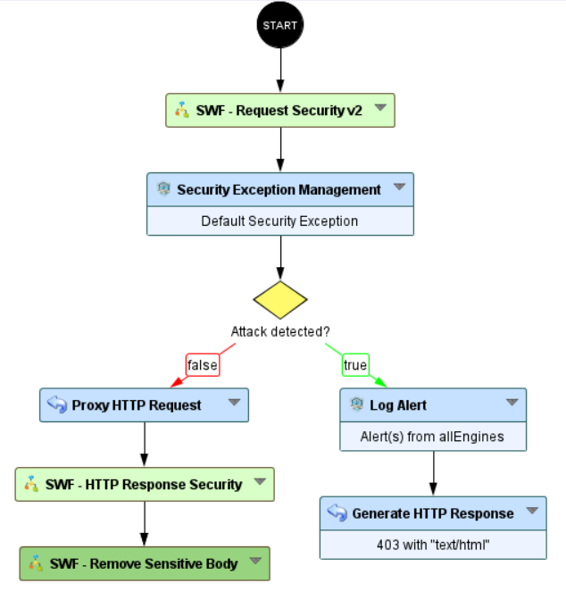

Backend Response - Remove Sensitive Body
===================================================

* 1 [Presentation](#presentation)
* 2 [Backup](#reminder)
* 3 [Workflow configuration](#workflow-configuration)
* 4 [Response body handled](#response-body-handled)

Presentation
------------

This use case allows to delete sensitive body frequently sent by the application backend. It will contains information about the software used by the origin server to handle the request.

Example: 

They potentially reveal internal implementation details that might make it (slightly) easier for attackers to find and exploit known security holes. 

Backup
--------

You can download this Sub-Workflow here: [SWF - Remove Sensitive Body.backup](./backup/SWF%20-%20Remove%20Sensitive%20Body.backup)

After uploading this workflow, it is available in the workflow nodes panel in the `Reponse` category.

Workflow configuration
-----------------

The Sub-Workflow **SWF - Remove Sensitive Body** must be placed after the **Proxy Request** node to allow changes in the `http.response.body` attribute:

Response body handled
--------

An attacker will not be able to access to your admin panel no matter of the path is url_encoded.

| **Name** | Description | **Example   ** |
| --- | --- | --- |
| Apache | The trailing footer line under server-generated documents displaying the Apache server version and contained in the http.response.body. The information comes from the `ServerSignature` Apache directive. [core - Apache HTTP Server Version 2.4](https://httpd.apache.org/docs/2.4/en/mod/core.html#serversignature) | `Apache/2.4.18 (Ubuntu) OpenSSL/1.0.2g Server at 172.29.52.2 Port 80` |
| Nginx | The trailing footer line under server-generated documents displaying the Nginx server version and contained in the http.response.body. [Module ngx_http_core_module](http://nginx.org/en/docs/http/ngx_http_core_module.html#server_tokens) The information comes from the `server_tokens` Nginx directive. | `nginx/1.23.3` |
