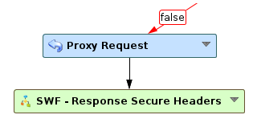
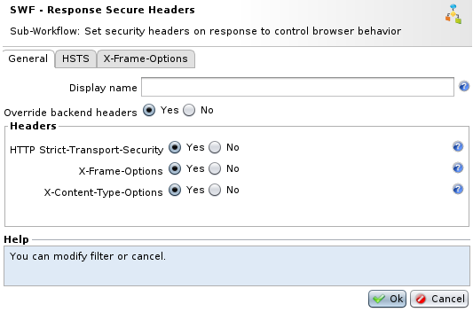

Response Secure Headers
=======================

* 1 [Presentation](#presentation)
* 2 [Usage](#usage)
* 3 [General parameters](#general-parameters)
* 4 [HSTS parameters](#hsts-parameters)
* 5 [X-Frame-Options parameters](#x-frame-options-parameters)

Presentation
------------

The Sub-Workflow **SWF - Response Secure Headers** is used to implement security mechanisms at the level of the client browser by injecting specific headers into the responses.

These security mechanisms are mainly aimed at preventing the browser from loading such content as scripts, images, media, ... from a domain that is not specified as a trusted domain.

Usage
-----

This Sub-Workflow is placed below a **Proxy Request** node in order to add headers in the application’s responses.



General parameters
------------------



*   **Display name**: The name of the node as it will appear in the Workflow. Replaces the term **SWF - Response Secure Headers**.
*   **Override backend headers:** Override values from existing headers set by the application.
*   **HTTP Strict-Transport-Security**: Tell browsers that the web site should only be accessed using HTTPS, instead of using HTTP. Advanced options can be set in **HSTS** tab.
*   **X-Frame-Options**: Indicate whether or not a browser should be allowed to render a page in a frame, iframe, embed or object. Sites can use this to avoid click-jacking attacks, by ensuring that content is not embedded into other sites. Advanced options can be set in **X-Frame-Options** tab. This header is now deprecated by the CSP frame-ancestors header.
*   **X-Content-Type-Options**: Indicate browsers that the MIME types advertised in the **Content-Type** headers should not be changed and be followed (nosniff).

HSTS parameters
---------------

*   **Duration (days)**: The time, in days, that the browser should remember that a site is only to be accessed using HTTPS.
*   **Include subdomains**: If enabled, the HSTS rule will be applied to all of the site's subdomains. (includeSubDomains)
*   **Preload entry in Browser**: If enabled and handled by browsers, they will securely connect to the web site using a preloaded list. See HSTS documentation for more details. (preload)

The header added in the response will be like:

```
Strict-Transport-Security: max-age=31536000; includeSubDomains
```

X-Frame-Options parameters
--------------------------

*   **Deny frame loading**: The page cannot be displayed in a frame, regardless of the site attempting to do so.
*   **Load from same origin**: The page can only be displayed in a frame on the same origin as the page itself.

The header added in the response will be like:

```
X-Frame-Options: DENY
```

or

```
X-Frame-Options: SAMEORIGIN
```
