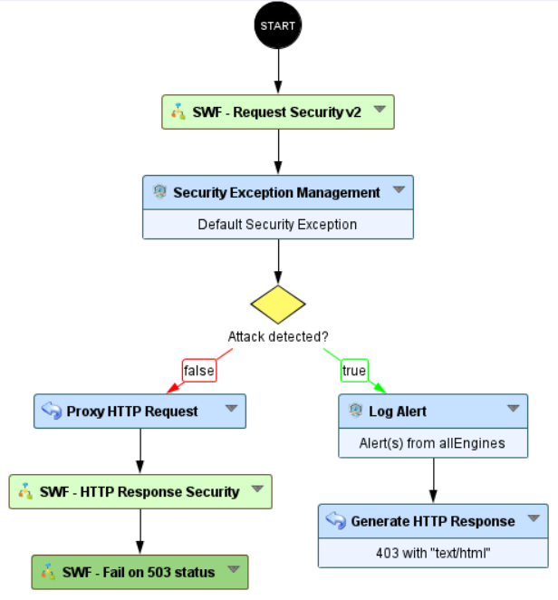
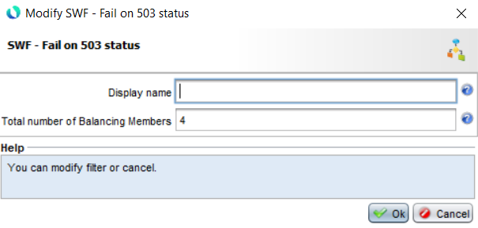
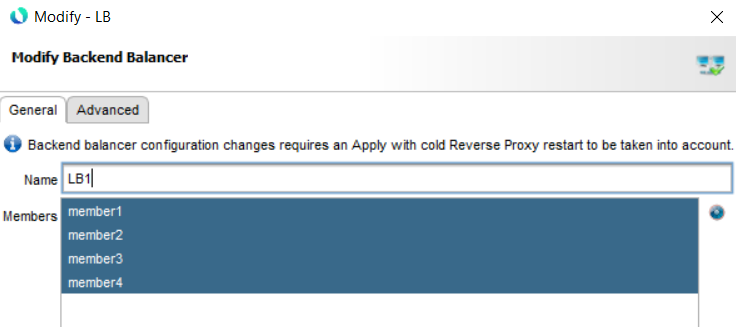
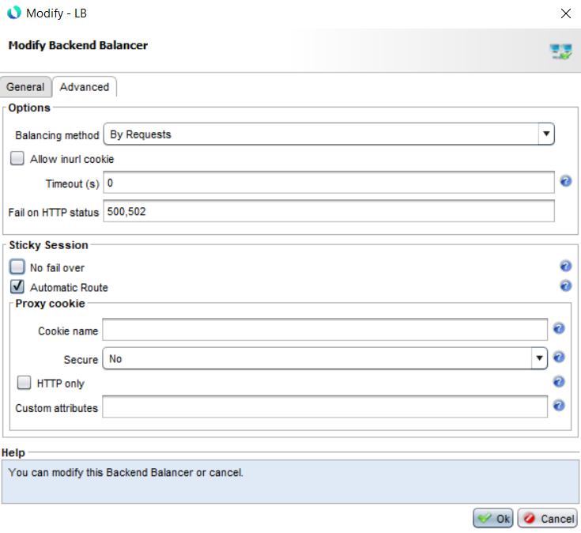

Backend balancing - Fail on status 503
===================================================

* 1 [Presentation](#presentation)
* 2 [Backup](#backup)
* 3 [Workflow Configuration](#workflow-configuration)
* 4 [Sub-workflow configuration](#sub-workflow-configuration)
* 5 [Backend Balancer configuration](#backend-balancer-configuration)
* 6 [How it works](#how-it-works)
	* 6.1 [Sticky session](#sticky-session)
	* 6.2 [Sub-workflow mechanism](#subworkflow-mechanism)

Presentation
------------

The WAF `Backend Balancing` feature is based on the `mod_proxy_balancer` Apache module. It is designed to distribute incoming requests among a group of backend servers, known as a cluster. When a request is received, the module will forward the request to one of the backend servers in the cluster. 

If the backend server returns a `503 (Service Unavailable)` response, the `mod_proxy_balancer` module will not consider the server to be failed.

This is because the 503 status code indicates that the server is temporarily unable to handle the request due to maintenance or overloading. It does not necessarily mean that the server has failed or is unavailable. The `mod_proxy_balancer` module will continue to send requests to the server unless it determines that the server is truly unavailable.

This is a known issue on Apache side but they have no plan to develop the feature.

This use case will provide a solution to handle this issue: if the WAF receives a 503 response from the backend, then the client will be automatically redirected to another member.

Backup
--------

You can download this Sub-Workflow here: [SWF - Fail on 503 status](./backup/SWF%20-%20Fail%20on%20503%20status.backup)

After uploading this workflow, it is available in the workflow nodes panel in the `Reponse` category.

Workflow configuration
-----------------

The Sub-Workflow `SWF - Fail on 503` status must be placed after the `Proxy Request` node:

Sub-workflow configuration
--------

You must provide the total number of members present in your `Backend Balancing` cluster. For example:

If you have four members, then just fill in the field with the value `4`.

Backend Balancer configuration
--------

The `Backend Balancer` cluster must have the `Automatic Route` enabled.

**The Backend Balancer Members must not have a custom Sticky Route. The Automatic Route is enough (and required). Otherwise, the sub-workflow will not work.**

How it works
--------

### Sticky session

For routing the client to the same backend, `mod_proxy_balancer` use a `sticky session` system within a cookie. In the product, it is called `BWROUTEID`. 

For example `BWROUTEID=7e645b31ad4a61004ad8d4f0a65f5963.1`.

The suffix at the end of the cookie represents a particular `Backend Balancer Member`. In our example:

    BWROUTEID=7e645b31ad4a61004ad8d4f0a65f5963.1 represents member1

    BWROUTEID=7e645b31ad4a61004ad8d4f0a65f5963.2 represents member2

    BWROUTEID=7e645b31ad4a61004ad8d4f0a65f5963.2 represents member3

    BWROUTEID=7e645b31ad4a61004ad8d4f0a65f5963.4 represents member4

### Sub-workflow mechanism

The sub-workflow works as follows:

- If the `http.response.status` is `503`,

- Then, we extract the current suffix (for example `.1`),

- We perform an addition: `current.member + 1`,

- Then, we modify the `BWROUTEID` cookie with the new value `.2`,

- We send a `Redirect` to the client on the same path, in this way the browser reload automatically and it is totally transparent.

- Now, the client will reached the `member2`.

**We manage the particulate case of the last member. For example, if the 503 comes from the `member4`, then `BWROUTEID` will have the value `1`.**
