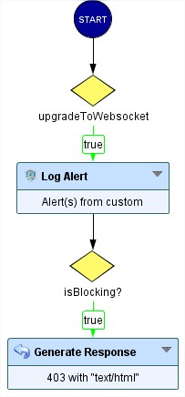
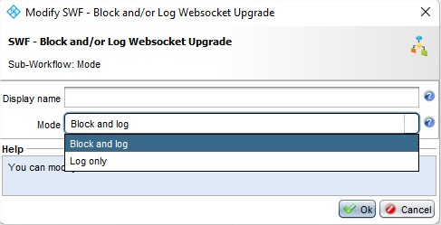
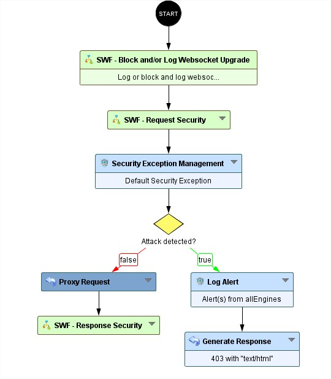

Block and log HTTP websocket upgrade attempts
=====================================

* 1 [Presentation](#presentation)
* 2 [Backup](#backup)
* 3 [SWF - Block and/or Log Websocket Upgrade](#swf-block-or-log-websocket-upgrade)

# Presentation

After the release of the WAF 6.8.0 the Websocket upgrade from HTTP becomes always authorized, therefore the `Forward Upgrade/Websocket` field of the `Proxy HTTP Request` node doesn't have any more impact. 
In other words, having `Forward Upgrade/Websocket` set to `No` will also allow the protocol upgrade.

To remedy this problem and be able to block the upgrade into Websocket we created the following sub-workflow "`SWF - Block and/or Log Websocket Upgrade`"

# SWF - Block and/or Log Websocket Upgrade

This SWF will check if headers `Connection: Upgrade` and `Upgrade: websocket` are present in the HTTP request, if so we create a security log and block (if set) the request.

This SWF can be configured by entering the desired mode:
* Block and log: This mode will block the request and log it inside the Security Logs
* Log only: This mode will NOT block the request but log it inside the Security Logs

The user needs to select one of these two modes, see the following figure:

Herein is an example that shows how we placed the Sub-Workflow between the `START` node and `SWF - Request Security` (see figure below).

# Backup

The sub-Workflow can be downloaded here: [SWF - Block and/or Log Websocket Upgrade](./backup/SWF%20-%20Block%20and_or%20Log%20Websocket%20Upgrade.backup).
