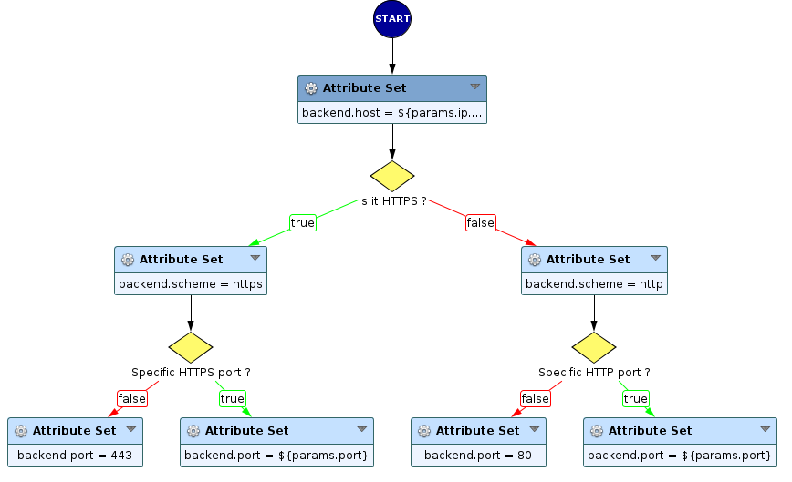
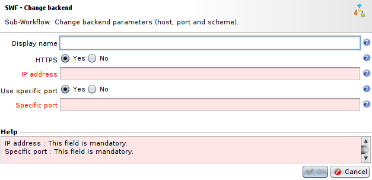

Change Backend target
=====================

* 1 [Presentation](#presentation)
* 2 [Backup](#backup)
* 3 [Sub-Workflow](#sub-workflow)
    * 3.1 [SWF - Change Backend](#swf-change-backend)
    * 3.2 [Settings](#settings)

Presentation
------------

The Sub-Workflow **SWF - Change Backend target** can be integrated to a main workflow, allowing it to change the backend parameters (host, port and scheme) during the process.

Backup
------

You can download this Sub-Workflow here: [SWF - Change backend target.backup](./backup/SWF%20-%20Change%20backend%20target.backup).

Sub-Workflow
------------

### SWF - Change Backend target

This Sub-Workflow allows to change the backend in the workflow process.

In the Sub-Workflow process, it first changes the IP address of the new backend.
Then it checks the user input, if the backend needs to be reachable through HTTP or HTTPS. In the first case, the backend's protocol is set to HTTP. In the second case, it is set to HTTPS.
If the usage of a specific port is selected, this port will be used for the backend, otherwise backend's port is set as 80 for HTTP or 443 for HTTPS.

### Settings

* The field **HTTPS** is a boolean that allows you to choose to use HTTPS. If set to `No`, HTTP will be used instead. 
* The field **IP Address** contains the new IP address for the backend.
* The field **Use specific port** is a boolean allowing to choose between selecting a specific port and selecting default port for chosen protocol.
* The field **Specific port** contains the port used in place of default one if **Use specific port** parameter is set to `Yes`.
%20target
