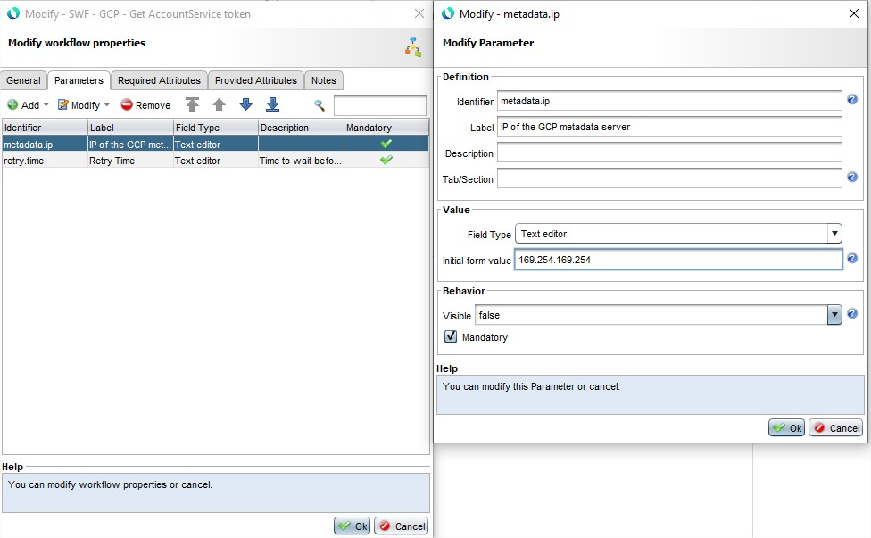
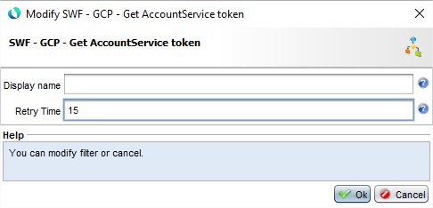

# CloudRun Protection

* 1 [Presentation](#presentation)
* 2 [How to use the SWF CloudRun protection](#how-to-use-the-swf-cloudrun-protection)
* 3 [Backup](#backup)

# Presentation
When creating an application using Cloud Run, you can require authentication to access it. Once it is set, you can add principals to set which account can access the application. Accounts authorized by the application can request it using their tokens. Our solution helps you protect your Cloud Run application by making the whole authentication process and request go through the WAF.

The `SWF - GCP - Get AccountService token` works as follow : 
- First, it checks for the gcp_token variable in the datastore. The gcp_token value will be present if a previously request succeeds.
- If the gcp_token value is present, the SWF setup the request header with the Authorization header containing the token and forward the request.
- If not, the SWF checks if the previous failed request was more than 15 seconds ago to avoid failed requests spamming.
- Once the check is done, the SWF requests the google metadata URL and retrieve the token of the current Service Account of the compute engine.
- If the request fails, the SWF raised an error and creates a log.
- If the request succeeds and the SWF can retrieves the token, the value is stored in a datastore. The SWF set the Authorization header with the token.

Concerning the SWF parameters and attributes :
- `metadata.ip` is the google metadata IP by default `169.254.169.254`. You can only change it in the SWF parameters as follow :

- `retry.time` is the waiting time between two requests for retrieving the token. You can set this directly in the node :  

> The SWF returns the attribute `gcp_token`.

# How to use the SWF CloudRun protection

Prerequisites :

- WAF must be on GCP.
- Your WAF Compute Engine must use a service account that is authorized to access the Cloud Run application.
- Your tunnel backend must be your Cloud Run application.
- The request must have the `Host` as the hostname of the Cloud Run application.

To Use the SWF just add the SWF node to your Workflow : 

# Backup

> Important, in the WAAP version 6.10.0, the SWF `SWF - GCP - Get AccountService token` is integrated by default in the product.

A backup of the explained use case of `SWF - GCP - Get AccountService token` can be downloaded here: [ `Cloud Run Protection use case`](./backup/SWF_-_GCP_-_Get_AccountService_token.backup).
