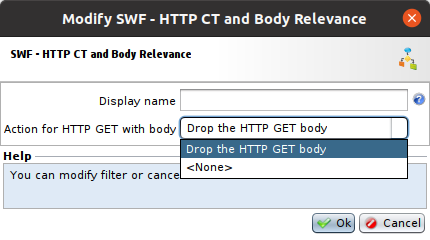
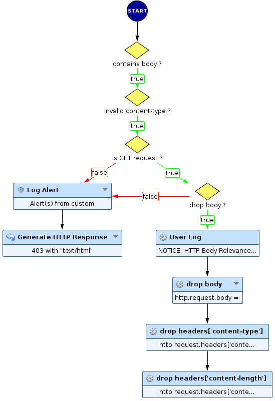
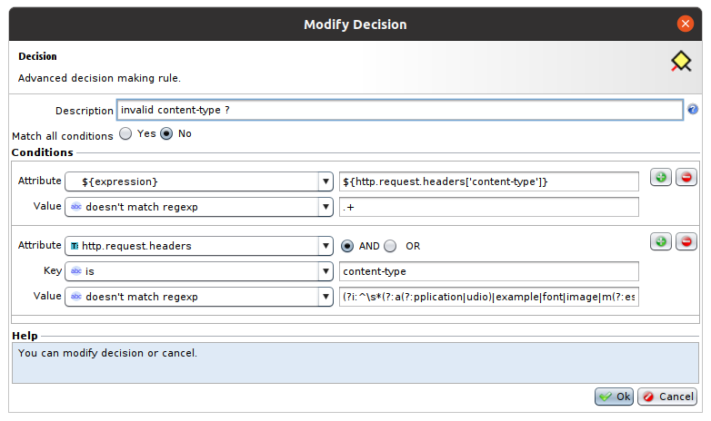
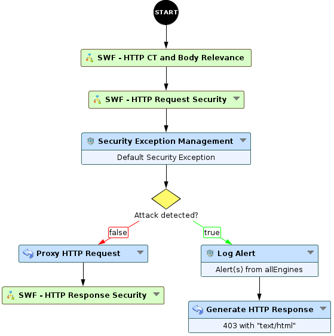

# HTTP Content-Type and Body Relevance

* 1 [Presentation](#presentation)
* 2 [SWF - HTTP CT and Body Relevance](#swf-http-content-type-and-body-relevance)
* 3 [Backup](#backup)

## Presentation
The HTTP POST request, and in some rare cases the HTTP GET request, contains an HTTP body `http.request.body`. The latter must be associated 
to a relevant content-type header. However, because of a poor configuration or a bad intention of the user the content-type can be (A) missing,
(B) empty or (C) malformed. This can lead to an improper data filtering issue.

In following, we will present the `SWF - HTTP CT and Body Relevance` and will explain how this use-case can resolve these problems. 

## SWF-HTTP Content-Type and Body Relevance

This sub-workflow handles both of the HTTP POST and GET requests with different maneers. Let's explain the particularity of each request type:

### HTTP POST
In the major cases, this SWF will handles HTTP POST requests, because generaly, the latter contains a body. If the body is present, the HTTP 
POST content-type must be (A) present, (B) not empty and (C) well formed, otherwise the SWF blocks the request. 

### HTTP GET
In some exceptional cases, an HTTP GET request can bring a body, to handle that an administrator can select one of the two proposed 
`Action for HTTP GET with body` modes (see the picture bellow).



* **None:** this is the default mode, in this case the SWF handles the HTTP GET request exactly as a POST request;
* **Drop the HTTP GET body:** the second mode is less strict, it allows an administrator to keep the HTTP GET request and remove the `body` and the potential 
associated headers `content-type` and `content-length`. 

### Operating principale
The following diagram, explains how the SWF works.



First, we check if the `http.request.body` is available or not, if so we check its content-type header, herein the configuration of the `invalid cont-type ?` decision node:



The first condition allows us to (A) check if the content-type header is present or missing, the second one, uses a regexp that validates the format of the content-type, thus 
if (B) the content-type is empty or (C) is malformed (eg. `content-type : xxxx` or  `content-type : àpplication/x-www-form-urlencoded`) then the decision node will return `true`.
Herein the used regexp for malformed content-types:
```
(?i:^\s*(?:a(?:pplication|udio)|example|font|image|m(?:essage|odel|ultipart)|text|video)\s*\/\s*(?:\*|[\w\.\+\-]{3,100})\s*(?:\;\s*(?:\w{2,100}\s*\=\s*"?\s*[\w\-\:\.\(\)]{2,100}\s*"?)?)?$)
```
Then, we check if the request is POST or GET to apply the adequate processing on the request. If the request is POST then we block it, else if GET then we check the selected `Action for HTTP GET with body` mode, if `drop body ?` is true than we remove the `body` (the removed body is logged by `User Log`), the `content-type` and the `content-length` else we handle the GET request as a POST request.

Herein is an example that shows how we placed the `SWF - HTTP CT and Body Relevance` between the `START` node and `SWF - Request Security` (see figure below).



Finally, when a request is blocked we trigger a log alert message that contains `Blocked request !` message and an `http_body_relevance_issue` flag, an example is showen by the picture bellow:


## Backup

The SWF can be downloaded here: [SWF - HTTP CT and Body Relevance](./backup/SWF%20-%20HTTP%20CT%20and%20Body%20Relevance.backup).
