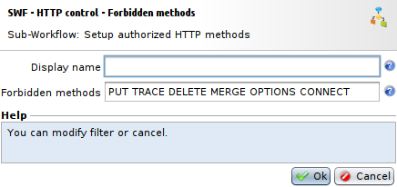

Control of request methods
==========================

* 1 [Presentation](#presentation)
* 2 [HTTP methods](#http-methods)
* 3 [Control and protection](#control-and-protection)
    * 3.1 [SWF - HTTP control - Authorized methods](#authorized-methods)
    * 3.2 [SWF - HTTP control - Forbidden methods](#swf-http-control-forbidden-methods)

Presentation
------------

HTTP traffic from a client to a Web application is a succession of HTTP requests and responses. Each HTTP request has a type which is assigned to it by its method, hence we can filter HTTP requests depending on their type.

HTTP methods
------------

The most common HTTP methods are:

*   **GET**: Requests the resource, the method has no effect on the resource.
*   **POST**: Sends data to the resource via the body of the request.
*   **HEAD**: Requests information on the resource.
*   **OPTIONS**: Obtains the communication options of the resource and the server.
*   **CONNECT**: Enables the use of a proxy as a communication tunnel.
*   **TRACE**: Requests that the server send back what it has received. (connection diagnostic)
*   **PUT**: Replaces the resource or adds it if it does not exist.
*   **DELETE**: Deletes a resource from the server.

Control and protection
----------------------

In the context of standard Web traffic, methods used are GET, POST and HEAD. That is why it is important to implement control of methods within the WAF Workflow.

This control can be put in place in two distinct ways:

*   Authorizing only the GET, POST, and HEAD methods via the **SWF - HTTP control - Authorized methods** Sub-Workflow.
*   Prohibiting a list of methods via the **SWF - HTTP control - Forbidden methods** Sub-Workflow.

### SWF - HTTP control - Authorized methods

This Workflow node is accessible in the **Security** category of the Workflow, it is preferable to place it at the entry point of the Workflow.

Methods that are allowed must be entered in the **Authorized methods** field, separated by spaces.

### SWF - HTTP control - Forbidden methods

This Workflow node is accessible in the **Security** category of the Workflow, it is preferable to place it at the entry point of the Workflow.

Methods that are prohibited must be entered in the **Forbidden methods** field, separated by spaces.

