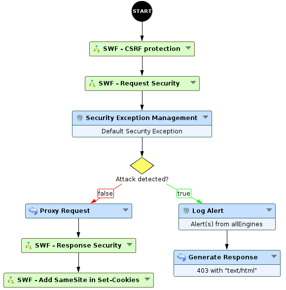
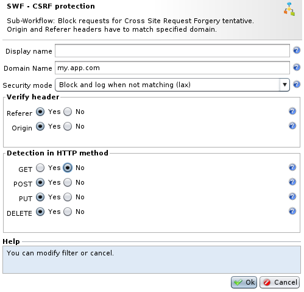
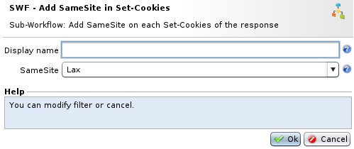

Cross-Site Request Forgery protection
=====================================

* 1 [Presentation](#presentation)
* 2 [Backup](#backup)
* 3 [Context](#context)
* 4 [Attack vectors](#attack-vectors)
* 5 [How to prevent CSRF attacks?](#how-to-prevent-csrf-attacks)
    * 5.1 [Tokens](#tokens)
    * 5.2 [Verify Referer and Origin headers](#verify-referer-and-origin-headers)
    * 5.3 [SameSite Cookie attribute](#samesite-cookie-attribute)
* 6 [Limitations](#limitations)
* 7 [Rohde & Schwarz’s solution](#rohde-schwarzs-solution)
    * 7.1 [SWF - CSRF Protection](#swf-csrf-protection)
    * 7.2 [SWF - Add SameSite in Set-Cookies](#swf-add-samesite-in-set-cookies)
    * 7.3 [Recommendations for complete protection against CSRF](#recommendations-for-complete-protection-against-csrf)

Presentation
------------

Cross-Site Request Forgery (abbreviated CSRF – pronounced “sea-surf” – or sometimes XSRF) is a cyber-attack where a hacker forces a legitimate user to perform an unwanted action on a trusted website in which the user is already authenticated. They unknowingly become an accomplice. Since the attack is being set in motion by the legitimate user on his own, it is capable of circumventing many authentication systems.

A CSRF attack is an effective attack because, generally, browser requests involve all the cookies, including the session cookies. Therefore, if the user is already authenticated to the site, the latter cannot distinguish between legitimate requests and forged ones.

The criticality and risks of CSRF attacks depend on the actions that can be made via these attacks. Hackers often attempt to get users to perform administrative tasks against their will.

For more details, see:

*   [https://cheatsheetseries.owasp.org/cheatsheets/Cross-Site\_Request\_Forgery\_Prevention\_Cheat\_Sheet.html](https://cheatsheetseries.owasp.org/cheatsheets/Cross-Site_Request_Forgery_Prevention_Cheat_Sheet.html)
*   [https://owasp.org/www-community/attacks/csrf](https://owasp.org/www-community/attacks/csrf)

Backup
------

Sub-Workflows can be downloaded here: [SWF - CSRF Protection.backup](./backup/SWF%20-%20CSRF%20Protection.backup) and [SWF - Add SameSite on Set-Cookies.backup](./backup/SWF%20-%20Add%20SameSite%20on%20Set-Cookies.backup)

Context
-------

The hacker’s goal here is to trigger an action within the victim’s operating context, using their rights and authorizations. To accomplish this, the user is forced to send a form to the web application or to visit an URL that is capable of setting off a particular action in a totally invisible way. Since the victim is already authenticated on the site when the action is performed, no request for authentication is issued.

Attack vectors
--------------

CSRF may exploit these vectors:

*   GET method: this is typically the result of poor web application development, allowing a simple HTML link to trigger an unwanted action.
*   POST method: this is more aggressive and is the most often encountered. They simulate the sending of a form, and thus of a more complex and sensitive operation.
*   PUT and DELETE methods: as many applications make API calls using methods like PUT and DELETE, these can be used but will require specific requirements, like a cross-origin resource sharing enabled on the web application (`Access-Control-Allow-Origin: *`).

How to prevent CSRF attacks?
----------------------------

### Tokens

The main solution lies in the development of the application. It consists of implementing tokens for sensitive operations in order to ensure that when the application receives an action from the user, the action is really derived from the last page visited by that user. Since the token is generated randomly, a hacker won’t be able to find it and include it in the request he wants to send to the site via the victim.

### Verify _Referer_ and _Origin_ headers

A secondary solution is to pay attention to _Referer_ and _Origin_ headers. These HTTP headers, included in POST requests, identify – respectively – the page and the domain where the current request originated. Therefore we can verify them and determine whether a POST request containing variables (typically the result of sending a form) is indeed derived from our web application and not from a third source set up by an attacker.

This solution can be implemented on the WAF, since it is not directly dependent on the web application’s code and structure (see next parts).

### SameSite Cookie attribute

The _SameSite_ cookie attribute allows declaring if the cookie is restricted to a first-party or same-site context.

For example, if a user is on `www.app.com` and requests an image from `images.app.com` then that is a **same-site** request. If a user is on `www.app.com` and requests an image from `images.otherapp.com` then that is a **cross-site** request.

Forbidding cookies to be sent along cross-site requests would help to mitigation some CSRF attacks by avoiding the authentication when going on the third party (if authentication is linked).

For more details, see [https://developer.mozilla.org/fr/docs/Web/HTTP/Headers/Set-Cookie/SameSite](https://developer.mozilla.org/fr/docs/Web/HTTP/Headers/Set-Cookie/SameSite)

The solution can be implemented on the WAF (see next parts).

Limitations
-----------

Here, we chose providing a protection based on the _Referer_ and _Origin_ headers verification, with the usage of the _SameSite_ attribute on application cookies.

The solution can protect against attacks derived from POST requests. However, attacks derived from GET requests cannot be stopped without risking false positives, especially on the first request (possibly no _Referer_ header yet).

Rohde & Schwarz’s solution
--------------------------

We currently provide 2 Sub-Workflows to mitigate CSRF attacks: "SWF - CSRF protection" and "SWF - Add SameSite in Set-Cookies"

The first "SWF - CRSF Protection" has to be placed after the start node and before security engines (see figure below).

### SWF - CSRF Protection

This node must be configured by entering the domain name that the headers _Referer_ and _Origin_ will have to respect:

*   There is no need to enter the '_https://_' scheme before, nor the final '_/_'. The SWF will check HTTP and HTTPS at the same time
*   The security mode allows to block and log, or only log, requests that do not match the domain name;
*   There is the possibility to enable checks for one of the two headers, both of them, and for the specified methods;
*   GET method check is disabled by default to avoid the risk of false positives. Enable checks on GET method with a log only security mode will allow checking for false positives without blocking.

#### How does this Workflow node operate?

The SWF will first check the method of the request:

*   If POST/PUT requests: it verifies that the received request is really a POST or PUT request and contains the body or query parameters. If so, it will check the validity of the _Referer_ and _Origin_ headers.
*   If GET/DELETE: it verifies that the received request is really a GET or DELETE request and contains query parameters (for GET). If so, it will check the validity of the _Referer_ header

**GET requests**

Verification on GET methods is not enabled by default to avoid false positives. Indeed, the first request arrives most of the time without the _Referer_ header. If the first requests are without any query parameters, the SWF will not check the _Referer_ header.

The SWF has also other security modes:

*   Block and log when not matching or not present (strict).
*   Block and log when not matching (lax): default mode. Requests will not be blocked when headers are not in the request.
*   Log only when not matching (log).

### SWF - Add SameSite in Set-Cookies

This node must be placed after the proxy request to work on the _Set-Cookie_ headers from the backend responses.

Different _SameSite_ policies can be configured:

*   **Lax** (default): cookies are not sent on normal cross-site sub-requests but will be sent when a user is navigating to the origin site;
*   **Strict**: cookies will only be sent in a first-party context and not be sent along with requests initiated by third party websites;
*   **None**: cookies will be sent in all contexts (Secure flag will be added).

#### How does this Workflow node operate?

The SWF will iterate over the response cookies table. If the _SameSite_ attribute does not exist in _Set-Cookie_ headers, it will be added with the specified policy configured in the SWF.

### Recommendations for complete protection against CSRF

*   Ask for confirmations from the user for critical actions, at the risk of weighing down the progression of the forms.
*   Avoid using HTTP GET method to perform actions or sent data. This technique will naturally eliminate simple attacks based on images but will let attacks using JavaScript, since they are capable of launching HTTP POST requests very easily.
*   Use validity tokens in forms. Ensure that a posted form is accepted only if it has been produced a few minutes earlier; the validity token serves as proof. Hence it must be sent as a parameter and verified on the server-side.
*   Verify the Referer in sensitive pages.
*   Implement the R&S WAF "SWF - CSRF Protection" and "SWF - Add SameSite in Set-Cookies" node.
