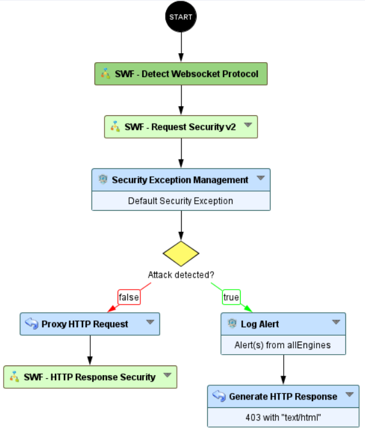
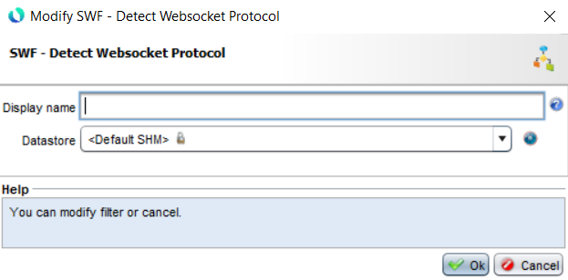
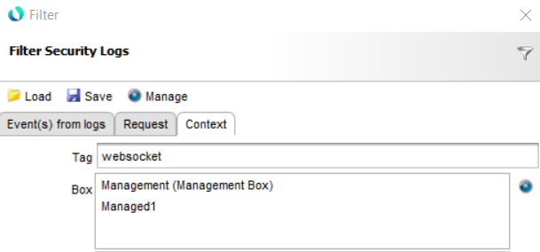
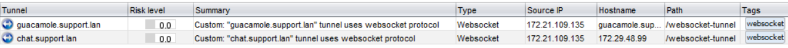

Detect Websocket Protocol
===============================

* 1 [Presentation](#presentation)
* 2 [Backup](#backup)
* 3 [Workflow Configuration](#workflow-configuration)
	* 3.1 [Subworkflow configuration](#subworkflow-configuration)
* 4 [Usage](#usage)
    * 4.1 [Workflow modification](#workflow-modification)
    * 4.2 [Send requests](#send-requests)
    * 4.3 [Filter the log view](#filter-the-log-view)
    * 4.4 [Check the logs](#check-the-logs)
    * 4.5 [Remove the subworkflow](#remove-the-subworkflow)

Presentation
------------

In some cases, the administrators may not be aware if the applications protected by the WAF use websockets.

This use case will provide a simple way to detect whether your backend uses the websocket protocol. Since version 6.9.0, we have introduced a new enhancement that allows an administrator to analyze and protect websocket traffic with the workflow.

When a tunnel is used for a websocket application, the WAF administrator must update the workflow to follow our recommendations. All the information you need about this topic is available here: [Ubika Github - Websocket](https://github.com/ubikasec/ubika-waap-extra/tree/main/use-cases/Workflow%20Configuration/Websocket).

Backup
------

You can download the Sub-Workflow here: [SWF - Detect Websocket Protocol.backup](./backup/SWF%20-%20Detect%20Websocket%20Protocol.backup)

After uploading this workflow, it will be available in the workflow nodes panel in the `Security` category.

Workflow Configuration
------------

The Sub-Workflow `SWF - Detect Websocket Protocol` should be placed immediately after the `Starting node`:

### Subworkflow configuration

You must select a datastore. We recommend using an `SHM datastore` (either the default or a dedicated one). It will be used for detecting if a websocket detection log has already been logged.

Usage
------------

This subworflow can be deployed on several tunnels at the same time. For example, let's take a real use case.

We have two tunnels:

- `guacamole.support.lan`
- `chat.support.lan`

### Workflow modification

We have to modify both workflows: just add the `SWF - Detect Websocket Protocol` right after the Starting node. You can let the `Default SHM datastore` or select a dedicated one. 

Apply the changes to the tunnels.

### Send requests

Request the tunnels using your browser. You will have to use all the features provided by your applications (because the websocket protocol may be enabled on a particular path).

### Filter the log view

Using the GUI:

- Go to `Alert & Reporting` and `Security Logs` menu,
- Click on `Filter`,
- Then, in the `Context` tab, fill in the `Tag` field with the value `websocket`

- Finally, click on `Submit`.

### Check the logs

Check the `Security Logs`, if the applications behind the WAF use the websocket protocol, you will find the following logs:

### Remove the subworkflow

Remove the `SWF - Detect Websocket Protocol` node in the workflows and apply the tunnels.

### Modify the websocket application workflow

Now that you know which applications use the websocket protocol, you can modify the workflows according to our recommendations: [Ubika Github - Websocket](https://github.com/ubikasec/ubika-waap-extra/tree/main/use-cases/Workflow%20Configuration/Websocket).