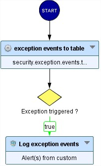

# Extract information on excepted requests

* 1 [Presentation](#presentation)
* 2 [SWF - Log Exceptions](#swf-log-exceptions)
* 3 [Backup](#backup)

## Presentation
With our WAF, users can create security exceptions on blocked requests by a security engine, and thus allow these requests to pass. 
The issue with that feature is once the security exception is created, users don't have any information when the exception is triggered  
and no log about the excepted request is registered.

In the following, we will present what we want to do (see Excepted requests) and then explain our solution (`SWF - Log Exceptions`): 

## Excepted Requests:
In this use case, we need to display a log when an exception is triggered. This log will contain: 
* The policy name;
* The event reason contains the used security engine name, the attack family, and the matched part.  

Herein is an example of an exception log obtained by using the `SWF - Log Exceptions` (explained in the next section): 

In this example the security engine is the _ICX engine_, the security policy name is called _Default Policy_, the attack category is _Command injection_ and  
the matched part is _Path_. We can also note that we have an _excepted\_request_ tag that can be useful for filtering logs.

## `SWF - Log Exceptions`:

The `SWF - Log Exceptions` handles the `security.exception.events` attribute provided by the `Security Exception Management` node. This attribute gives all   
the necessary information about the excepted events. It also contains the Security Exception profile that has excepted them (`securityExceptionConfigurationUid`). 
The `security.exception.events`, which is an opaque attribute, is transformed into a readable table (`security.exception.events.table`) using the `Events exception to table` node, to extract the information we want.
Then, using a `Decision` node we check if an exception is triggered or not, and finally, if the request is excepted, we use a `Log Alert` node to add the excepted request to security logs.

This SWF doesn't have any parameter to configure, users can only enter a custom name for the node.

Here is an example that shows how we placed the Sub-Workflow between the `Security Exception Management` node and `Decision` node (see figure below).

## Backup
The sub-Workflow can be downloaded here: [SWF - Log Exceptions](./backup/SWF%20-%20Log%20Exceptions.backup).
