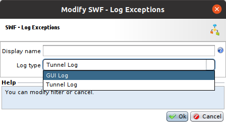
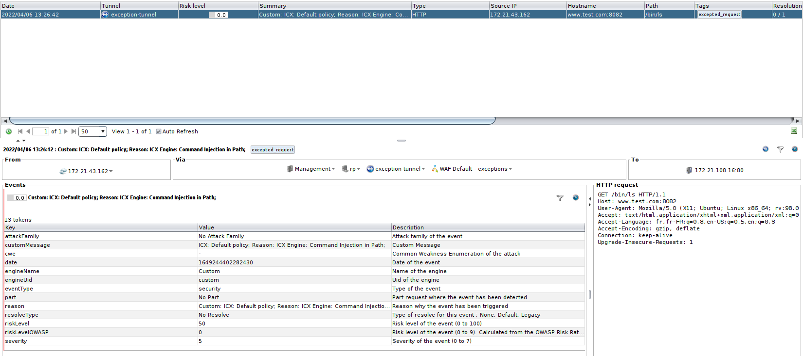
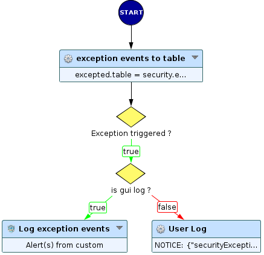
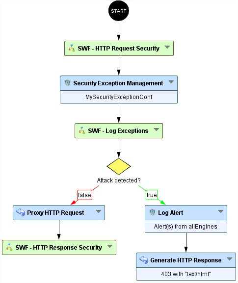

# Extract information on excepted requests

* 1 [Presentation](#presentation)
* 2 [SWF - Log Exceptions](#swf-log-exceptions)
* 3 [Backup](#backup)


## Presentation
With our WAF, when a security engine detects and blocks a request, the administrator can create a security exception on the blocked request, and thus allow the latter to pass.
The issue with that feature is once the security exception is created, administrators are not notified and don't have any information each time when the exception is
triggered and no log about the excepted request is registered.

In the following, we will present what we want to do (see Excepted requests) and then explain our solution (`SWF - Log Exceptions`):<br/>

## Excepted Requests:
In this use case, we need to display a log when an exception is triggered. For this, we created two types of logs and the administrator can choose one of them:




* **GUI log:** shows the most useful information of an excepted request. It is displayed in the Alert & Reporting tab; 
* **Tunnel log:** gives more detailed information such as the matched partValue, the partValueMatch, the criticty of the attack, etc; 

### GUI log
The GUI log mainly contains:<br/>
* The policy name;
* The event reason that contains the used security engine name, the attack family, and the matched request part;
* The ExceptionRuleUid which is a unique identifier for the triggered exception rule;
* The handled request;
* And other information about the tunnel, the appliance, etc.

Herein is an example of an exception log obtained by using the `SWF - Log Exceptions` (explained in the next section):<br/>



In this example the security engine is the `ICX engine`, the security policy name is called `Default Policy`, the attack category is `Command injection`, 
the matched part is `Path`, the ExceptionRuleUid is `34f4b3767f41dd4c9f43fe71672f05bd`, the request is in the right-bottom of the image, the ip source is `172.21.105.113`, etc.
We can also note that we have an `excepted_request` tag that can be useful for filtering logs.

### Tunnel log
The Tunnel log returns a JSON content of the following excepted request fields, see the example below:
```
[Tue Apr 26 18:29:13.135657 2022] [workflow:notice] [21920:140569257903872] User: 
{
	"securityExceptionConfigurationUids": "ba60e3820e02febbe9bd359fb95f0bd9",
	"ExceptionRuleUid": "34f4b3767f41dd4c9f43fe71672f05bd",

	"http.request.host" : "www.test.com",
	"http.request.hostname" : "www.test.com",
	"http.request.hostpath" : "/bin/ls",
	"http.request.hostport" : "80",
	"http.request.ip-src" : "172.21.105.113",
	"http.request.method" : "GET",
	"http.request.path" : "/bin/ls",
	"http.request.protocol" : "HTTP/1.1",
	"http.request.uid" : "e89731831540e204e5e469169d51d605",
	"protocol.type" : "http",
	"tunnel.name" : "test-tunnel",
	"tunnel.uid" : "5bb0871e42befa286f47a5e7f9680c0f",

	"date": "1650990553133147",
	"eventType": "security",
	"engineUid": "icxEngine",
	"engineName": "ICX Engine",
	"severity": 5,
	"resolveType": "Default Resolve",
	"part": "Multiple",
	"icxPolicyName": "Default policy",
	"icxPolicyUid": "fbfb5aec58e3ff3bea900f646351cc30",
	"icxRuleName": "Command Injection",
	"icxRuleUid": "cccca8b382ef38e44f0b620c39adbbba",		
		
	"matchingParts.part": "Path",
	"matchingParts.partValue": "/bin/ls",
	"matchingParts.partValueOperator": "pattern",
	"matchingParts.partValuePatternUid": "CommandInjectionProprietaryPattern_00527",
	"matchingParts.partValuePatternName": "Command Injection",
	"matchingParts.partValuePatternVersion": "00527",
	"matchingParts.partValueMatch": "/bin/ls",
	"matchingParts.attackFamily": "Command Injection",	
	"matchingParts.riskLevel": 80,
	"matchingParts.riskLevelOWASP": 8,	
	"matchingParts.cwe": "CWE-77",
	"reason": "ICX Engine: Command Injection in Path"
}
```
> To easily find the wanted Tunnel log, you can filter it using the `ExceptionRuleUid`.
## `SWF - Log Exceptions`:



The `SWF - Log Exceptions` handles the `security.exception.events` attribute provided by the `Security Exception Management` node. This attribute gives all  
the necessary information about the excepted events. It also contains the Security Exception profile that has excepted them (`securityExceptionConfigurationUid`).
The `security.exception.events`, which is an opaque attribute, is transformed into a readable table (`excepted.table`) using the `Events exception to table` node 
to extract the information we want.
Then, using a first decision node, `Exception triggered ?`, we check if an exception is triggered or not. Then a second decision node
to know the selected log type (GUI or Tunnel). Finally, depending on the selected log type, we use a `Log Alert` node to add the excepted request to the GUI security logs
or the `User Log` node to add it to the tunnel.

This SWF has only the selecting log type parameter and the node custom name.

Here is an example that shows how we placed the Sub-Workflow between the `Security Exception Management` node and `Decision` node (see figure below).




## Backup
The sub-Workflow can be downloaded here: [SWF - Log Exceptions](./backup/SWF%20-%20Log%20Exceptions.backup).
