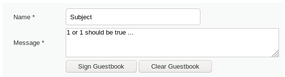
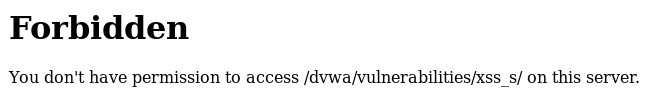
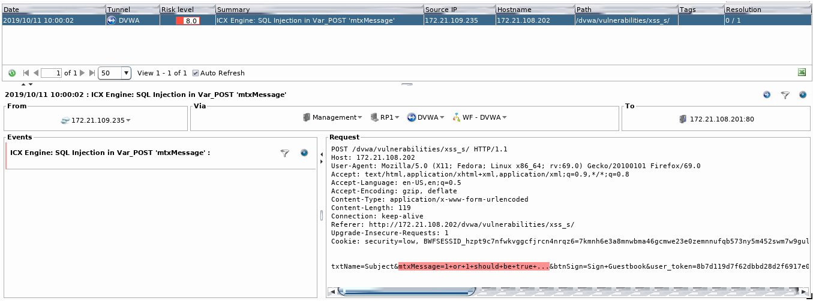
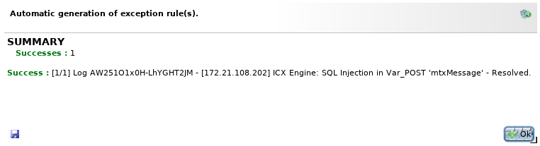
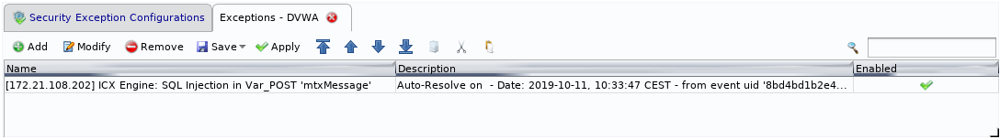
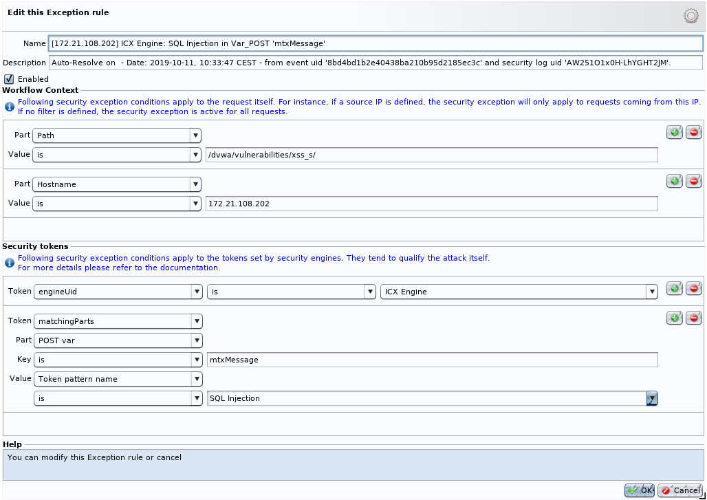
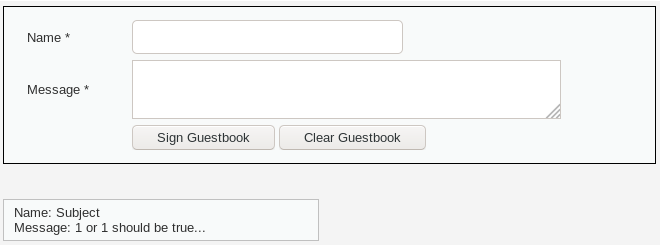
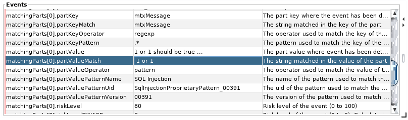
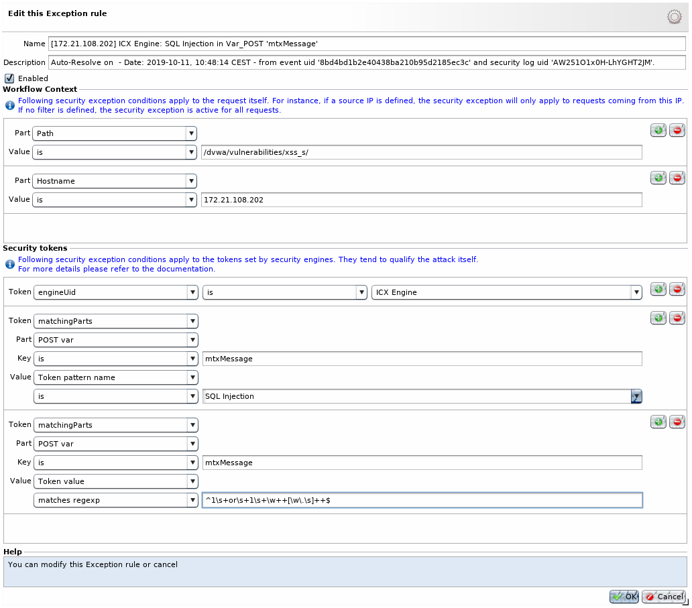
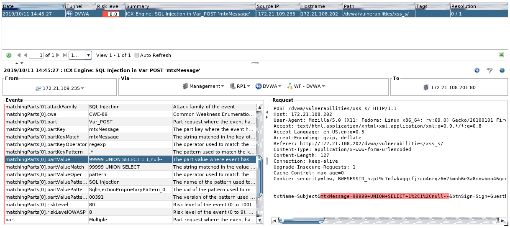

False positives resolution with exceptions
==========================================

* 1 [Presentation](#presentation)
* 2 [Problem](#problem)
* 3 [Resolution](#resolution)
    * 3.1 [Create an exception using the automatic resolution](#create-an-exception-using-the-automatic-resolution)
    * 3.2 [Exception can be too large](#exception-can-be-too-large)

Presentation
------------

This document describes a good practice to handle false positives (i.e. requests that will raise an alert despite being harmless). We will use a simple scenario to illustrate how to resolve a false positive with the **Resolve alerts** feature.

The following case uses the ICX engine but it can also be applied to other security engines.

Problem
-------

So, we will start with the example below where we have a simple form consisting of two fields, one for the message's title and one for the message itself.

Imagine the following message content:

The content `1 or 1 should be true...`  cannot be considered has dangerous but it is close to a simple form of SQL injection. When the request is received by the WAF, it's analyzed following the security policy configured by the product administrator. If the request contains a non legitimate content, the security engines will detect it and the request will be blocked and not sent to the backend.

We are in this case, the ICX engine detects a SQL injection and triggers a security alert:

Sometimes detected events are invalid : engines detect attacks that should not, commonly named **false positives**. However, events can be considered as legitimate by the administrator and can be resolved to accept future requests and access to the backend.

Resolution
----------

We are here in a false positive case, so we decide to create an exception.

To do it, we can use two ways:

*   the automatic resolution with the **Resolve Alerts** button. It will automatically add an exception in the associated security policy.
*   the custom resolution of each event with the blue button. It allows to manually choose the conditions of the exception.

We will choose the easy way to resolve our false positive with the automatic resolution. The exception will be customized later.

### Create an exception using the automatic resolution

Select wanted log and click on **Resolve Alerts** button.

A windows will open with the list of events to resolve. All are selected by default. Click OK to confirm.

A summary page is displayed with the result of each event. This confirms our resolution:

And a new exception is added to our Security Exception policy:

The created exception authorized requests matching:

*   the path `/dvwa/vulnerabilities/xss_s/`
*   the hostname `172.21.108.202`
*   the pattern "SQL Injection" on the value of the field **mtxMessage**

We can now apply the exception on our tunnel and try to send the same form again to see if our exception is working.

**Replay**

Exceptions can be validated by the **Replay**.

The message is now sent and saved on the backend.

### Exception can be too large

The created exception authorizes all requests matching the **SQL Injection** pattern on the specified parameter, path and hostname. SQL injections will not be blocked anymore.

For example, a SQL injection `99999 UNION SELECT 1,1,null--` will not be blocked. We have to be more restrictive.

We would like to authorize the request marked as false positive and continue to use the SQL Injection pattern for other requests. The first exception created is precise on the context, now we want to be more accurate on what has been matched.

To do this, we can modify our previous exception and add a second condition on the parameter value.

**ICX match details**

On the ICX engine, the value matched by a pattern or regexp is available in the `matchingParts.partValueMatch` token from an event.

In our example, the value matched is: `1 or 1`

Here, we will use the regexp `^1\s+or\s+1\s+\w++[\w\.\s]++$` to match the parameter value as close as possible.

The exception now authorizes requests matching:

*   the path `/dvwa/vulnerabilities/xss_s/`
*   the hostname `172.21.108.202`
*   the pattern **SQL Injection** on the value of the field **mtxMessage**
*   the form of the value of the field **mtxMessage**

After applying this updated rule, our false positive (first request) is still excepted and SQL injections are still blocked (second request).

