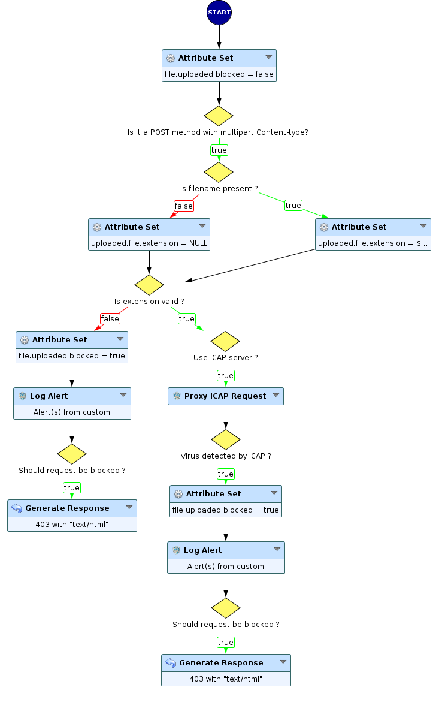
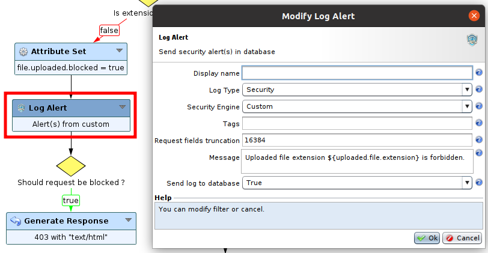
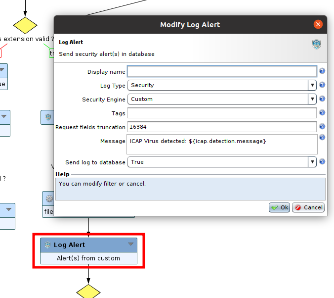
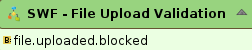
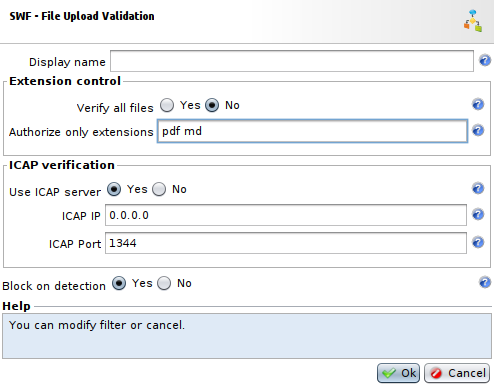
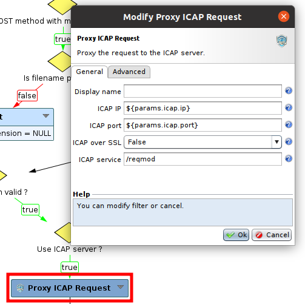

File Upload Validation
======================

* 1 [Presentation](#presentation)
* 2 [Backup](#backup)
* 3 [Sub-Workflow](#sub-workflow)
	* 3.1 [SWF - File Upload Validation](#swf-file-upload-validation)
	* 3.1 [Settings](#settings)

Presentation
------------

The Sub-Workflow **SWF - File Upload Validation** allows to retrieve an uploaded file, check its extension and analyze it with ICAP server.

Backup
------

You can download this Sub-Workflow here: [SWF - File Upload Validation.backup](./backup/SWF%20-%20File%20Upload%20Validation.backup)

After uploading this Sub-Workflow, it is available in the workflow nodes panel in the Security category.

Sub-Workflow
------------

### SWF - File Upload Validation

This sub-workflow can be used to validate uploaded files, by performing checks on several levels: 
* Request method 
* Request headers
* Request body headers
* File extension
* File content with ICAP server

At first, the Sub-Workflow checks that `POST` method is used and that the `Content-type` header is `Multipart/Form-data`.
Then, it looks at the `Request body headers` level, to verify if a `filename` attribute is present. If so, it will get file extension and store it in `uploaded.file.extension` attribute, otherwise it will be set as `NULL`.

Next, it checks extension to see if it's a valid one, if not, request is blocked and a custom log is sent with **Log Alert** node (you can change this custom log message in the **Log Alert** node shown below).

Afterwards, if it has to, uploaded file will be scanned for viruses by an ICAP server with **Proxy ICAP Request** node. If something has been found, it will block the request and send a custom log with **Log Alert** node (you can change this custom log message in the **Log Alert** node shown below).

Note that this Sub-Workflow provides a boolean attribute **file.uploaded.blocked** that shows if uploaded file has been blocked or not.

### Settings

* The field **Verify all files** is a boolean that allows you to choose between accepting and verifying every file whatsoever its extension and selecting a specific list of file extension to authorize and verify.
* The field **Authorize only extensions** allows to select a list of valid file extensions separated bye spaces if **Verify all files** parameter is set to `No`. For instance, the list could be `txt pdf png`.
* The field **Use ICAP server** is a boolean that selects if an ICAP server should be used to scan uploaded file for viruses or not. The two next fields only appear if this setting is set to `Yes`.
* The field **ICAP IP** is the IP address of the ICAP server, default is `0.0.0.0` and should be changed.
* The field **ICAP Port** is the port used by ICAP server, default is `1344`. This port is the default one for this protocol.
* The field **Block on detection** is a boolean that allows to choose if requests with invalid file should be blocked or not.

If you want to change more advanced settings of ICAP server, you will need to go for the **Proxy ICAP Request** node in **SWF - File Upload Validation** Sub-Workflow.

