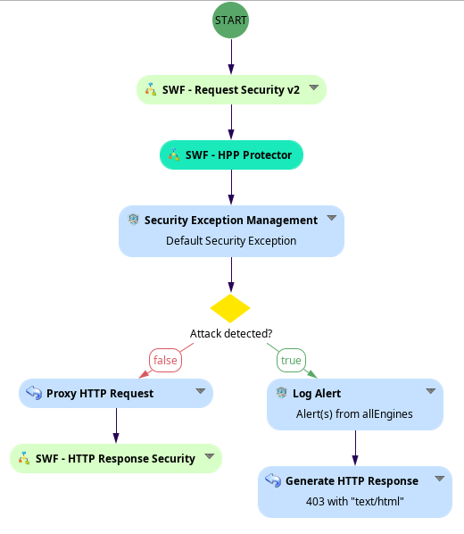

# SWF - HPP Protection

## Table of Contents

1. [Presentation](#presentation)  
2. [Backup](#backup)  
3. [Context](#context)  
4. [Attack Vectors](#attack-vectors)  
5. [How to Prevent HPP Attacks?](#how-to-prevent-hpp-attacks)

---

## Presentation

**HTTP Parameter Pollution (HPP)** is a technique used by attackers to send multiple HTTP parameters with the same name, potentially manipulating server-side logic or bypassing security controls. This can lead to unexpected behavior such as authentication bypass, privilege escalation, or injection vulnerabilities.

For more details, see: [OWASP - HTTP Parameter Pollution](https://owasp.org/www-project-web-security-testing-guide/latest/4-Web_Application_Security_Testing/07-Input_Validation_Testing/04-Testing_for_HTTP_Parameter_Pollution)

---

## Context

Web applications often rely on query parameters for routing and input. When duplicated parameters are sent, different frameworks may handle them inconsistently, some override values, others concatenate them, and some treat them as arrays. This inconsistency can be exploited by attackers to alter application behavior.

---

## Attack Vectors

Examples of HPP exploitation include:

- **Authentication Bypass**: Sending multiple `user` or `token` parameters to override access logic.
- **Privilege Escalation**: Injecting additional role or permission parameters.
- **Injection Attacks**: Manipulating backend logic that parses or concatenates parameters.

Example:

```
GET /login?role=user&role=admin
```

Depending on the backend, this could result in elevated privileges.

---

## How to Prevent HPP Attacks using Ubika WAAP Gateway?

1. In your **advanced profile of the tunnel**, set:  
   ```
   DuplicatedVarsConcatenation none
   ```
2. Use the **SWF - HPP Protector** node in your workflow.

When a duplicated parameter is detected, the SWF generates a **Security Event**, and the request is blocked just like any other web injection.

> Important: you must put it before the **Security Exception Management**, see the example below:



Once an HPP is detected, a log alert is triggered, see the example below:

Request: 
```
GET /?url=www.site.com&key=mykey&url=www.evil.com HTTP/1.1
```


---

## Backup

You can download the Sub-Workflow here:
**[SWF - HPP Protector.backup](./backup/SWF - HPP Protector.backup)**

> Important: with the actual version of WAAP Gateway (v6.16.0) we found a bug in the **Auto Normalisation Engine** therefore we created another backup that handles only the already decoded params:  **[SWF - HPP Protector without autonormalisation.backup](./backup/SWF - HPP Protector without normalisation.backup)**

---

For further assistance or to report any issue with the Sub-Workflow, please contact our support team.