Updating ICX security patterns
==============================

* 1 [Context](#context)
* 2 [Implementation](#implementation)
    * 2.1 [Security Update](#security-update)
    * 2.2 [ICX Policies](#icx-policies)
    * 2.3 [Workflows](#workflows)
    * 2.4 [Tunnel](#tunnel)
* 3 [Processing new false positives](#processing-new-false-positives)
* 4 [Switchover after qualification](#switchover-after-qualification)
    * 4.1 [Workflow](#workflow)
    * 4.2 [Tunnel](#tunnel)

Context
-------

Regular Security Updates provide protection against new attacks, but they can sometimes generate new false positives which in certain cases can block certain functionalities of the Web application.

In a sensitive environment where no interruption of service can be tolerated, it is recommended that you perform an update of the security policy in non-blocking mode in order to resolve potential false positives without blocking application traffic.

Implementation
--------------

### Security Update

The first step is to perform the update to the new version of the security rules.

To do that, see the following section: **Policies > Security > Security Patterns > Security Updates** and upload the update file.

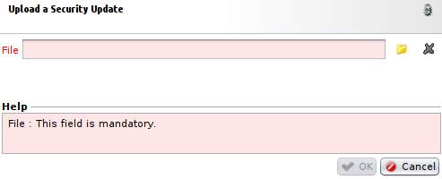

Once the file is loaded on the WAF, the new version must be marked as Active by default, which means that the **Default Policy** and **Default Policy (Strict)** are now in their default versions. It is important to note that the security policies put in place by the user are not modified at this point.

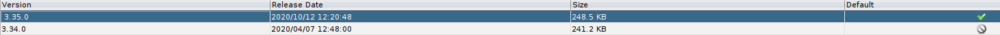

### ICX Policies

In order to implement the validation period you need to make a copy of the current security policy using **Save as…**.
We advise you to name this copy like the original and add the version number of the security update _(see example below)_.

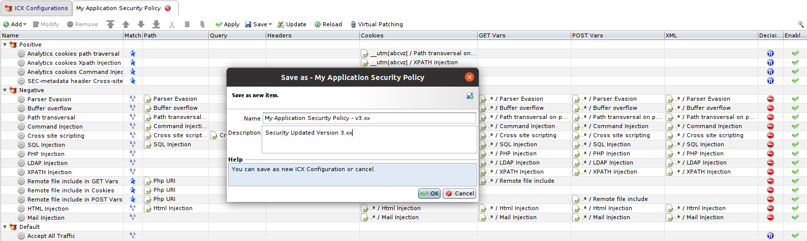

Once this stage is completed, the new security policy is identical to the original one. Now you need to update it to the default version (the latest version loaded on the i‑Suite). To do that, select the new ICX policy created in the preceding stage, then use the **Update** function in the Options button submenu.

Now back up the policy using **Save**.

### Workflows

Now go to the **Workflow** section and select the Workflow currently being used.
Note that this workflow shoud use **Security Exception Management** node after **ICX Engine** node with a **Security Exception Configuration** different from default configuration, the latter being on **read only**.

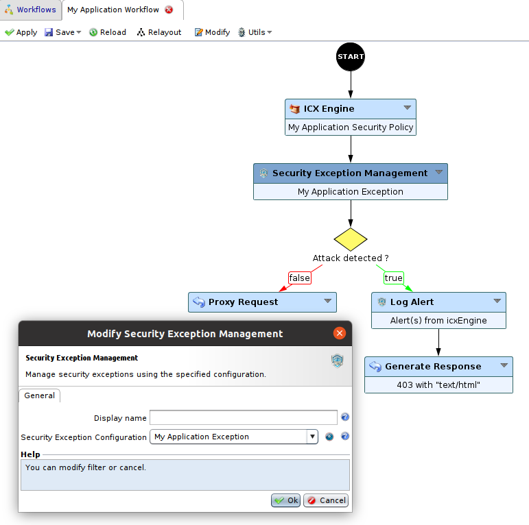

And make a copy of the Workflow currently being used using **Save as…**, as you did for the ICX policy.

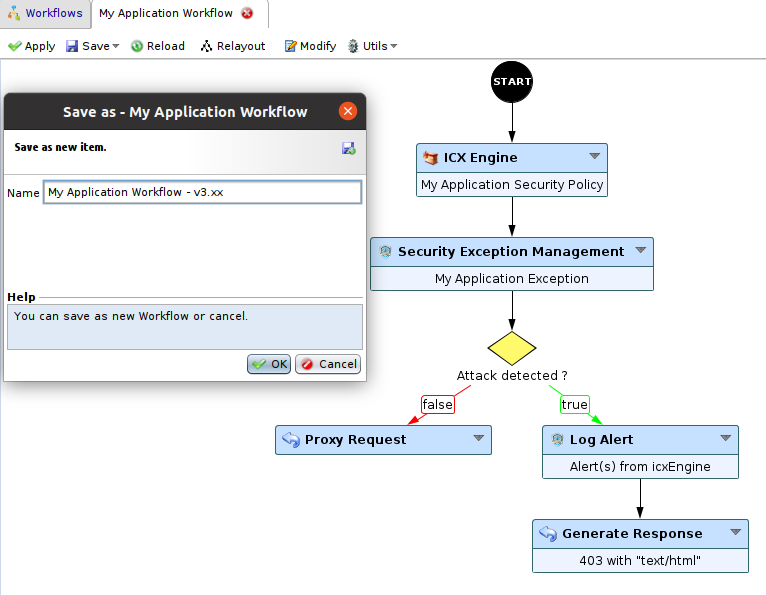

Once the new Workflow is in place, modify it as follows: Add a new **ICX Engine** node, a new **Log Alert** node and a new **Security Exception Management** node and link them as in the screenshot below.

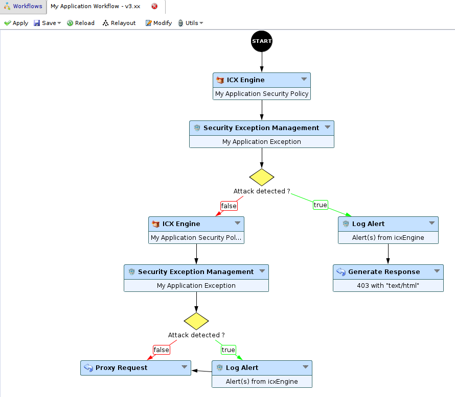

Then, associate the new **ICX Configuration** you created previously with the new **ICX Engine** node you set up (the second one here).

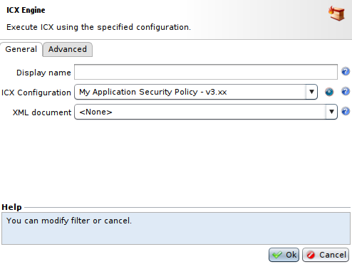

Next, for the new **Security Exception Management** node select the same **Security Exception Configuration** as the other one.

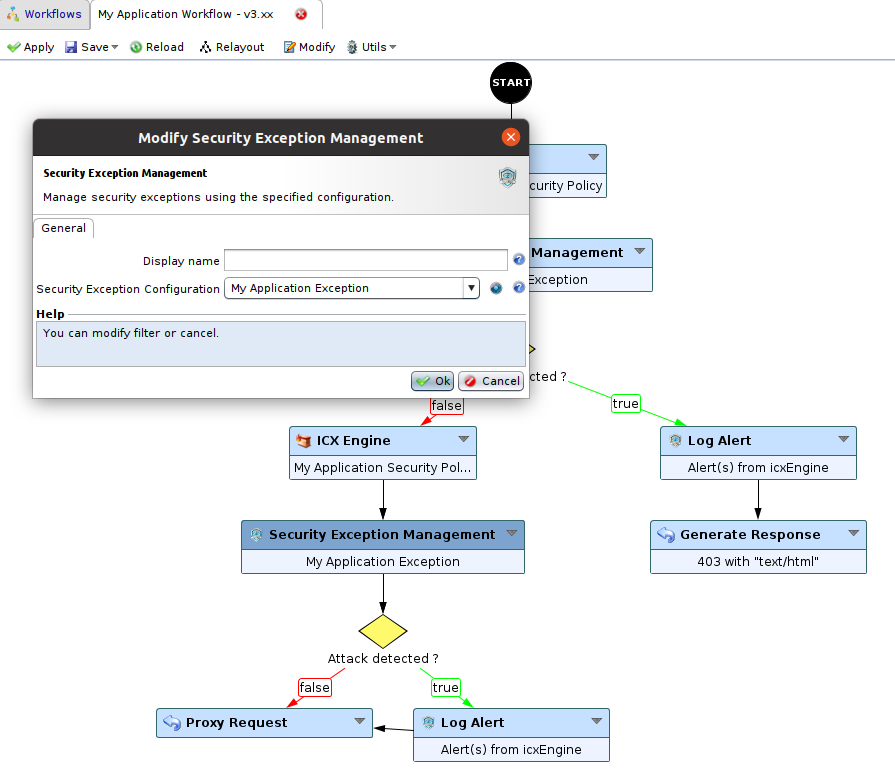

Finally, add a **Tag** to the **Log Alert** node related to the second **ICX Engine** node, for instance **new_blocked**.

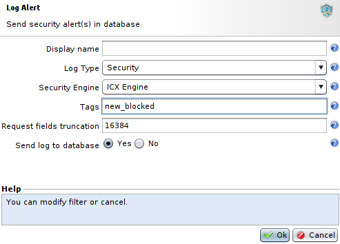

Now back up the Workflow using **Save**.

### Tunnel

Associate the new Workflow with the Tunnel of the Web application, then perform an **Apply** on the Tunnel and its Reverse Proxy.

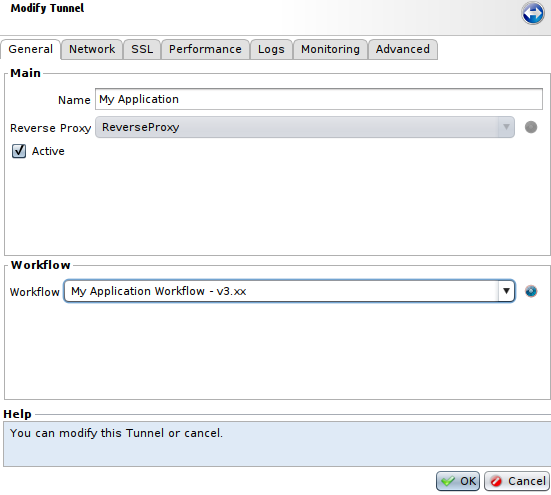

Processing new false positives
------------------------------

During the qualification period, false positives generated by the new security policy must be handled and resolved.
To do this, go to the **Security Logs** section and use the **Filter** function, then in the **Context** tab fill in the **Tag** field with the one you previously set in the **Log Alert** node, here it is **new_blocked**. And in the **Workflow** field select the workflow you created earlier.
Then, press **submit** to only display logs generated by the update.

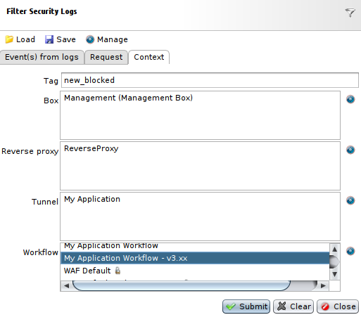

Finally, select every log you get after filtering and use **Resolve alerts** button. It will add selected logs to the exception configuration set in the **Security Exception Management** node you used in previous Workflows.

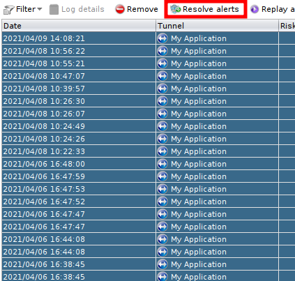

Switchover after qualification
-----------------------------

### Workflow

When the qualification period is ended, you can switch back to standard operation for application protection and in blocking mode with the new updated policy.

To do that, modify the Workflow used previously to assign the policy updated in the **ICX Engine** node.

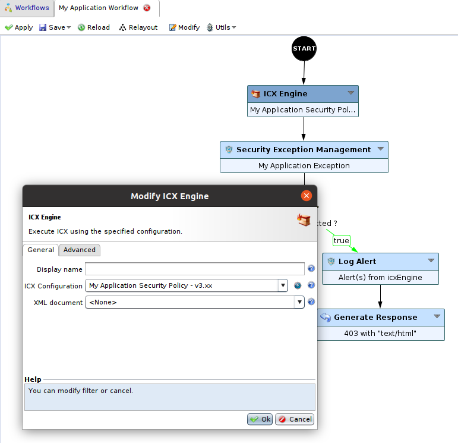

Back up the Workflow using **Save**.

### Tunnel

Associate the Workflow used before qualification with the Tunnel of the Web application, then perform an **Apply** on the Tunnel and its Reverse Proxy.

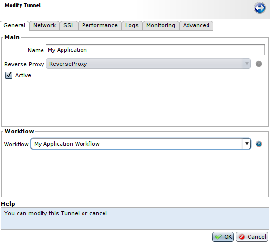
