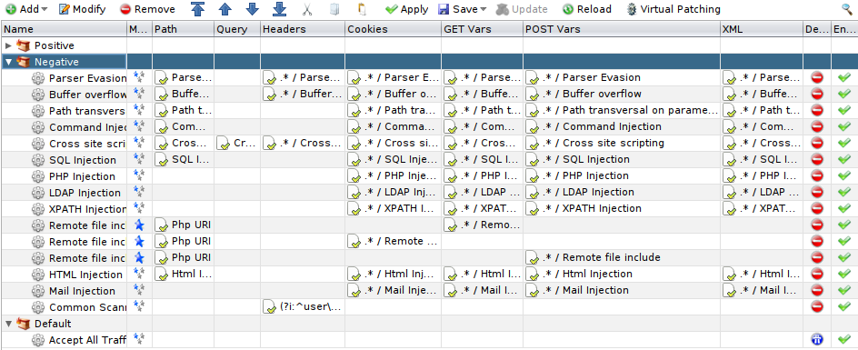
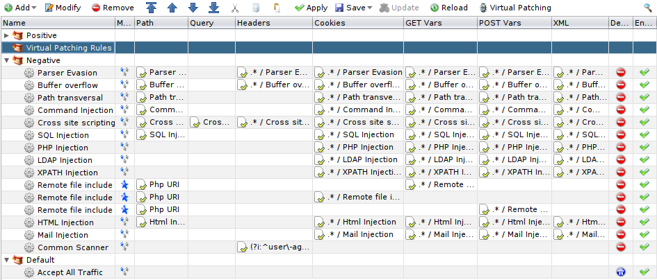
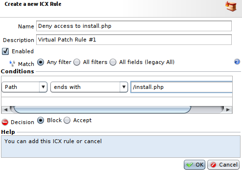
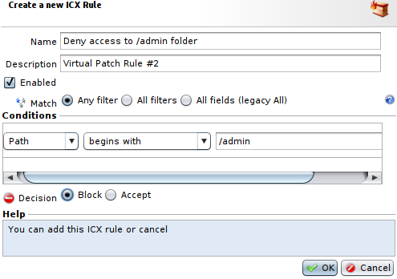

Virtual Patching with ICX
=========================

* 1 [Presentation](#presentation)
* 2 [Negative categories](#negative-categories)
* 3 [Creating the rules](#creating-the-rules)
* 4 [Save and Apply](#save-and-apply)

Presentation
------------

To control and strengthen the security of a Web application, security rules that deal with a vulnerability or deny access to a particular resource can be put in place. Implementing these blocking rules is called **Virtual Patching**.

Negative categories
-------------------

Virtual Patching rules are configured in **ICX Policies**, in the **Negative** category.

It’s also possible to create a category for grouping all the **Virtual Patching** rules together.

It is imperative that blocking rules be located below, and never above, the **Positive** categories.

Creating the rules
------------------

In this case, we’re going to implement denial of access to a resource. Certain Web applications are delivered in a package that needs to be installed via an installation script before the first use. And certain Web servers have an administration space that must not be accessible via the Internet under any circumstances.

We’re going to see how to deny access to a file named **install.php** and to the **/admin** directory of the Web server.

To deny access to the file **install.php**, we’ll create a rule in the **Negative** section or in our **Virtual Patching** category and thus block any HTTP request whose **path ends in /install.php**.

To deny access to the **/admin** directory, we’ll create a rule in the **Negative** section or in our **Virtual Patching** category and thus block any request whose **path begins with /admin**.

To go further, rules to mitigate vulnerabilities on specific endpoints or parameters can also be deployed.

Save and Apply
--------------

Once the rules are in place, the **ICX policy** must be **saved** and an **Apply** performed on the Tunnel(s) concerned.
