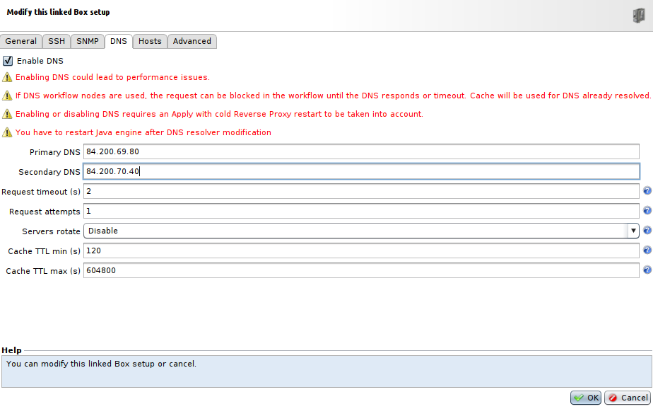
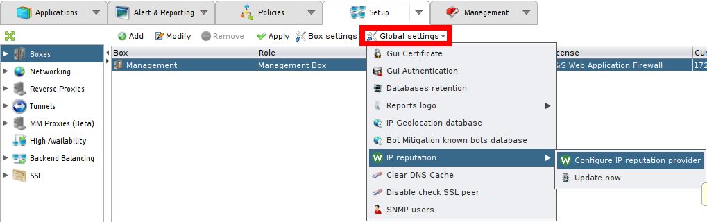
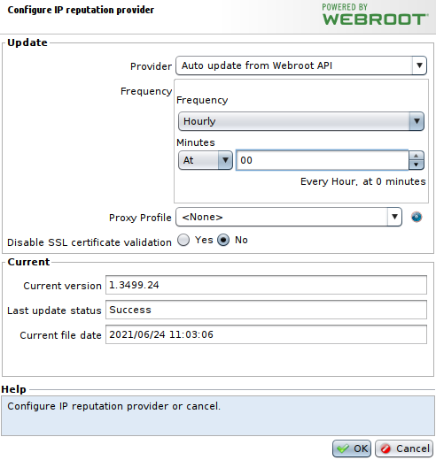
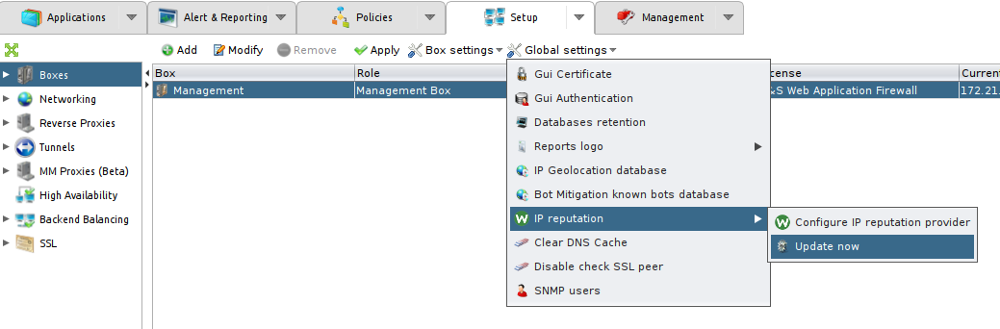
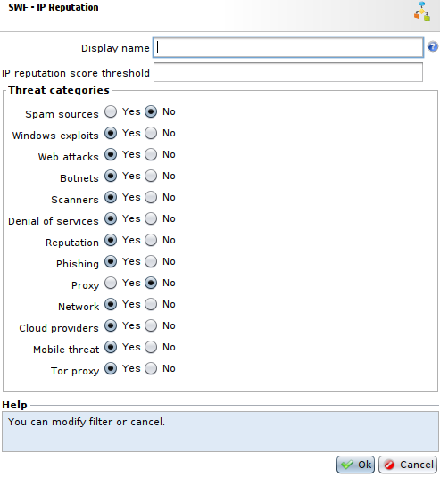
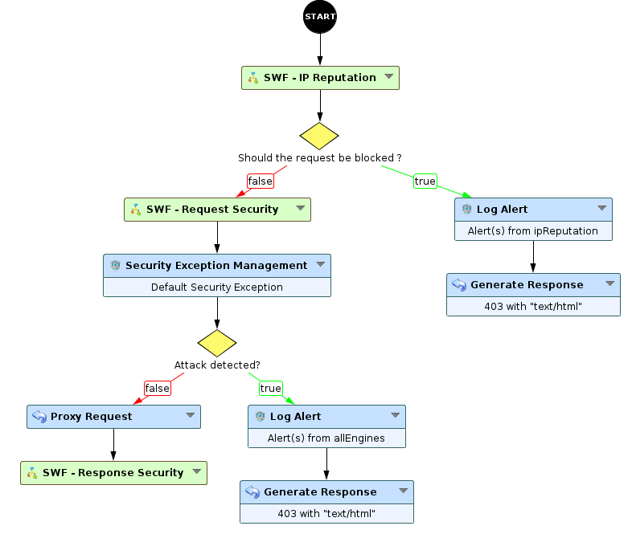
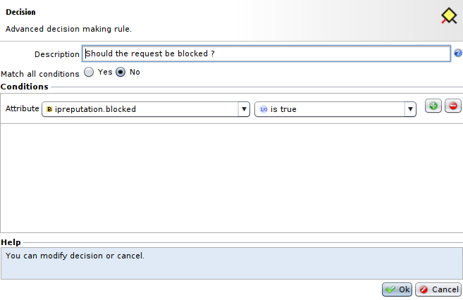
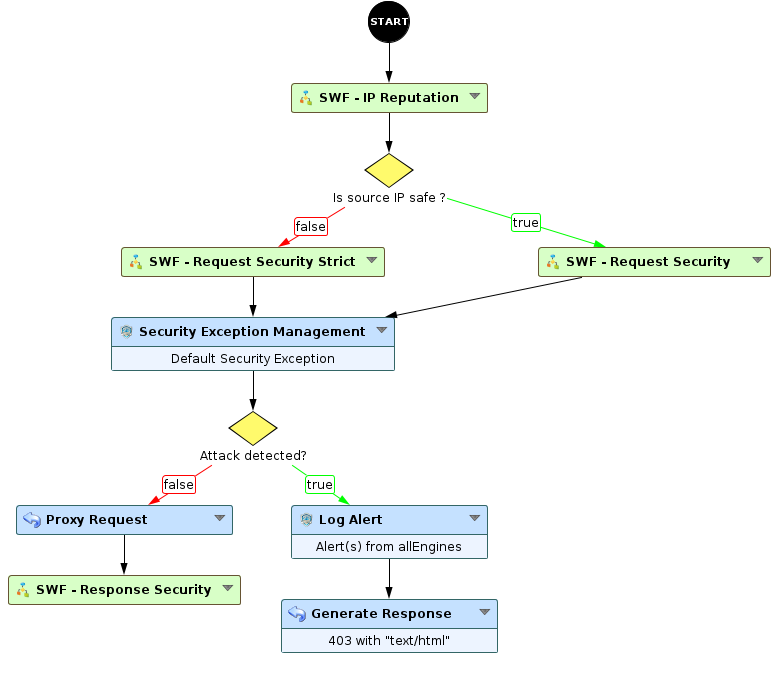
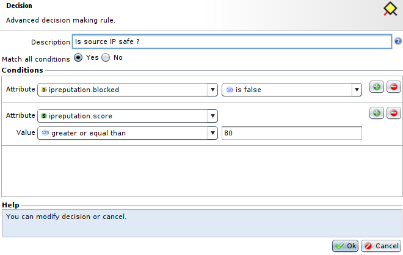

IP Reputation
=============

* 1 [Presentation](#presentation)
* 2 [Backup](#backup)
* 3 [Setup IP Reputation database](#setup-ip-reputation-database)
	* 3.1 [Setup database access](#setup-database-access)
	* 3.2 [Setup database updates](#setup-database-updates)
* 4 [SWF - IP Reputation](#swf-ip-reputation)
	* 4.1 [Settings](#settings)
	* 4.2 [IP Reputation score threshold example](#ip-reputation-score-threshold-example)
	* 4.3 [Provided attributes](#provided-attributes)
	* 4.4 [Usage](#usage)
		* 4.4.1 [To block any potentially dangerous source IP address](#to-block-any-potentially-dangerous-source-ip-address)
		* 4.4.2 [To sort requests depending on the score or threats](#to-sort-requests-depending-on-the-score-or-threats)

Presentation
------------

This use case presents a way to check if the source IP address is known for being related to different possible threats and how much a source is dangerous based on a scoring system. This allows to apply different policies depending on how threatening the source is.

It uses Webroot database to verify IP address, more informations can be found on [Webroot](https://www.webroot.com/us/en/business/threat-intelligence/internet/ip-reputation).

Backup
------

You can download the Sub-Workflow here: [SWF - IP Reputation](./backup/SWF%20-%20IP%20Reputation.backup)

Setup IP Reputation database
----------------------------

First of all, to use the Sub-Workflow **SWF - IP Reputation**, we need to configure the Webroot database it will use, i.e. the access to the database and the updates.

|A Webroot license is required to enable IP Reputation node, this license is included with the appliance if you asked for it.|
|----------------------------------------------------------------------------------------------------------------------------|

### Setup database access

Now let's setup the WAF to allow access to Webroot's database.

* The management appliance needs to have an HTTPS access (TCP port 443) to contact Webroot API.
* It also requires to have **Enable DNS** activated and configured in your management Box. To do so, go to **Setup > Boxes**, go to your management box's settings, then in the **DNS** tab tick **Enable DNS**. Finally, enter **Primary** and **Secondary** **DNS addresses**. You can keep default settings values or change them for specific needs.

### Setup database updates

To manage the Webroot's database updates:

* Go to **Setup > Boxes**, click on **Global Settings > IP Reputation > Configure IP reputation provider**.

In the **Configure IP reputation provider** menu:

* Select **Auto update from Webroot API** in the **Provider** field, and choose **Hourly** **Frequency**.
* You can also choose an already created **Proxy Profile** for the update if you need it to give an internet access to your **management Box**, or create one from this menu by going to **Management > Proxy Profiles**.
* You also have the option to **Disable SSL certificate validation** or not, default is **No**.
* Press **OK** and **Apply**.

The automatic update of Webroot's database for the **SWF - IP Reputation** is ready, you can now go to **Setup > Boxes**, click on **Global settings > IP Reputation > Update now** to instantly update the Webroot's database.

SWF - IP Reputation
-------------------

This Sub-Workflow allows to check for potential threats related to the request's source IP address, to enable or disable specific threats's monitoring you are interested in or not, and optinally selects a score threshold to make the Sub-Workflow automatically allow requests with IP Reputation score higher than this threshold.

### Settings

* The field **IP Reputation score threshold** allows to select a threshold score, which will force the Sub-Workflow to validate requests where source IP addresses have a higher score than this threshold. Default value is set to 80.
* Then, in the **Threat categories** section, there is a list of different fields with radio buttons allowing to disable or enable the monitoring of some threat categories:

|Threat catgory|Description|
|--------------|-----------|
|spamSources|Spam Sources includes Tunneling Spam messages through proxy, anomalous SMTP activities, Forum Spam activities.|
|windowsExploits|	Windows exploit category includes active IP Address offering or distributing malware, shell code, rootkits, worms or viruses.|
|webAttacks|	Web attacks category includes cross site scripting, iFrame injection, SQL injection, cross domain injection, or domain password brute force attack.|
|botnets|	Botnet category includes Botnet C&C channels, and infected zombie machine controlled by Bot master.|
|scanners|	Scanners category includes all reconnaissance such as probes, host scan, domain scan and password brute force attack.|
|denialOfServices|	Denial of Services category includes DOS, DDOS, anomalous sync flood, anomalous traffic detection.|
|reputation|	Deny access from IP addresses currently known to be infected with malware. This category also includes IPs with an average low Webroot Reputation Index score. Enabling this category will prevent access from sources identified to contact malware distribution points.|
|phishing|	Phishing category includes IP addresses hosting phishing sites, other kind of fraud activities such as Ad Click Fraud or Gaming fraud.|
|proxy| Proxy category includes IP addresses providing proxy and def services.|
|network|	N/A.|
|cloudProviders|	N/A.|
|mobileThreat|	Mobile Threat category includes IP addresses of malicious and unwanted mobile applications. This category leverages data from Webroot mobile threat research team.|
|torProxy|	Tor proxy category includes IP addresses acting as exit nodes for the Tor Network. Exit nodes are the last point along the proxy chain and make a direct connection to the originator's intended destination.|

|:warning: Note that by default every category is enabled except for **spamSources** and **proxy**, blocking these categories can lead to many false positives|
|---------------------------------------------------------------------------------------------------------------------------------------------------------------|

### IP Reputation score threshold example

IP Reputation score threshold parameter will make any request coming from an IP address with a score higher than the threshold automatically accepted.

The IP reputation score ranges from 0 to 100 and the lower the score is, the hazardous the source is. Webroot sorts IP addresses in different categories depending on the score:

* **00-20**: These are high risk IP addresses. There is a high predictive risk that these IPs will deliver attacks – such as malicious payloads, DoS attacks, or others – to your infrastructure and endpoints.
* **21-40**: These are suspicious IPs. There is a higher than average predictive risk that these IPs will deliver attacks to your infrastructure and endpoints.
* **41-60**: These are generally benign IPs but have exhibited some potential risk characteristics. There is some predictive risk that these IPs will deliver attacks to your infrastructure and endpoints.
* **61-80**: These are benign IPs and rarely exhibit characteristics that expose your infrastructure andendpoints to security risks. There is a low predictive risk of attack.
* **81-100**: These are clean IPs that have not been tied to a security risk. There is very low predictive risk that your infrastructure and endpoints will be exposed to attack.

By default, **IP Reputation score threshold** is 80, so every request coming from an IP address with 80+ score will be validated by the Sub-Workflow with no listing of threat categories, because an address with a score above 80 is generally considered trustworthy.

You can select another value between 0 and 100 for this threshold, but a value too low can reduce the interest of this Sub-Workflow. You can also select an empty value to verify threat categories for every source IP address independently of the **reputation score**.

### Provided attributes

This Sub-Workflow provides some attributes to permit to process differently depending on the output:

* **ipreputation.score** is a string representing the reputation score of the IP address from which the request originates from.
* **ipreputation.threats** is a table listing which threats, among those you selected on the settings, have been detected for the source IP address.
* **ipreputation.blocked** is a boolean showing if the request should be blocked or not.

### Usage

The Sub-workflow **SWF - IP Reputation** should be placed right after the **Start** node and before **Security engines**.

The **SWF - IP Reputation** Sub-Workflow can be used in several ways:

* As a security engine that will block any request where the source IP address is considered dangerous.
* To select a different **Security Engine** depending on the reputation score or the threats detected.

#### To block any potentially dangerous source IP address

To do so, you will have to place a **Decision** node after the Sub-Workflow checking for the **ipreputation.blocked** provided attribute, as shown below:

The **Decision** node is really straightforward and will look like this:

This Workflow is now blocking every request where the source IP address is related to any threat categorie you enabled in the settings.

|Note that you could also use the Sub-Workflow right before the Security engine without **Decision** node, letting the following security engines raise the alert and block the request, but it wouldn't let you treat the **IP Reputation** alert in a specific way|
----------------------------------------------------------------------------------------------------------------------------------------------------------|

#### To sort requests depending on the score or threats

To do so, you will need to put a **Decision** node after the Sub-Workflow that will check the **ipreputation.score** (or **ipreputation.threats** if you want a threat specific sort), and depending on the score, you choose a stricter Security Engine or not.

In this example the **Decision** node will look like this: 

The Workflow now uses a differently configured **Security Engine** depending on the **IP Reputation** score.
