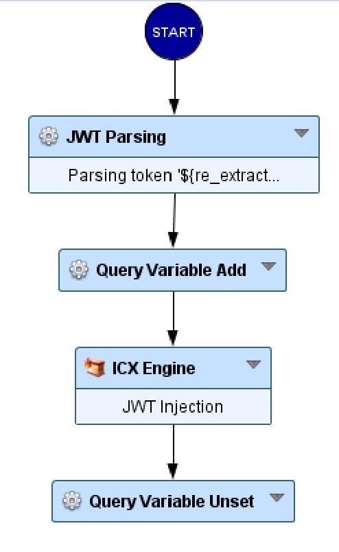

JWT Injection protection
=====================================

* 1 [Presentation](#presentation)
* 2 [Backup](#backup)
* 3 [Context](#context)
* 4 [Attack vectors](#attack-vectors)
* 5 [How to prevent Injection inside JWT Tokens?](#how-to-prevent-injection-inside-jwt-tokens)
* 6 [Limitations](#limitations)
* 7 [Solution description](#solution-description)

Presentation
------------

JSON Web Tokens (JWT) are a widely adopted standard for securely transmitting information between parties as a JSON object. They are commonly used in authentication and authorization mechanisms across modern web applications, microservices, and APIs.

Despite their usefulness, JWTs can be vulnerable to injection attacks when applications fail to properly validate, sanitize, or verify the contents of JWT payloads.

For more details, see:

*   [https://jwt.io/introduction](https://jwt.io/introduction)

Context
-------

JSON Web Tokens (JWTs) are commonly used to transmit identity and contextual data between services in a compact, URL-safe format. While JWTs are often signed or encrypted to guarantee authenticity, they are still user-controllable inputs, especially when issued by third-party identity providers or decoded client-side.

A common and dangerous misconception is that a valid signature or well-formed structure makes a JWT safe to use. In reality, the payload within a JWT can carry malicious content, which, if not carefully handled, may lead to injection vulnerabilities.

Attack vectors
--------------

While JSON Web Tokens are primarily trusted for their cryptographic integrity, the payload data remains attacker-controlled if not validated. This opens the door for various injection attacks when applications directly consume and act upon JWT claim values.

How to prevent Injection inside JWT Tokens?
----------------------------

Injection attacks targeting JWT (JSON Web Token) payloads exploit the trust established between parties exchanging the token. While JWTs are typically used for authentication and authorization, if they are not properly validated or sanitized, they can become vectors for injection attacks such as SQL Injection, Cross-Site Scripting, Command Injection, or Path Traversal.

Here’s how to secure JWTs against such injection attacks:

####   1. Avoid Embedding Unsafe User Input in JWT Claims

*   Never insert raw user input (e.g., username, email, custom fields) directly into JWT claims without validation and sanitization. 
*   Use whitelisting validation (accept known-good values) and type-checking before encoding data into the JWT.

####   2. Use Strong JSON Serialization and Encoding

*   Always encode special characters (e.g., <, >, &, ; ) before placing data in claims to prevent injection upon decoding or reflection in a frontend application.
*   Use secure libraries that handle encoding safely when serializing/deserializing JWT payloads.

####   3. Validate JWT Structure and Signature Strictly

*   Ensure the token is well-formed, with a valid header, payload, and signature.
*   Always verify the signature using a secure algorithm (e.g., HS256 or RS256) and never trust unsigned tokens (alg: none).

####   4. Sanitize and Validate Data After Decoding

*   Once a token is decoded, do not trust its payload blindly.
*   Re-validate all claims (e.g., roles, user ID, scopes) before using them in business logic or database queries.
*   Sanitize output if claim data is reflected into HTML pages or command lines.

####   5. Limit JWT Claim Scope and Size

*   Keep JWT payloads minimal and only include essential claims.
*   Do not include executable or sensitive data (like scripts or file paths) in any claim.

Limitations
-----------

While implementing protections against injection inside JWT tokens significantly reduces risk, there are important limitations and caveats to consider.

####   - Protection Focus Is Narrow

This use case addresses injection risks within JWT contents, not broader JWT misuse issues such as replay attacks, token theft, or authorization bypasses.

It does not cover access control validation failures or improper scope enforcement.

####   - Post-Issuance Tampering Is Still a Risk

If a JWT is stolen and reused (e.g. via XSS or insecure storage), injection protections won't prevent abuse of valid, signed tokens.

JWTs are stateless by design, making revocation or blacklisting more complex.

####   - Developer Trust and Misuse

JWT claim fields (e.g., role, isAdmin) may be over-trusted if not validated server-side, leading to logic flaws despite injection protections.

Developers may mistakenly rely on token contents as immutable truth without proper validation or access checks.

Solution description
--------------------------

We provide a Sub-Workflow to mitigate JWT Injection attacks via Authorization header.

The "SWF - JWT Injection" node has to be placed after the start node and before security engines (see figure below).

### SWF - JWT Injection Protection

This node does not require any configuration:

#### How does this Workflow node operate?

The SWF will first use our JWT Parsing node to extract the payload from the JWT Token provided inside the Authorization header.
It will then add the JWT payload to a query (GET) variable and perform our ICX engine to detect any injection attempt.

The variable is finally unset before proceeding with the rest of the workflow.

Backup
------

Sub-Workflow can be downloaded here: [SWF - JWT Injection Protection.backup](./backup/SWF%20-%20JWT%20Injection%20Protection.backup).

The Sub-Workflow will soon be available by default.

#### For further assistance or to report any issue with the Sub-Workflow, please contact our support team.