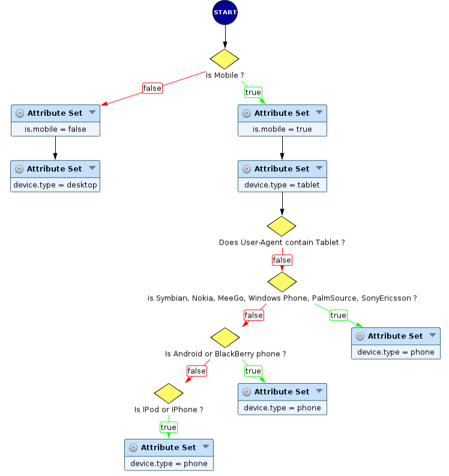
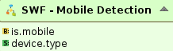

Mobile Detection
================

* 1 [Presentation](#presentation)
* 2 [Backup](#backup)
* 3 [SWF - Mobile Detection](#swf-mobile-detection)
* 4 [Disclaimer](#disclaimer)

Presentation
------------

The Sub-Workflow **SWF - Mobile Detection** can be used to identify which type of device sent the request. It has to be integrated in a main workflow, before the Proxy Request and it takes one parameter as input, the **http.request.headers** attribute.

Backup
------

You can download this Sub-Workflow here: [SWF - Mobile Detection.backup](./backup/SWF%20-%20Mobile%20Detection.backup)

SWF - Mobile Detection
----------------------

The Sub-Workflow **SWF - Mobile Detection** allows to identify the type of the device from which requests are coming. To do so, it inspects the **User-Agent** request header. That explains why the Sub-Workflow takes the request headers table as a required parameter.

It looks for many brands to define the device:
* Tablet: Xoom, Android, Apple, BlackBerry.
* Mobile: Nokia, Symbian, MeeGo, Windows Phone, PalmSource, Sony Ericsson, Android, iPhone, iPod, BlackBerry.

This Sub-Workflow provides different attributes: 

* Attribute **is.mobile** is a boolean that identifies if the device used by the client is a mobile or not.
* Attribute **device.type** contains which type of device is used by the client. If **is.mobile** is true, **device.type** value can be **phone** or **tablet**. Otherwise, it's set as **desktop**.

Disclaimer
----------

However, you have to keep in mind that the **User-Agent** header isn't a completely reliable source of information about device used. Because it's difficult to detect all types of devices due to **User-Agent** many possible forms that depend of its brand or OS and browser used. And most of all, **User-Agent** can be easily changed by user, hence any user willing to bypass a verification based on device type can do it this way.
