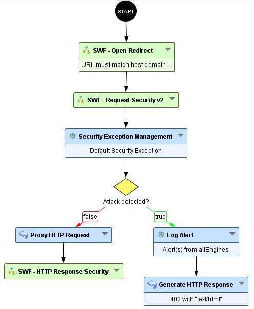
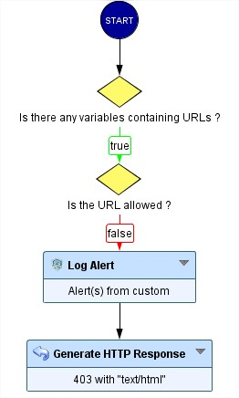

Open Redirect protection
=====================================

* 1 [Presentation](#presentation)
* 2 [Backup](#backup)
* 3 [Context](#context)
* 4 [Attack vectors](#attack-vectors)
* 5 [How to prevent Open Redirect attacks?](#how-to-prevent-open-redirect-attacks)
* 6 [Limitations](#limitations)
* 7 [Solution description](#solution-description)

Presentation
------------

Open Redirect vulnerabilities occur when a web application improperly processes untrusted input in a way that allows attackers to redirect users to malicious external sites. This usually happens via URL parameters or request headers, where redirection destinations are not adequately validated.

Such flaws don’t necessarily expose sensitive data or compromise the server directly, but they can be exploited in phishing attacks, where a trusted domain is used to trick users into clicking on a legitimate-looking link that ultimately leads to a harmful site.

This type of attack undermines user trust, poses reputation risks, and can bypass some client-side security filters (like email or browser warnings), making it a subtle but dangerous vector - especially when combined with social engineering.

For more details, see:

*   [https://learn.snyk.io/lesson/open-redirect/?ecosystem=javascript](https://learn.snyk.io/lesson/open-redirect/?ecosystem=javascript)

Context
-------

Modern web applications frequently use redirection mechanisms to guide users through authentication flows, post-login return pages, password reset confirmations, and other workflows that temporarily transfer users between pages or domains. These redirection URLs are often passed via query parameters, headers, or request bodies.

However, when such parameters are not strictly validated, they become an entry point for Open Redirect attacks, where attackers manipulate redirect targets to point to malicious external domains. This abuse can be subtle and easily overlooked, yet it poses serious risks.

Attack vectors
--------------

Open Redirect vulnerabilities are commonly exploited through user-controllable input that influences redirection logic. Attackers craft URLs that exploit these flaws to redirect users to malicious domains, often under the guise of legitimate services.

How to prevent Open Redirect attacks?
----------------------------

Preventing Open Redirect attacks requires a combination of secure development practices, input validation, and, where possible, WAF-level controls. The goal is to ensure that any redirect target - whether passed via parameters, headers, or paths - is explicitly validated and restricted to trusted locations.

####   1. Avoid Using Absolute URLs

Whenever possible, only allow relative paths (e.g., /dashboard) for redirections instead of full URLs like https://example.com/dashboard.

####   2. Implement Whitelisting

If redirection to external domains is necessary, use a strict allowlist of trusted domains or subdomains.
*   Validate against a hardcoded list of approved destinations.
*   Reject or redirect to a default safe page if the target is not allowed.

####   3. Sanitize and Validate User Input

Validate any redirect-related input:
*   Ensure it begins with / or matches an expected domain pattern.
*   Reject URLs containing // (to prevent protocol-relative or full external URLs).

####   4. Avoid Trusting Client-Controlled Headers

Do not use headers like Host, Referer, Origin, or X-Forwarded-* as redirect targets without strict validation. They are easily spoofed.

####   5. Fallback Behavior

When in doubt, redirect users to a safe default page instead of an unverified or user-provided destination.

Limitations
-----------

While Open Redirect protections significantly reduce the risk of abuse, it’s important to recognize the inherent limitations of detection and prevention mechanisms, particularly at the WAF or middleware level.

####   - Legitimate Use Cases May Be Blocked

Strict validation or WAF rules can inadvertently block legitimate redirects to external services (e.g., OAuth providers, payment gateways, SSO logins), which rely on full URLs as redirect targets.

Requires careful configuration and domain allowlisting to avoid service disruption.

####   - WAF Cannot Fully Understand Application Logic

If redirection logic is deeply embedded in server-side code (e.g., frameworks, authentication flows), the WAF cannot always distinguish between secure and insecure behavior.
Only the application has full context about user intent and safe routes.

####   - Obfuscation Techniques Can Bypass Simple Rules

Attackers may encode malicious URLs in subtle ways to bypass filters.

####   - Header Spoofing Is Difficult to Fully Prevent

Although WAFs can inspect and block suspicious headers, headers like Host, Referer, and X-Forwarded-* can still be spoofed when applications run behind misconfigured proxies or load balancers.

####   - Chained or Deferred Redirects May Evade Detection

Some attackers chain redirects through multiple legitimate domains or use deferred redirection (e.g., triggered after user interaction), which can evade static validation rules.

Solution description
--------------------------

We provide a Sub-Workflow to mitigate Open Redirect attacks via parameters & headers based on the host domain.

The "SWF - Open Redirect Protection" node has to be placed after the start node and before security engines (see figure below).

### SWF - Open Redirect Protection

This node does not require any configuration:

#### How does this Workflow node operate?

The SWF will first check if any parameters or headers contain a URL.
If so, it will verify whether the URL is allowed based on the request's host.

Any URL that does not match the current domain will be blocked - subdomains, however, are allowed.

Backup
------

Sub-Workflow can be downloaded here: [SWF - Open Redirect Protection.backup](./backup/SWF%20-%20Open%20Redirect%20Protection.backup).

The Sub-Workflow will soon be available by default.

#### For further assistance or to report any issue with the Sub-Workflow, please contact our support team.