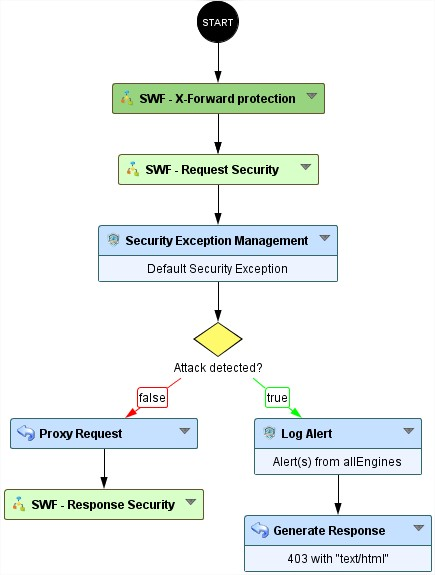
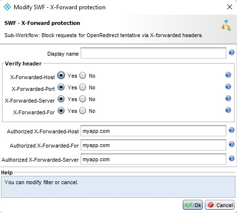

Open redirect/XSS/DOS via X-Forwards Headers
=====================================

* 1 [Presentation](#presentation)
* 2 [Backup](#backup)
* 3 [Context](#context)
* 4 [Attack vectors](#attack-vectors)
* 5 [How to prevent cache poisoning attacks?](#how-to-prevent-cache-poisoning-attacks)
    * 5.1 [Cache key](#cache-key)
    * 5.2 [Remove useless functionality](#remove-useless-functionality)
* 6 [Limitations](#limitations)
* 7 [Rohde & Schwarz’s solution](#rohde-schwarzs-solution)
    * 7.1 [SWF - X-Forwarded headers protection](#swf-x-forwarded-headers-protection)
    * 7.2 [Recommendations for complete protection against X-Forwarded headers cache poisoning](#recommendations-for-complete-protection-against-x-forwarded-headers-cache-poisoning)

Presentation
------------

Application can be vulnerable to cache poisoning which can lead to Open redirect, XSS and DOS.  The poison vectors are HTTP Headers :  X-Forward-Host, X-Forward-Port, X-Forward-Server. These headers can be reflected in the html response from the server so an attacker can submit malicious requests to the server that will be served to future legitimate users requesting the cache of the application.

For more details on attacks : 
*   [https://portswigger.net/research/practical-web-cache-
poisoning](https://portswigger.net/research/practical-web-cache-
poisoning)
*   [https://www.acunetix.com/blog/web-security-zone/what-are-open-redirects](https://www.acunetix.com/blog/web-security-zone/what-are-open-redirects)
*   [https://owasp.org/www-community/attacks/xss/](https://owasp.org/www-community/attacks/xss/)
*   [https://www.trendmicro.com/vinfo/us/security/definition/denial-of-service-dos](https://www.trendmicro.com/vinfo/us/security/definition/denial-of-service-dos)

Backup
------

Sub-Workflow can be downloaded here: [SWF - X-Forwarded headers protection.backup](./backup/SWF%20-%20X-Forwarded%20headers%20protection.backup).

The Sub-Workflow will be available by default in the 6.9.0 version.

Context
-------

The hacker’s goal here is to trigger an action within the victim’s operating context, using the cached application page. To accomplish this, the hacker needs to poison headers values used in the application's cache.

Attack vectors
--------------

Cache poising may exploit these headers:

*   X-Forward-Host
*   X-Forward-For
*   X-Forward-Server
*   X-Forward-Port

How to prevent cache poisoning attacks?
----------------------------

### Cache key

Add headers to the cache key.

### Remove useless functionality

You can choose to disable or remove the functionality of those headers if it is not relevant or can be replaced with something more secure.

Limitations
-----------

It can be tricky to verify headers inside your application if you need those headers.

Rohde & Schwarz’s solution
--------------------------

### SWF - X-Forwarded headers protection

This node must be configured by entering the domain name that the headers X-Forwarded-Host, X-Forwarded-For and X-Forwarded-Server will have to respect:

*   There is no need to enter the '_https://_' scheme before, nor the final '_/_'. You can enter several domain name, the field is regex compatible. For example: 'www.app.com', 'app.com', 'app.com|app2.com';
*   There is the possibility to enable checks for the headers you want/don't want;

#### How does this Workflow node operate?

The SWF will check for each headers :
*   If it is enable;
*   If it is defined;
*   If it is correct;
Then it will set the headers with the values set in the node.

### Recommendations for complete protection against CSRF

*   Avoid render caching informations in the response if it is not necesary.
*   Verify headers values if you know it is used on your application.
*   Set the headers to a known-safe value or unset the headers completely.
*   Implement the R&S WAF "SWF - X-Forwarded headers protection".
