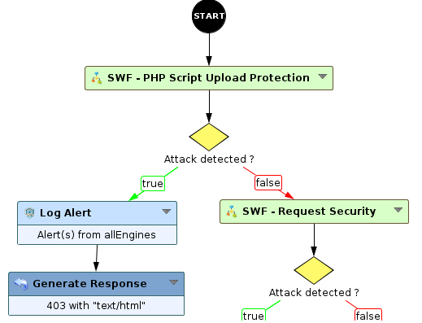
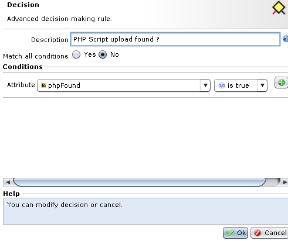

Protecting against PHP script upload and shellcode attacks
==========================================================

* 1 [Presentation](#presentation)
* 2 [Backup](#backup)
* 3 [Setting up protection](#setting-up-protection)

Presentation
------------

PHP script upload and shellcode attacks are very critical. They exploit non-secured file upload forms (for uploading images or other files) and can enable an attacker to take control of a Web server by installing a backdoor loaded on the server via the vulnerable form.

Backup
------

The sub-workflow can be downloaded here: [SWF - PHP Script Upload Protection.backup](./backup/SWF%20-%20PHP%20Script%20Upload%20Protection.backup)

Setting up protection
---------------------

Protection against uploading of a backdoor is done by putting a Workflow in place that analyzes the content of the files uploaded to the server.

Once the backup is restored onto the i-Suite, a Workflow node named **SWF - PHP Script Upload Protection** is available in the **Security** category.

This node must be positioned at the start of the Workflow and followed by a test to check the value of the variable **phpFound**. This variable is a Boolean whose value is **True** if an attack is found.

The SWF has an option for detecting PHP short tags (**Use shorttag**). This option is not enabled by default. N.B.: If the option is enabled the node can return the variable **phpFound** as **True** for other languages that use tags of the **<?** type, such as XML.

Here is an example Workflow:

Configuring the test run on the output of the node:

